# Benchmarks

## Goal

Compare `yaml12` and `yaml` for reading and writing YAML over a range of
document sizes.

We intentionally avoid testing semantic differences between YAML 1.1 and
1.2, as well as less-used YAML features like tags and streams. Instead,
we focus on the simple default usage of both.

Operations:

- **read**: YAML file → R object
- **write**: R object → YAML (written to
  [`nullfile()`](https://rdrr.io/r/base/showConnections.html))

## Setup

``` r

library(dplyr, warn.conflicts = FALSE)
library(ggplot2)
```

### Generate inputs

To benchmark, we create YAML files consisting of a repeating sequence of
a small, fixed “mixed” node, repeated `2^(1:15)` times. This node is
designed to exercise the full YAML 1.2 core schema (every core type is
represented). We generate these files with
[`yaml12::write_yaml()`](https://posit-dev.github.io/r-yaml12/reference/format_yaml.md).

Each file is written to a temporary file and then we measure read time.
Note that on macOS and Linux,
[`tempfile()`](https://rdrr.io/r/base/tempfile.html) paths often live on
a `tmpfs` in RAM, so this typically won’t trigger a write to disk under
most circumstances.

``` r

# A YAML node that exercises every core schema type:
#   seq, map, str, bool, int, float, null
mixed_node <- list(
  str = c(
    "Lorem ipsum dolor sit amet, vel accumsan vitae faucibus ultrices leo",
    "neque? Et cursus lacinia, ut, sit donec facilisi eu interdum. Dui",
    "ipsum, vitae ligula commodo convallis ac sed nunc. Ipsum at nec lacus",
    "eros suscipit vitae."
  ),
  block_str = "lorem \n ipsum \n dolor\n",
  bools = c(TRUE, FALSE),
  ints = c(123L, -123L),
  floats = c(123.456, -123.456),
  null = NULL
)
```

``` r

make_yaml_doc <- function(size = 1) {
  path <- tempfile(fileext = ".yaml")
  yaml12::write_yaml(rep(list(mixed_node), size), path)
  path
}

docs <- sapply(2^(1:15), make_yaml_doc)
```

## Read performance

``` r

read_results <- lapply(docs, function(doc) {
  result <- bench::mark(
    yaml12::read_yaml(doc),
    yaml::read_yaml(doc),
    check = FALSE
  )
  result$file_size <- file.info(doc)$size
  result
})
#> Warning: Some expressions had a GC in every iteration; so filtering is
#> disabled.
#> Warning: Some expressions had a GC in every iteration; so filtering is
#> disabled.
#> Warning: Some expressions had a GC in every iteration; so filtering is
#> disabled.
```

### Read results summary

``` r

read_results_df <- bind_rows(read_results) |>
  mutate(expression = as.factor(sapply(expression, deparse1)))
```

``` r

read_results_df |>
  ggplot(aes(x = file_size, y = median, color = expression)) +
  labs(
    y = "Median Run Time",
    x = "File Size",
    title = "Read Performance"
  ) +
  geom_point() +
  geom_smooth(linewidth = .5) +
  scale_x_log10(labels = scales::label_bytes()) +
  scale_y_continuous(trans = bench::bench_time_trans())
#> `geom_smooth()` using method = 'loess' and formula = 'y ~ x'
```

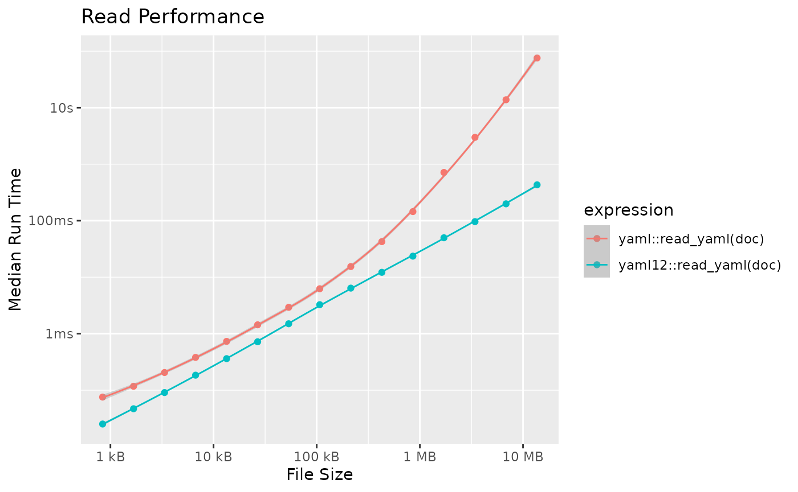

### Read results (detailed)

``` r

invisible(lapply(read_results, \(result) {
  print(plot(result) + ggplot2::ggtitle(scales::label_bytes()(result$file_size[1])))
  print(summary(result, filter_gc = FALSE))
}))
```

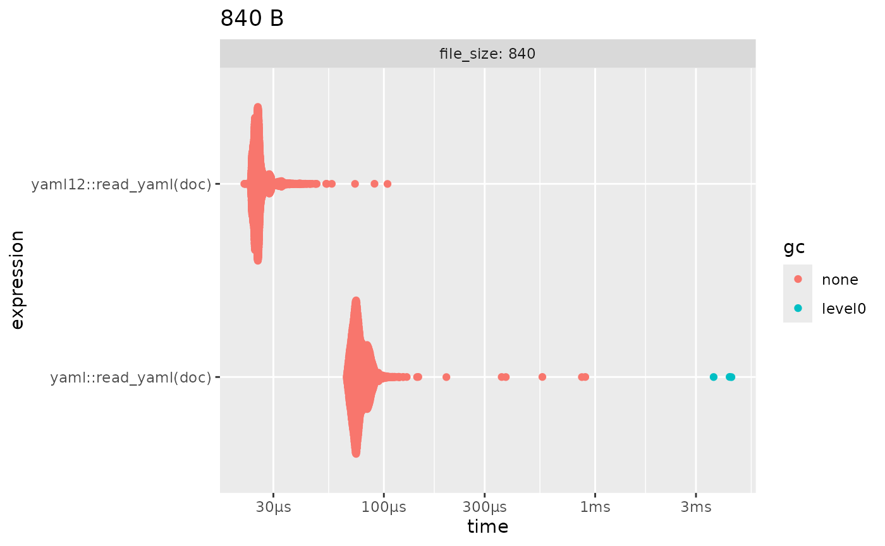

    #> # A tibble: 2 × 14
    #>   expression     file_size     min  median `itr/sec` mem_alloc `gc/sec`
    #>   <bch:expr>         <dbl> <bch:t> <bch:t>     <dbl> <bch:byt>    <dbl>
    #> 1 yaml12::read_…       840  32.8µs  34.1µs    28104.    2.75KB     0   
    #> 2 yaml::read_ya…       840   103µs 117.4µs     8133.   34.78KB     4.00
    #> # ℹ 7 more variables: n_itr <int>, n_gc <dbl>, total_time <bch:tm>,
    #> #   result <list>, memory <list>, time <list>, gc <list>

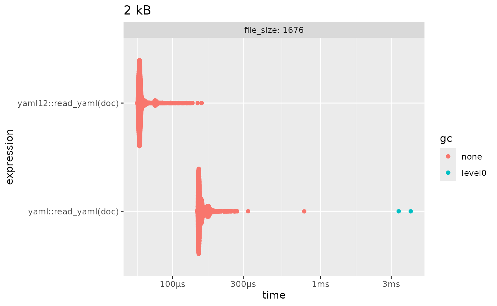

    #> # A tibble: 2 × 14
    #>   expression     file_size     min  median `itr/sec` mem_alloc `gc/sec`
    #>   <bch:expr>         <dbl> <bch:t> <bch:t>     <dbl> <bch:byt>    <dbl>
    #> 1 yaml12::read_…      1676  57.3µs  60.1µs    16169.        0B     0   
    #> 2 yaml::read_ya…      1676 147.7µs 156.3µs     6126.    10.8KB     4.00
    #> # ℹ 7 more variables: n_itr <int>, n_gc <dbl>, total_time <bch:tm>,
    #> #   result <list>, memory <list>, time <list>, gc <list>

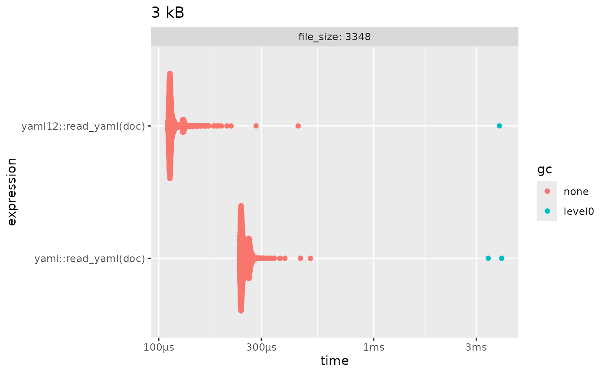

    #> # A tibble: 2 × 14
    #>   expression  file_size   min median `itr/sec` mem_alloc `gc/sec` n_itr
    #>   <bch:expr>      <dbl> <bch> <bch:>     <dbl> <bch:byt>    <dbl> <int>
    #> 1 yaml12::re…      3348 110µs  114µs     8452.        0B     2.00  4225
    #> 2 yaml::read…      3348 238µs  248µs     3911.    13.7KB     4.00  1956
    #> # ℹ 6 more variables: n_gc <dbl>, total_time <bch:tm>, result <list>,
    #> #   memory <list>, time <list>, gc <list>

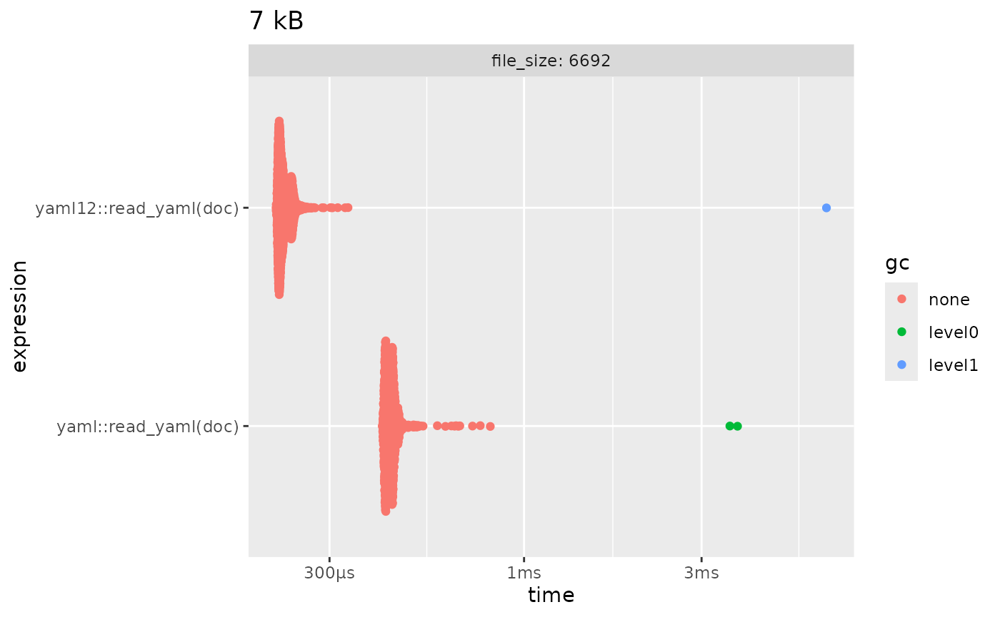

    #> # A tibble: 2 × 14
    #>   expression  file_size   min median `itr/sec` mem_alloc `gc/sec` n_itr
    #>   <bch:expr>      <dbl> <bch> <bch:>     <dbl> <bch:byt>    <dbl> <int>
    #> 1 yaml12::re…      6692 215µs  224µs     4333.        0B     2.00  2167
    #> 2 yaml::read…      6692 419µs  440µs     2249.    19.3KB     2.00  1125
    #> # ℹ 6 more variables: n_gc <dbl>, total_time <bch:tm>, result <list>,
    #> #   memory <list>, time <list>, gc <list>

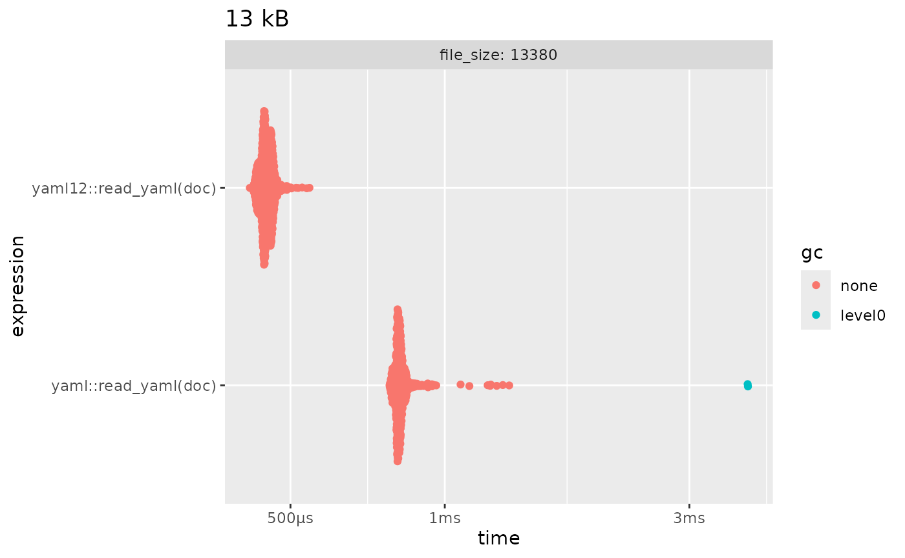

    #> # A tibble: 2 × 14
    #>   expression  file_size   min median `itr/sec` mem_alloc `gc/sec` n_itr
    #>   <bch:expr>      <dbl> <bch> <bch:>     <dbl> <bch:byt>    <dbl> <int>
    #> 1 yaml12::re…     13380 416µs  450µs     2187.      304B     2.00  1094
    #> 2 yaml::read…     13380 782µs  813µs     1201.    30.9KB     4.00   601
    #> # ℹ 6 more variables: n_gc <dbl>, total_time <bch:tm>, result <list>,
    #> #   memory <list>, time <list>, gc <list>

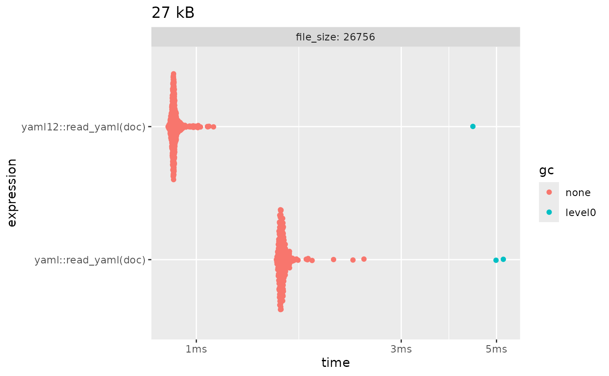

    #> # A tibble: 2 × 14
    #>   expression   file_size      min   median `itr/sec` mem_alloc `gc/sec`
    #>   <bch:expr>       <dbl> <bch:tm> <bch:tm>     <dbl> <bch:byt>    <dbl>
    #> 1 yaml12::rea…     26756 856.38µs 890.73µs     1108.      560B     2.00
    #> 2 yaml::read_…     26756   1.54ms   1.58ms      617.    69.4KB     3.98
    #> # ℹ 7 more variables: n_itr <int>, n_gc <dbl>, total_time <bch:tm>,
    #> #   result <list>, memory <list>, time <list>, gc <list>

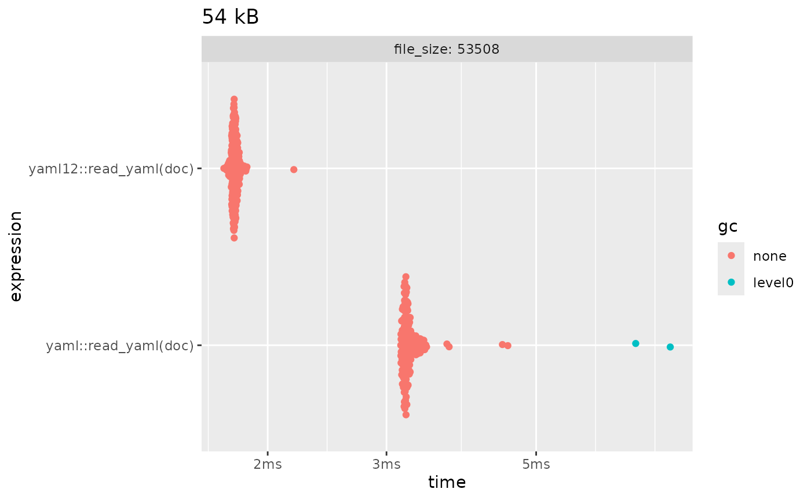

    #> # A tibble: 2 × 14
    #>   expression file_size    min median `itr/sec` mem_alloc `gc/sec` n_itr
    #>   <bch:expr>     <dbl> <bch:> <bch:>     <dbl> <bch:byt>    <dbl> <int>
    #> 1 yaml12::r…     53508 1.72ms 1.78ms      559.    1.05KB     0      280
    #> 2 yaml::rea…     53508 3.15ms 3.21ms      302.  146.29KB     3.98   152
    #> # ℹ 6 more variables: n_gc <dbl>, total_time <bch:tm>, result <list>,
    #> #   memory <list>, time <list>, gc <list>

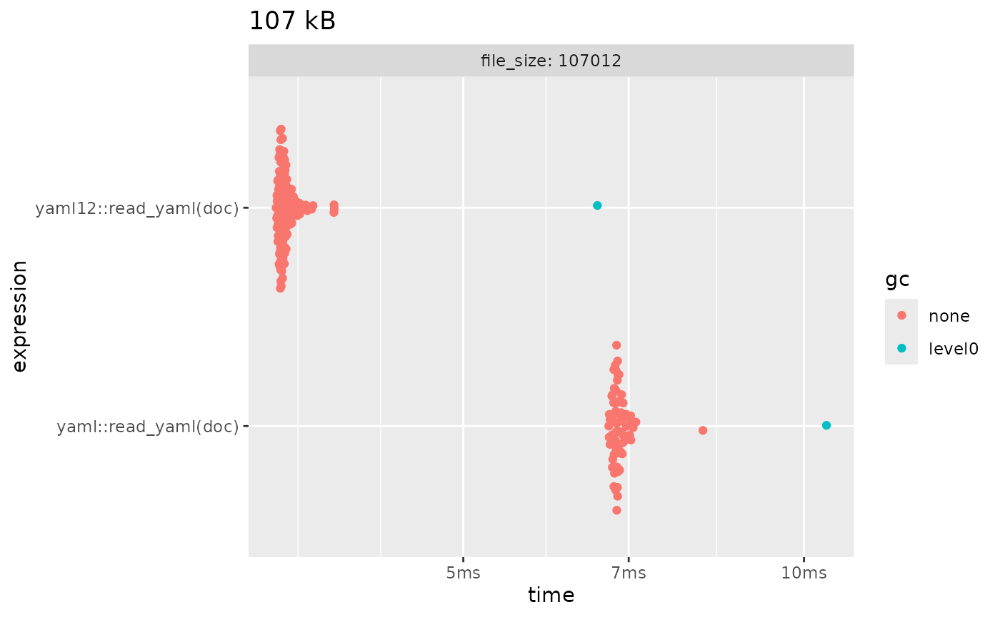

    #> # A tibble: 2 × 14
    #>   expression file_size    min median `itr/sec` mem_alloc `gc/sec` n_itr
    #>   <bch:expr>     <dbl> <bch:> <bch:>     <dbl> <bch:byt>    <dbl> <int>
    #> 1 yaml12::r…    107012 3.42ms 3.47ms      285.    2.05KB     1.99   143
    #> 2 yaml::rea…    107012 6.72ms 6.84ms      144.  300.09KB     1.98    73
    #> # ℹ 6 more variables: n_gc <dbl>, total_time <bch:tm>, result <list>,
    #> #   memory <list>, time <list>, gc <list>

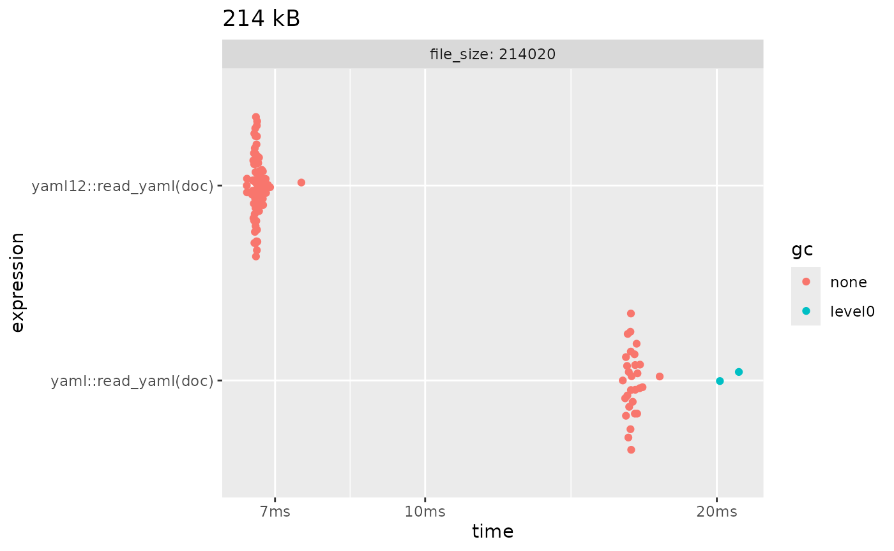

    #> # A tibble: 2 × 14
    #>   expression     file_size     min  median `itr/sec` mem_alloc `gc/sec`
    #>   <bch:expr>         <dbl> <bch:t> <bch:t>     <dbl> <bch:byt>    <dbl>
    #> 1 yaml12::read_…    214020  6.64ms  6.72ms     147.     4.05KB     1.98
    #> 2 yaml::read_ya…    214020 15.95ms  16.2ms      60.6  607.63KB     3.91
    #> # ℹ 7 more variables: n_itr <int>, n_gc <dbl>, total_time <bch:tm>,
    #> #   result <list>, memory <list>, time <list>, gc <list>

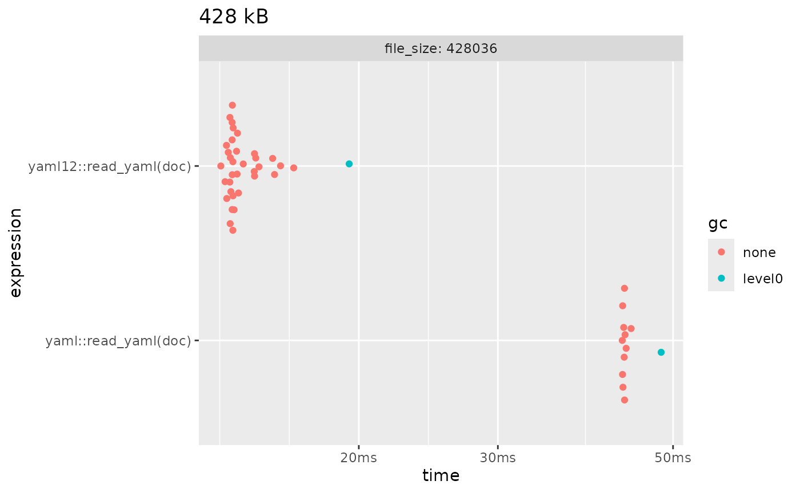

    #> # A tibble: 2 × 14
    #>   expression file_size    min median `itr/sec` mem_alloc `gc/sec` n_itr
    #>   <bch:expr>     <dbl> <bch:> <bch:>     <dbl> <bch:byt>    <dbl> <int>
    #> 1 yaml12::r…    428036 12.8ms 12.9ms      76.3    8.05KB     1.96    39
    #> 2 yaml::rea…    428036 42.5ms 43.2ms      23.0    1.19MB     1.91    12
    #> # ℹ 6 more variables: n_gc <dbl>, total_time <bch:tm>, result <list>,
    #> #   memory <list>, time <list>, gc <list>

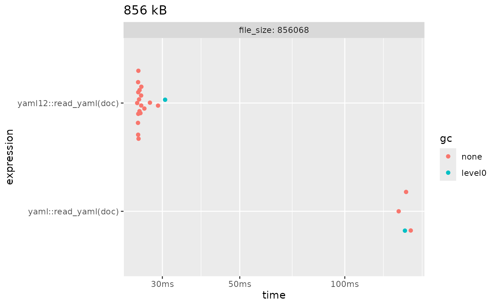

    #> # A tibble: 2 × 14
    #>   expression     file_size     min  median `itr/sec` mem_alloc `gc/sec`
    #>   <bch:expr>         <dbl> <bch:t> <bch:t>     <dbl> <bch:byt>    <dbl>
    #> 1 yaml12::read_…    856068  25.2ms  25.6ms     38.1       16KB     1.91
    #> 2 yaml::read_ya…    856068 141.1ms 148.3ms      6.77     2.4MB     1.69
    #> # ℹ 7 more variables: n_itr <int>, n_gc <dbl>, total_time <bch:tm>,
    #> #   result <list>, memory <list>, time <list>, gc <list>


    #> # A tibble: 2 × 14
    #>   expression      file_size     min median `itr/sec` mem_alloc `gc/sec`
    #>   <bch:expr>          <dbl> <bch:t> <bch:>     <dbl> <bch:byt>    <dbl>
    #> 1 yaml12::read_y…   1712132  52.2ms   53ms     18.5       32KB     1.85
    #> 2 yaml::read_yam…   1712132 869.5ms  869ms      1.15     4.8MB     0   
    #> # ℹ 7 more variables: n_itr <int>, n_gc <dbl>, total_time <bch:tm>,
    #> #   result <list>, memory <list>, time <list>, gc <list>

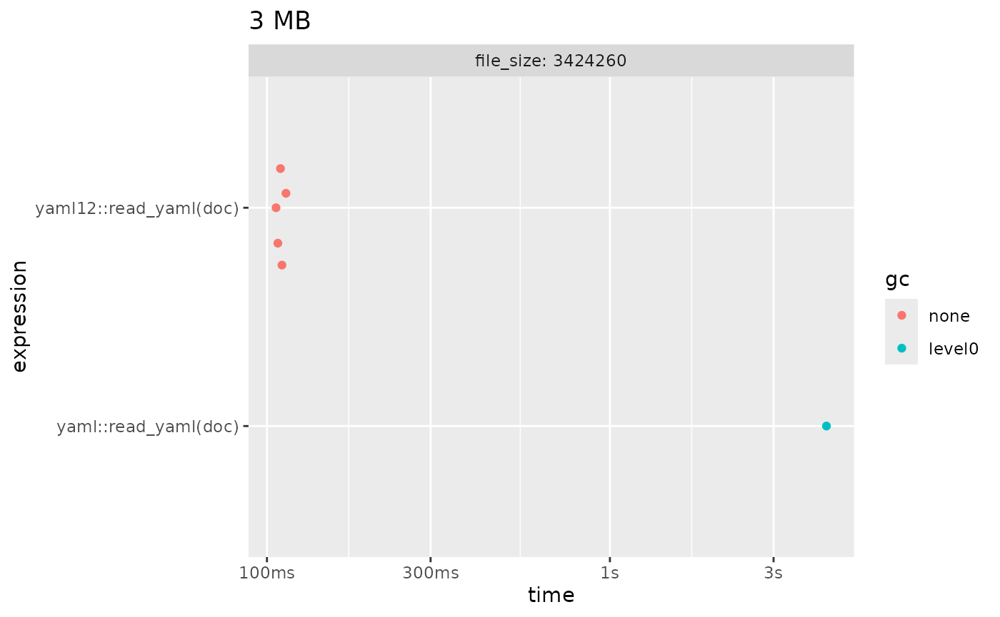

    #> # A tibble: 2 × 14
    #>   expression   file_size      min   median `itr/sec` mem_alloc `gc/sec`
    #>   <bch:expr>       <dbl> <bch:tm> <bch:tm>     <dbl> <bch:byt>    <dbl>
    #> 1 yaml12::rea…   3424260 105.28ms 106.61ms     9.25       64KB    0    
    #> 2 yaml::read_…   3424260    4.26s    4.26s     0.235     9.6MB    0.235
    #> # ℹ 7 more variables: n_itr <int>, n_gc <dbl>, total_time <bch:tm>,
    #> #   result <list>, memory <list>, time <list>, gc <list>

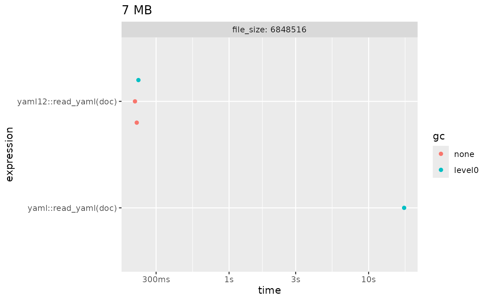

    #> # A tibble: 2 × 14
    #>   expression     file_size     min  median `itr/sec` mem_alloc `gc/sec`
    #>   <bch:expr>         <dbl> <bch:t> <bch:t>     <dbl> <bch:byt>    <dbl>
    #> 1 yaml12::read_…   6848516 218.3ms 222.7ms    4.49       128KB    2.99 
    #> 2 yaml::read_ya…   6848516   18.1s   18.1s    0.0553    19.2MB    0.111
    #> # ℹ 7 more variables: n_itr <int>, n_gc <dbl>, total_time <bch:tm>,
    #> #   result <list>, memory <list>, time <list>, gc <list>

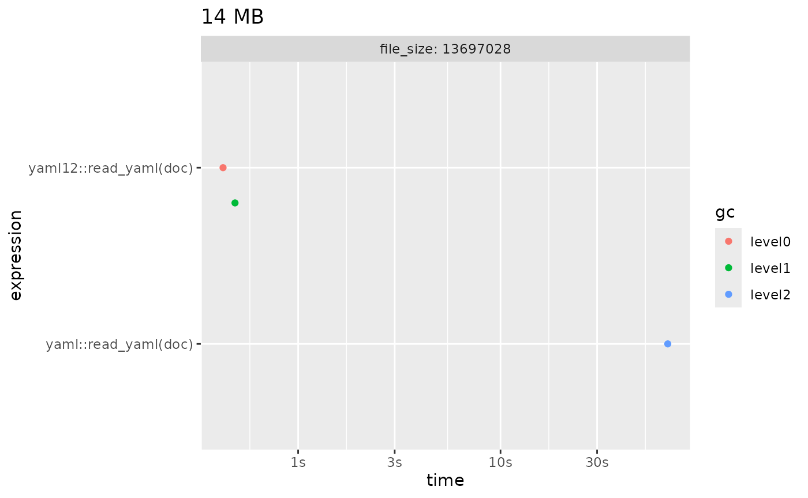

    #> # A tibble: 2 × 14
    #>   expression   file_size      min   median `itr/sec` mem_alloc `gc/sec`
    #>   <bch:expr>       <dbl> <bch:tm> <bch:tm>     <dbl> <bch:byt>    <dbl>
    #> 1 yaml12::rea…  13697028 425.62ms 456.63ms    2.19       256KB   3.28  
    #> 2 yaml::read_…  13697028    1.12m    1.12m    0.0149    38.4MB   0.0746
    #> # ℹ 7 more variables: n_itr <int>, n_gc <dbl>, total_time <bch:tm>,
    #> #   result <list>, memory <list>, time <list>, gc <list>

## Write performance

``` r

objs <- lapply(2^(1:15), function(n) rep(list(mixed_node), n))

write_results <- lapply(objs, function(obj) {
  result <- bench::mark(
    yaml12::write_yaml(obj, nullfile()),
    yaml::write_yaml(obj, nullfile()),
    check = FALSE
  )
  result$obj_size <- object.size(obj)
  result
})
#> Warning: Some expressions had a GC in every iteration; so filtering is
#> disabled.
#> Warning: Some expressions had a GC in every iteration; so filtering is
#> disabled.
```

### Write results summary:

``` r

write_results_df <- bind_rows(write_results) |>
  mutate(expression = as.factor(sapply(expression, deparse1)))
```

``` r

write_results_df |>
  ggplot(aes(x = obj_size, y = median, color = expression)) +
  labs(
    y = "Median Run Time",
    x = "Object Size",
    title = "Write Performance"
  ) +
  geom_point() +
  geom_smooth(linewidth = .5) +
  scale_x_log10(labels = scales::label_bytes()) +
  scale_y_continuous(trans = bench::bench_time_trans())
#> `geom_smooth()` using method = 'loess' and formula = 'y ~ x'
```

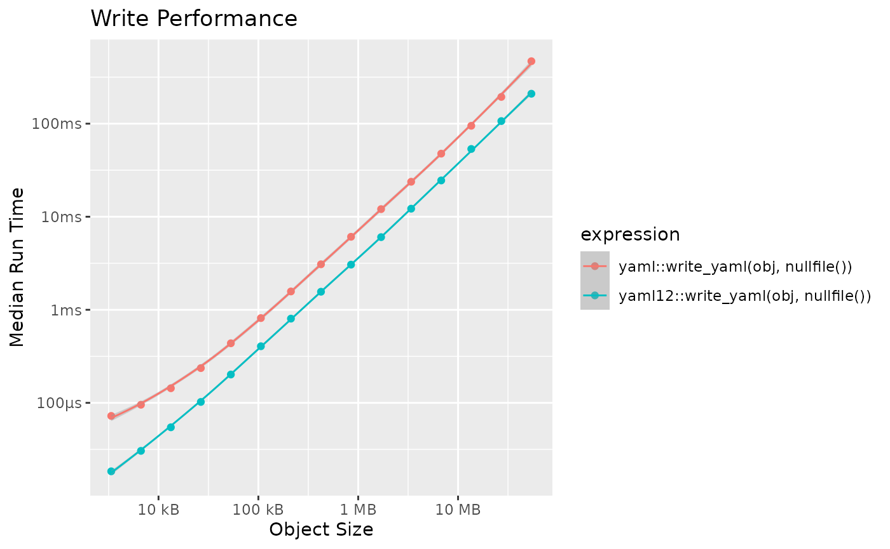

### Write results (detailed)

``` r

invisible(lapply(write_results, \(result) {
  print(plot(result) + ggplot2::ggtitle(scales::label_bytes()(as.numeric(result$obj_size[1]))))
  print(summary(result, filter_gc = FALSE))
}))
```

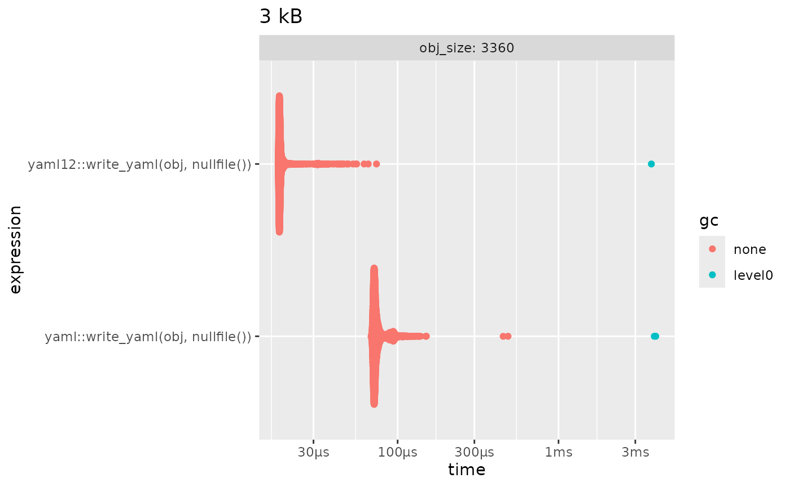

    #> # A tibble: 2 × 14
    #>   expression  obj_size    min median `itr/sec` mem_alloc `gc/sec` n_itr
    #>   <bch:expr>  <objct_> <bch:> <bch:>     <dbl> <bch:byt>    <dbl> <int>
    #> 1 yaml12::wr… 3360 by… 18.1µs 18.5µs    51526.    3.02KB     5.15 10000
    #> 2 yaml::writ… 3360 by… 68.5µs 72.4µs    12981.   33.68KB     4.00  6487
    #> # ℹ 6 more variables: n_gc <dbl>, total_time <bch:tm>, result <list>,
    #> #   memory <list>, time <list>, gc <list>

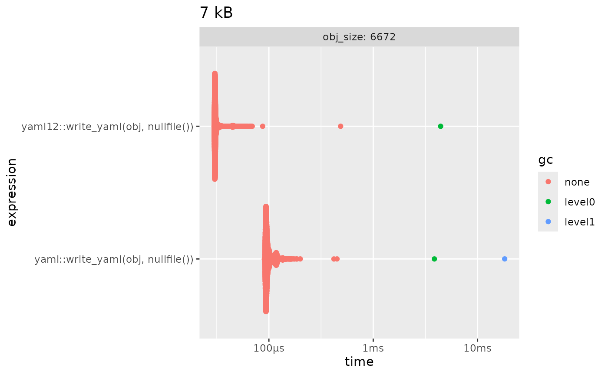

    #> # A tibble: 2 × 14
    #>   expression  obj_size    min median `itr/sec` mem_alloc `gc/sec` n_itr
    #>   <bch:expr>  <objct_> <bch:> <bch:>     <dbl> <bch:byt>    <dbl> <int>
    #> 1 yaml12::wr… 6672 by… 30.1µs 30.8µs    31066.        0B     3.11 10000
    #> 2 yaml::writ… 6672 by… 90.9µs 95.8µs     9425.    1.56KB     4.00  4711
    #> # ℹ 6 more variables: n_gc <dbl>, total_time <bch:tm>, result <list>,
    #> #   memory <list>, time <list>, gc <list>

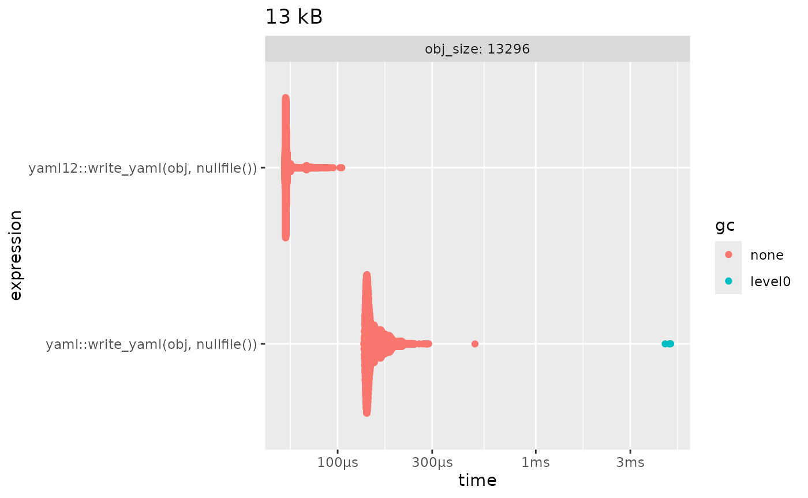

    #> # A tibble: 2 × 14
    #>   expression  obj_size   min  median `itr/sec` mem_alloc `gc/sec` n_itr
    #>   <bch:expr>  <objct_> <bch> <bch:t>     <dbl> <bch:byt>    <dbl> <int>
    #> 1 yaml12::wr… 13296 b…  54µs  55.2µs    17626.        0B     0     8807
    #> 2 yaml::writ… 13296 b… 136µs 144.8µs     6379.    3.07KB     6.00  3189
    #> # ℹ 6 more variables: n_gc <dbl>, total_time <bch:tm>, result <list>,
    #> #   memory <list>, time <list>, gc <list>

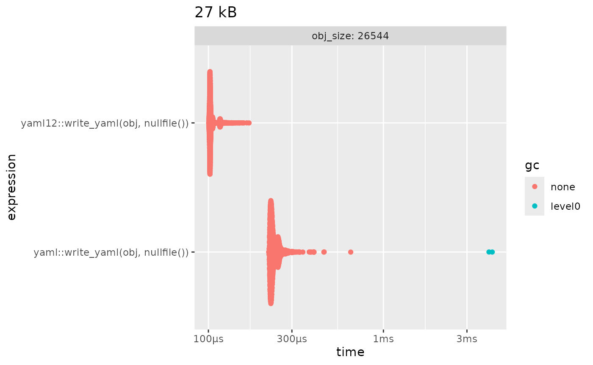

    #> # A tibble: 2 × 14
    #>   expression   obj_size   min median `itr/sec` mem_alloc `gc/sec` n_itr
    #>   <bch:expr>   <objct_> <bch> <bch:>     <dbl> <bch:byt>    <dbl> <int>
    #> 1 yaml12::wri… 26544 b… 102µs  103µs     9508.        0B     0     4753
    #> 2 yaml::write… 26544 b… 223µs  237µs     3921.    6.09KB     6.00  1960
    #> # ℹ 6 more variables: n_gc <dbl>, total_time <bch:tm>, result <list>,
    #> #   memory <list>, time <list>, gc <list>

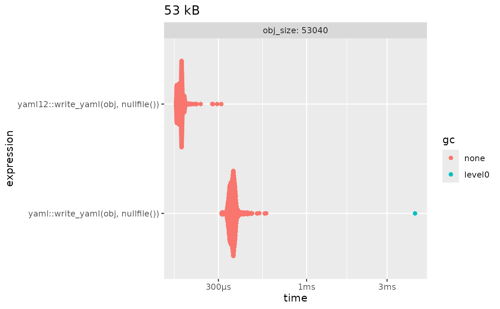

    #> # A tibble: 2 × 14
    #>   expression   obj_size   min median `itr/sec` mem_alloc `gc/sec` n_itr
    #>   <bch:expr>   <objct_> <bch> <bch:>     <dbl> <bch:byt>    <dbl> <int>
    #> 1 yaml12::wri… 53040 b… 197µs  202µs     4876.        0B     0     2438
    #> 2 yaml::write… 53040 b… 411µs  438µs     2198.    12.1KB     4.00  1099
    #> # ℹ 6 more variables: n_gc <dbl>, total_time <bch:tm>, result <list>,
    #> #   memory <list>, time <list>, gc <list>

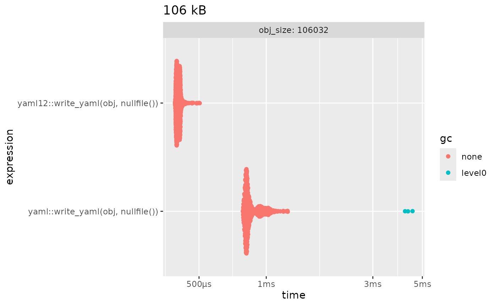

    #> # A tibble: 2 × 14
    #>   expression   obj_size   min median `itr/sec` mem_alloc `gc/sec` n_itr
    #>   <bch:expr>   <objct_> <bch> <bch:>     <dbl> <bch:byt>    <dbl> <int>
    #> 1 yaml12::wri… 106032 … 390µs  402µs     2471.        0B     0     1236
    #> 2 yaml::write… 106032 … 785µs  822µs     1134.    24.2KB     6.00   567
    #> # ℹ 6 more variables: n_gc <dbl>, total_time <bch:tm>, result <list>,
    #> #   memory <list>, time <list>, gc <list>

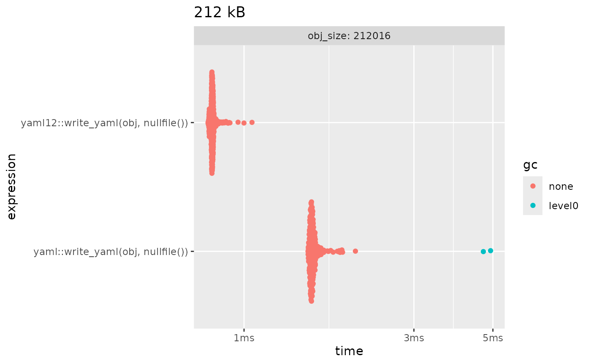

    #> # A tibble: 2 × 14
    #>   expression    obj_size      min   median `itr/sec` mem_alloc `gc/sec`
    #>   <bch:expr>    <objct_> <bch:tm> <bch:tm>     <dbl> <bch:byt>    <dbl>
    #> 1 yaml12::writ… 212016 … 779.88µs 801.86µs     1236.        0B     0   
    #> 2 yaml::write_… 212016 …   1.54ms   1.59ms      589.    48.3KB     5.99
    #> # ℹ 7 more variables: n_itr <int>, n_gc <dbl>, total_time <bch:tm>,
    #> #   result <list>, memory <list>, time <list>, gc <list>

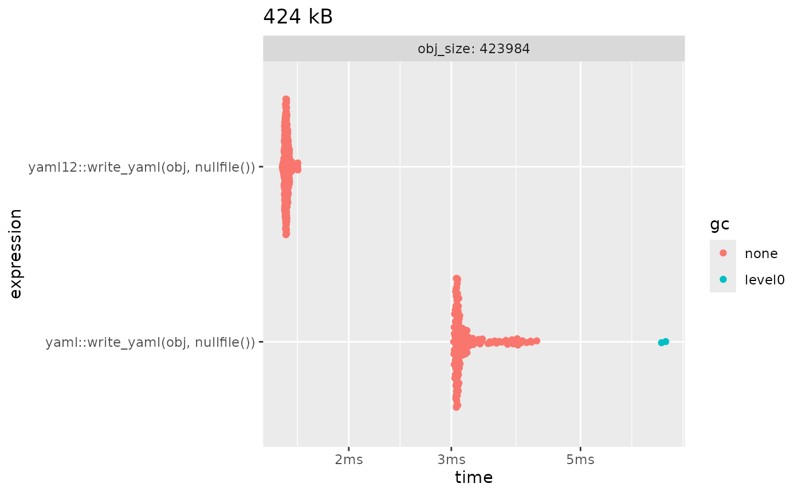

    #> # A tibble: 2 × 14
    #>   expression  obj_size    min median `itr/sec` mem_alloc `gc/sec` n_itr
    #>   <bch:expr>  <objct_> <bch:> <bch:>     <dbl> <bch:byt>    <dbl> <int>
    #> 1 yaml12::wr… 423984 … 1.54ms 1.56ms      639.        0B     0      320
    #> 2 yaml::writ… 423984 … 3.03ms 3.09ms      306.    96.6KB     4.00   153
    #> # ℹ 6 more variables: n_gc <dbl>, total_time <bch:tm>, result <list>,
    #> #   memory <list>, time <list>, gc <list>

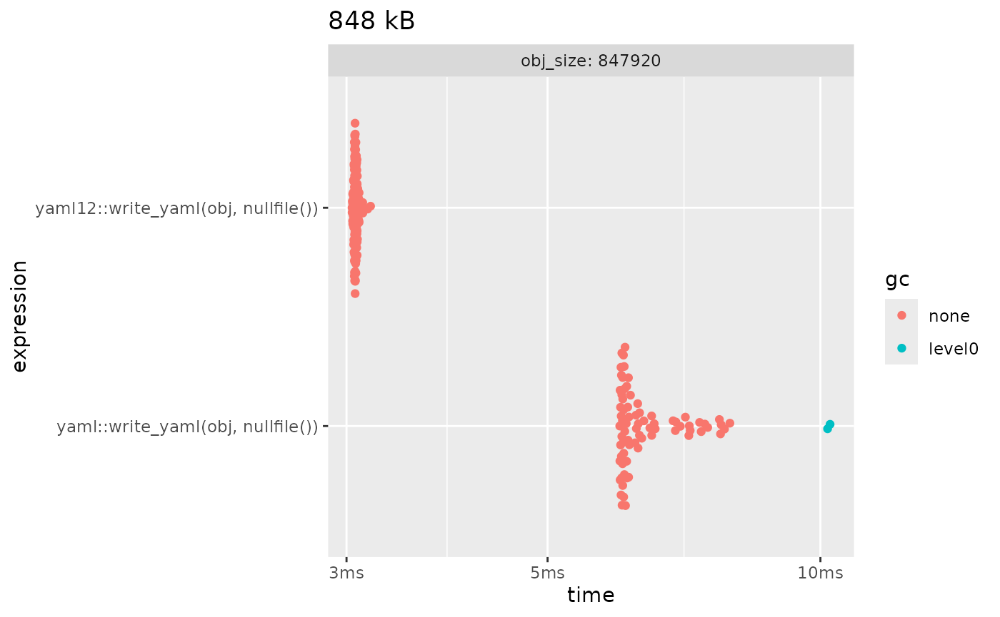

    #> # A tibble: 2 × 14
    #>   expression  obj_size    min median `itr/sec` mem_alloc `gc/sec` n_itr
    #>   <bch:expr>  <objct_> <bch:> <bch:>     <dbl> <bch:byt>    <dbl> <int>
    #> 1 yaml12::wr… 847920 … 3.04ms 3.07ms      325.        0B     0      163
    #> 2 yaml::writ… 847920 … 6.01ms 6.14ms      153.     193KB     3.98    77
    #> # ℹ 6 more variables: n_gc <dbl>, total_time <bch:tm>, result <list>,
    #> #   memory <list>, time <list>, gc <list>

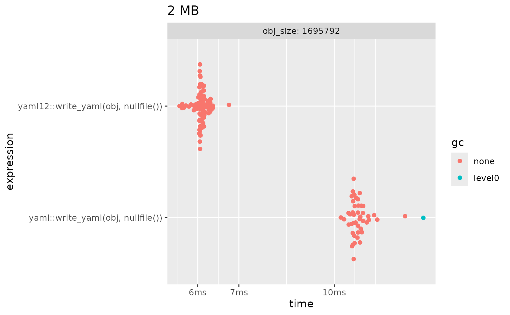

    #> # A tibble: 2 × 14
    #>   expression      obj_size     min  median `itr/sec` mem_alloc `gc/sec`
    #>   <bch:expr>      <objct_> <bch:t> <bch:t>     <dbl> <bch:byt>    <dbl>
    #> 1 yaml12::write_… 1695792…  6.01ms  6.05ms     165.         0B     0   
    #> 2 yaml::write_ya… 1695792… 11.78ms 12.15ms      49.6     386KB     3.97
    #> # ℹ 7 more variables: n_itr <int>, n_gc <dbl>, total_time <bch:tm>,
    #> #   result <list>, memory <list>, time <list>, gc <list>

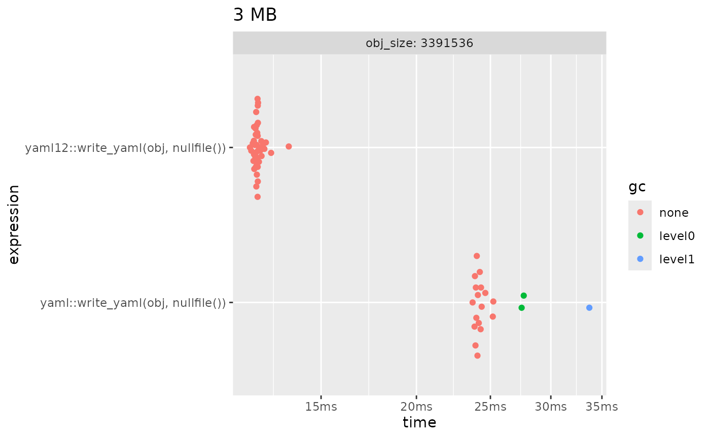

    #> # A tibble: 2 × 14
    #>   expression  obj_size    min median `itr/sec` mem_alloc `gc/sec` n_itr
    #>   <bch:expr>  <objct_> <bch:> <bch:>     <dbl> <bch:byt>    <dbl> <int>
    #> 1 yaml12::wr… 3391536… 12.1ms 12.2ms      81.7        0B     0       41
    #> 2 yaml::writ… 3391536… 23.6ms 24.1ms      41.0     772KB     3.90    21
    #> # ℹ 6 more variables: n_gc <dbl>, total_time <bch:tm>, result <list>,
    #> #   memory <list>, time <list>, gc <list>

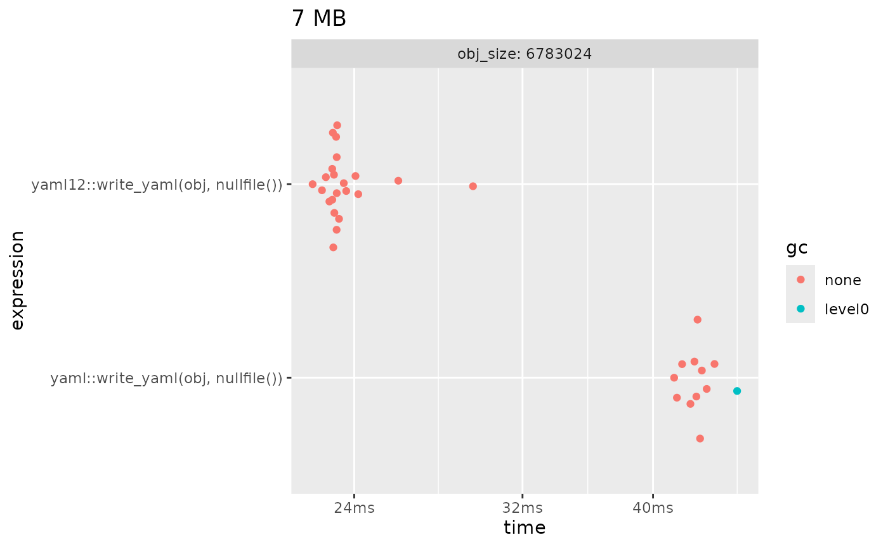

    #> # A tibble: 2 × 14
    #>   expression  obj_size    min median `itr/sec` mem_alloc `gc/sec` n_itr
    #>   <bch:expr>  <objct_> <bch:> <bch:>     <dbl> <bch:byt>    <dbl> <int>
    #> 1 yaml12::wr… 6783024… 24.1ms 24.8ms      40.3        0B     0       21
    #> 2 yaml::writ… 6783024… 47.2ms 47.7ms      20.6    1.51MB     3.75    11
    #> # ℹ 6 more variables: n_gc <dbl>, total_time <bch:tm>, result <list>,
    #> #   memory <list>, time <list>, gc <list>

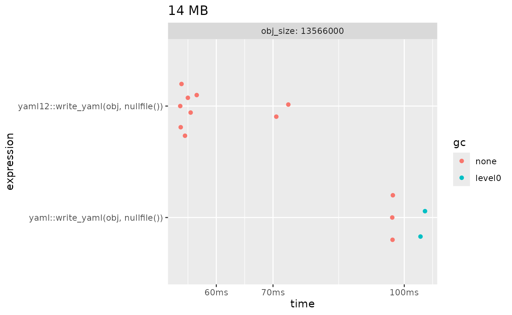

    #> # A tibble: 2 × 14
    #>   expression  obj_size    min median `itr/sec` mem_alloc `gc/sec` n_itr
    #>   <bch:expr>  <objct_> <bch:> <bch:>     <dbl> <bch:byt>    <dbl> <int>
    #> 1 yaml12::wr… 1356600…   50ms 51.4ms      19.4        0B     0       10
    #> 2 yaml::writ… 1356600… 95.6ms 96.4ms      10.3    3.02MB     3.43     6
    #> # ℹ 6 more variables: n_gc <dbl>, total_time <bch:tm>, result <list>,
    #> #   memory <list>, time <list>, gc <list>

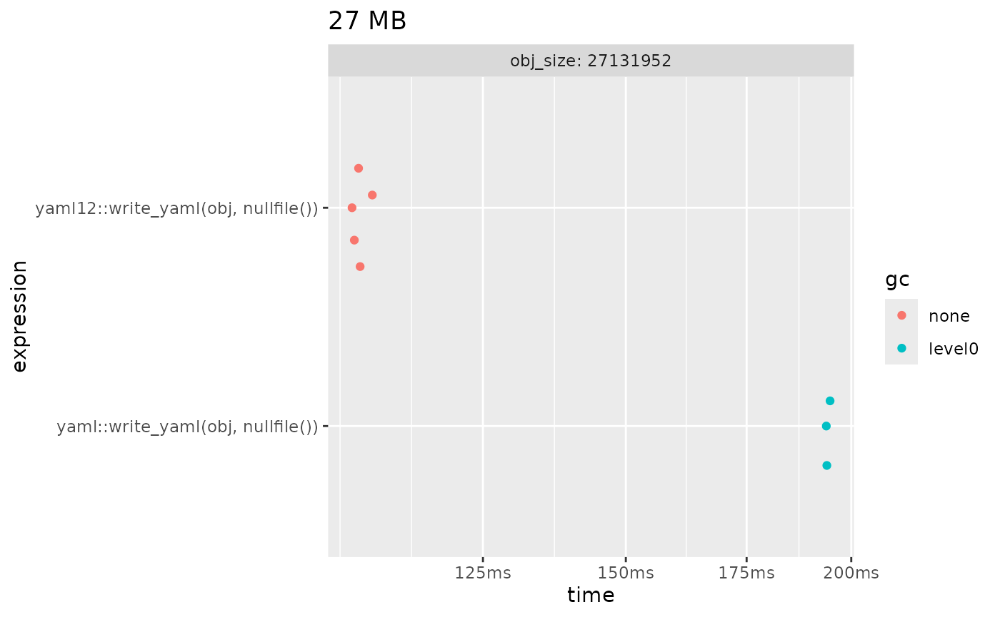

    #> # A tibble: 2 × 14
    #>   expression   obj_size   min median `itr/sec` mem_alloc `gc/sec` n_itr
    #>   <bch:expr>   <objct_> <bch> <bch:>     <dbl> <bch:byt>    <dbl> <int>
    #> 1 yaml12::wri… 2713195… 105ms  106ms      9.45        0B     0        5
    #> 2 yaml::write… 2713195… 195ms  195ms      5.12    6.03MB     5.12     3
    #> # ℹ 6 more variables: n_gc <dbl>, total_time <bch:tm>, result <list>,
    #> #   memory <list>, time <list>, gc <list>

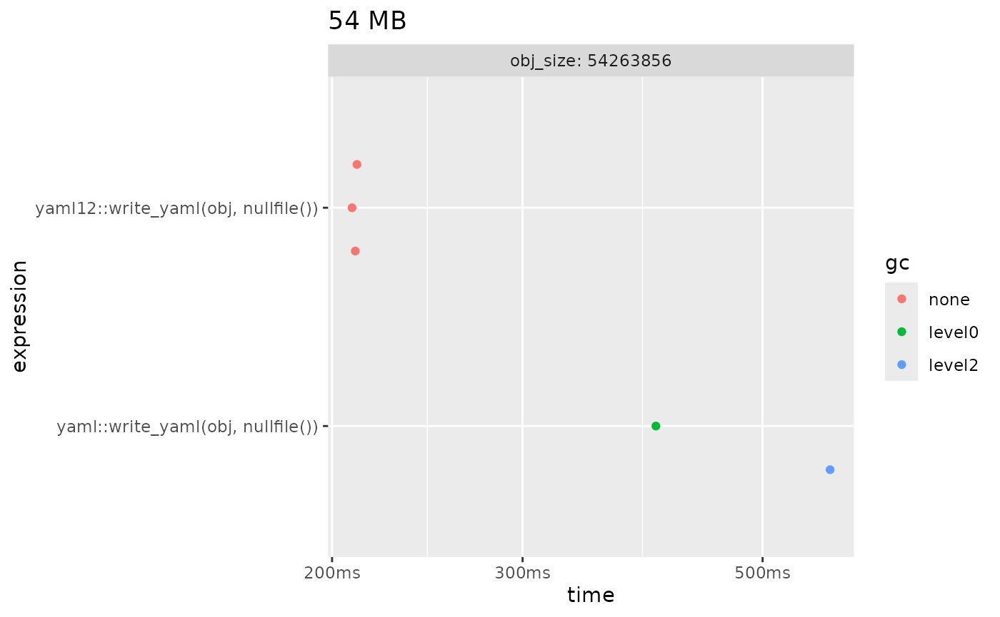

    #> # A tibble: 2 × 14
    #>   expression   obj_size   min median `itr/sec` mem_alloc `gc/sec` n_itr
    #>   <bch:expr>   <objct_> <bch> <bch:>     <dbl> <bch:byt>    <dbl> <int>
    #> 1 yaml12::wri… 5426385… 209ms  210ms      4.76        0B     0        3
    #> 2 yaml::write… 5426385… 393ms  471ms      2.12    12.1MB     3.19     2
    #> # ℹ 6 more variables: n_gc <dbl>, total_time <bch:tm>, result <list>,
    #> #   memory <list>, time <list>, gc <list>

## Conclusion

Across all tested file sizes and for this workload, `yaml12` is faster
than `yaml` at reading and writing YAML.
