# Benchmarks

## Goal

Compare `yaml12` and `yaml` for reading and writing YAML over a range of
document sizes.

We intentionally avoid testing semantic differences between YAML 1.1 and
1.2, as well as less-used YAML features like tags and streams. Instead,
we focus on the simple default usage of both.

Operations:

- **read**: YAML file → R object
- **write**: R object → YAML (written to
  [`nullfile()`](https://rdrr.io/r/base/showConnections.html))

## Setup

``` r
library(dplyr, warn.conflicts = FALSE)
library(ggplot2)
```

### Generate inputs

To benchmark, we create YAML files consisting of a repeating sequence of
a small, fixed “mixed” node, repeated `2^(1:15)` times. This node is
designed to exercise the full YAML 1.2 core schema (every core type is
represented). We generate these files with
[`yaml12::write_yaml()`](https://posit-dev.github.io/r-yaml12/dev/reference/format_yaml.md).

Each file is written to a temporary file and then we measure read time.
Note that on macOS and Linux,
[`tempfile()`](https://rdrr.io/r/base/tempfile.html) paths often live on
a `tmpfs` in RAM, so this typically won’t trigger a write to disk under
most circumstances.

``` r
# A YAML node that exercises every core schema type:
#   seq, map, str, bool, int, float, null
mixed_node <- list(
  str = c(
    "Lorem ipsum dolor sit amet, vel accumsan vitae faucibus ultrices leo",
    "neque? Et cursus lacinia, ut, sit donec facilisi eu interdum. Dui",
    "ipsum, vitae ligula commodo convallis ac sed nunc. Ipsum at nec lacus",
    "eros suscipit vitae."
  ),
  block_str = "lorem \n ipsum \n dolor\n",
  bools = c(TRUE, FALSE),
  ints = c(123L, -123L),
  floats = c(123.456, -123.456),
  null = NULL
)
```

``` r
make_yaml_doc <- function(size = 1) {
  path <- tempfile(fileext = ".yaml")
  yaml12::write_yaml(rep(list(mixed_node), size), path)
  path
}

docs <- sapply(2^(1:15), make_yaml_doc)
```

## Read performance

``` r
read_results <- lapply(docs, function(doc) {
  result <- bench::mark(
    yaml12::read_yaml(doc),
    yaml::read_yaml(doc),
    check = FALSE
  )
  result$file_size <- file.info(doc)$size
  result
})
#> Warning: Some expressions had a GC in every iteration; so filtering is
#> disabled.
#> Warning: Some expressions had a GC in every iteration; so filtering is
#> disabled.
#> Warning: Some expressions had a GC in every iteration; so filtering is
#> disabled.
```

### Read results summary

``` r
read_results_df <- bind_rows(read_results) |>
  mutate(expression = as.factor(sapply(expression, deparse1)))
```

``` r
read_results_df |>
  ggplot(aes(x = file_size, y = median, color = expression)) +
  labs(
    y = "Median Run Time",
    x = "File Size",
    title = "Read Performance"
  ) +
  geom_point() +
  geom_smooth(linewidth = .5) +
  scale_x_log10(labels = scales::label_bytes()) +
  scale_y_continuous(trans = bench::bench_time_trans())
#> `geom_smooth()` using method = 'loess' and formula = 'y ~ x'
```

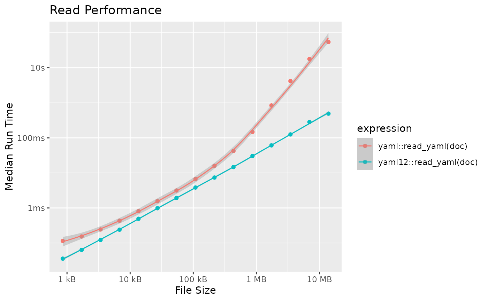

### Read results (detailed)

``` r
invisible(lapply(read_results, \(result) {
  print(plot(result) + ggplot2::ggtitle(scales::label_bytes()(result$file_size[1])))
  print(summary(result, filter_gc = FALSE))
}))
```

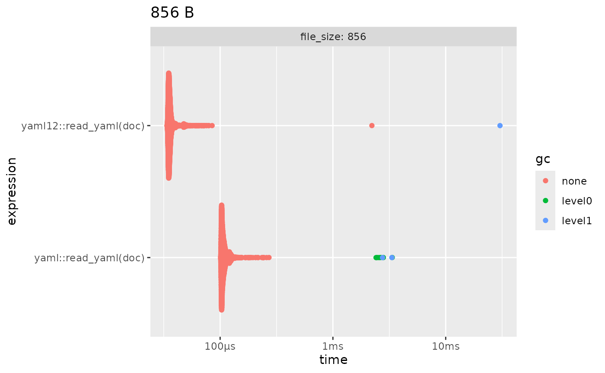

    #> # A tibble: 2 × 14
    #>   expression     file_size     min  median `itr/sec` mem_alloc `gc/sec`
    #>   <bch:expr>         <dbl> <bch:t> <bch:t>     <dbl> <bch:byt>    <dbl>
    #> 1 yaml12::read_…       856  33.8µs  35.4µs    25211.     2.6KB     2.52
    #> 2 yaml::read_ya…       856   101µs 105.5µs     8800.    34.8KB    16.0 
    #> # ℹ 7 more variables: n_itr <int>, n_gc <dbl>, total_time <bch:tm>,
    #> #   result <list>, memory <list>, time <list>, gc <list>

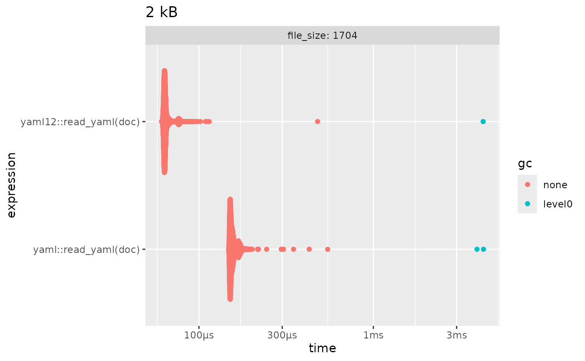

    #> # A tibble: 2 × 14
    #>   expression     file_size     min  median `itr/sec` mem_alloc `gc/sec`
    #>   <bch:expr>         <dbl> <bch:t> <bch:t>     <dbl> <bch:byt>    <dbl>
    #> 1 yaml12::read_…      1704  59.5µs  62.8µs    15509.        0B     2.00
    #> 2 yaml::read_ya…      1704 145.5µs 164.2µs     5097.    10.9KB     6.00
    #> # ℹ 7 more variables: n_itr <int>, n_gc <dbl>, total_time <bch:tm>,
    #> #   result <list>, memory <list>, time <list>, gc <list>

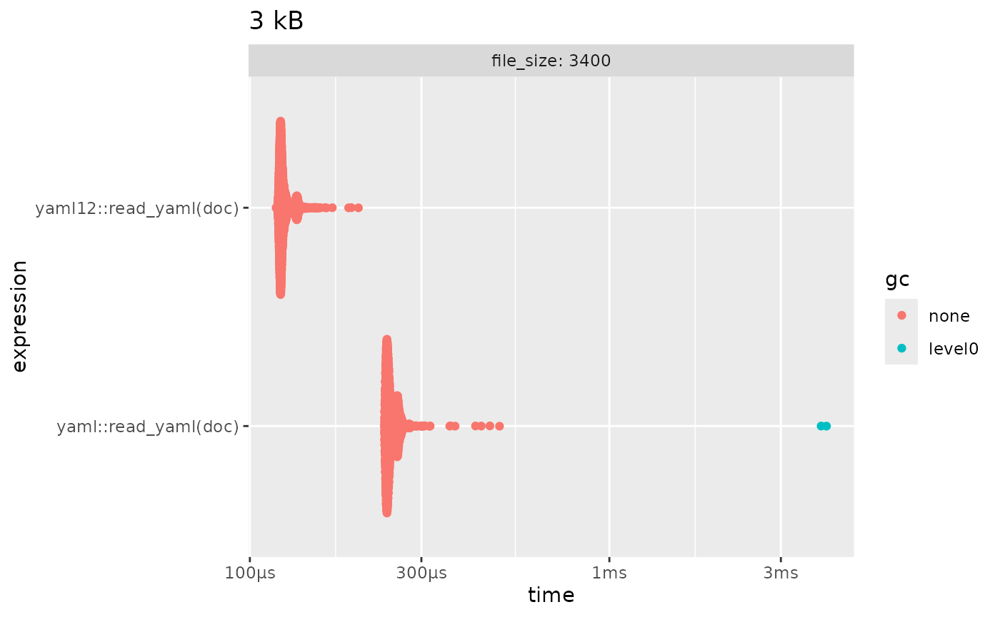

    #> # A tibble: 2 × 14
    #>   expression  file_size   min median `itr/sec` mem_alloc `gc/sec` n_itr
    #>   <bch:expr>      <dbl> <bch> <bch:>     <dbl> <bch:byt>    <dbl> <int>
    #> 1 yaml12::re…      3400 113µs  119µs     8262.        0B     0     4130
    #> 2 yaml::read…      3400 233µs  244µs     3971.    13.7KB     4.00  1986
    #> # ℹ 6 more variables: n_gc <dbl>, total_time <bch:tm>, result <list>,
    #> #   memory <list>, time <list>, gc <list>

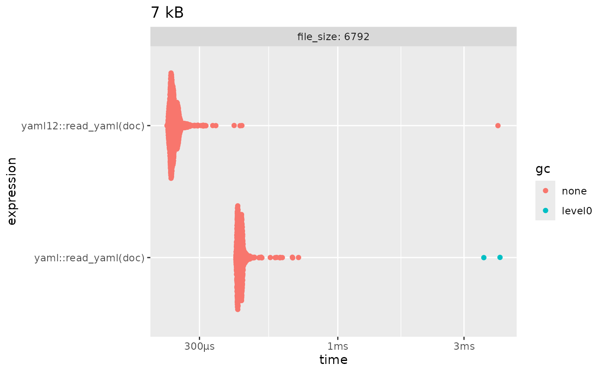

    #> # A tibble: 2 × 14
    #>   expression  file_size   min median `itr/sec` mem_alloc `gc/sec` n_itr
    #>   <bch:expr>      <dbl> <bch> <bch:>     <dbl> <bch:byt>    <dbl> <int>
    #> 1 yaml12::re…      6792 226µs  238µs     4116.        0B     0     2058
    #> 2 yaml::read…      6792 412µs  429µs     2293.    19.4KB     4.00  1147
    #> # ℹ 6 more variables: n_gc <dbl>, total_time <bch:tm>, result <list>,
    #> #   memory <list>, time <list>, gc <list>

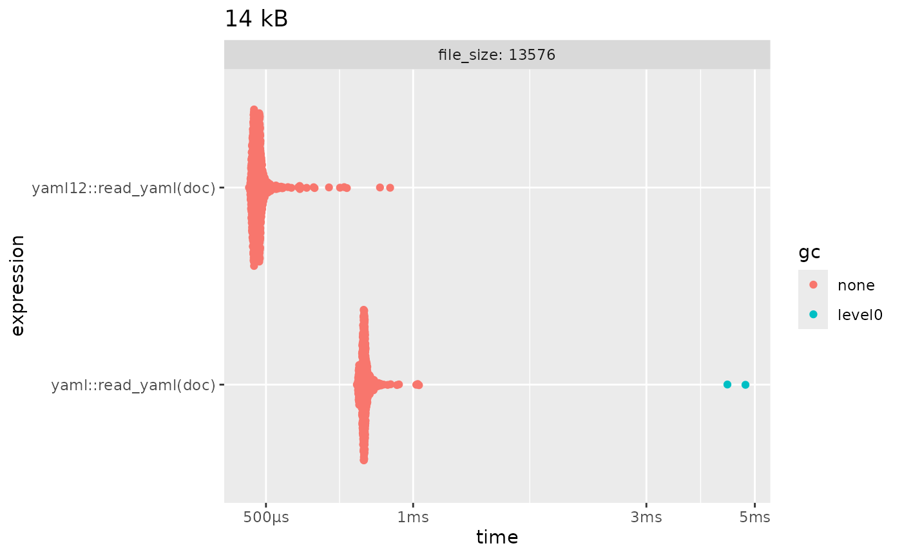

    #> # A tibble: 2 × 14
    #>   expression  file_size   min median `itr/sec` mem_alloc `gc/sec` n_itr
    #>   <bch:expr>      <dbl> <bch> <bch:>     <dbl> <bch:byt>    <dbl> <int>
    #> 1 yaml12::re…     13576 462µs  480µs     2068.      304B     0     1034
    #> 2 yaml::read…     13576 767µs  794µs     1234.    31.1KB     3.99   618
    #> # ℹ 6 more variables: n_gc <dbl>, total_time <bch:tm>, result <list>,
    #> #   memory <list>, time <list>, gc <list>

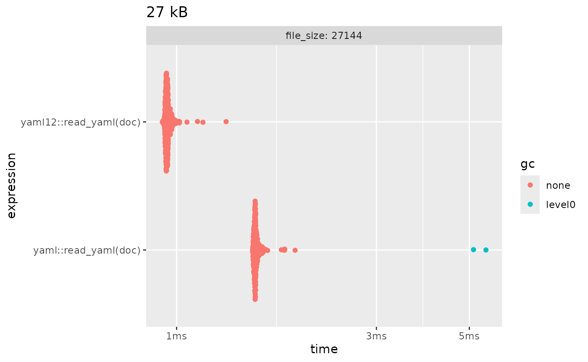

    #> # A tibble: 2 × 14
    #>   expression   file_size      min   median `itr/sec` mem_alloc `gc/sec`
    #>   <bch:expr>       <dbl> <bch:tm> <bch:tm>     <dbl> <bch:byt>    <dbl>
    #> 1 yaml12::rea…     27144 924.49µs 949.44µs     1048.      560B     0   
    #> 2 yaml::read_…     27144   1.52ms   1.54ms      635.    69.8KB     3.99
    #> # ℹ 7 more variables: n_itr <int>, n_gc <dbl>, total_time <bch:tm>,
    #> #   result <list>, memory <list>, time <list>, gc <list>

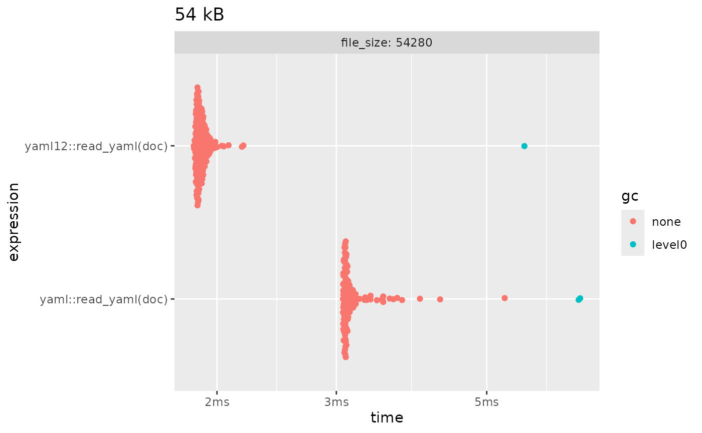

    #> # A tibble: 2 × 14
    #>   expression file_size    min median `itr/sec` mem_alloc `gc/sec` n_itr
    #>   <bch:expr>     <dbl> <bch:> <bch:>     <dbl> <bch:byt>    <dbl> <int>
    #> 1 yaml12::r…     54280 1.85ms 1.89ms      523.    1.05KB     2.00   262
    #> 2 yaml::rea…     54280 3.07ms  3.1ms      311.  147.06KB     3.96   157
    #> # ℹ 6 more variables: n_gc <dbl>, total_time <bch:tm>, result <list>,
    #> #   memory <list>, time <list>, gc <list>

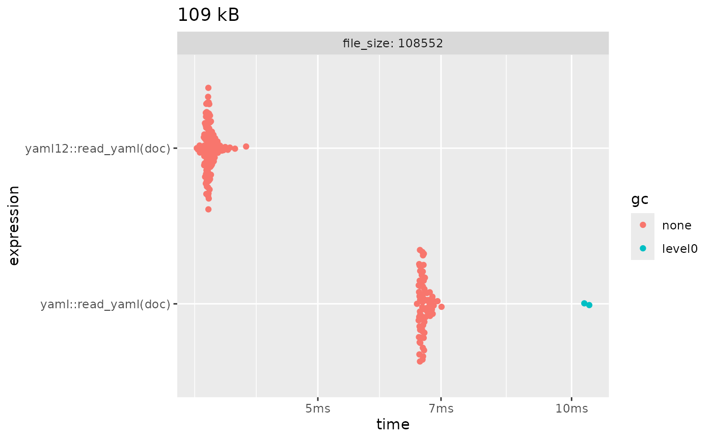

    #> # A tibble: 2 × 14
    #>   expression file_size    min median `itr/sec` mem_alloc `gc/sec` n_itr
    #>   <bch:expr>     <dbl> <bch:> <bch:>     <dbl> <bch:byt>    <dbl> <int>
    #> 1 yaml12::r…    108552 3.59ms 3.71ms      268.    2.05KB     0      135
    #> 2 yaml::rea…    108552 6.55ms 6.66ms      147.   301.6KB     3.99    74
    #> # ℹ 6 more variables: n_gc <dbl>, total_time <bch:tm>, result <list>,
    #> #   memory <list>, time <list>, gc <list>

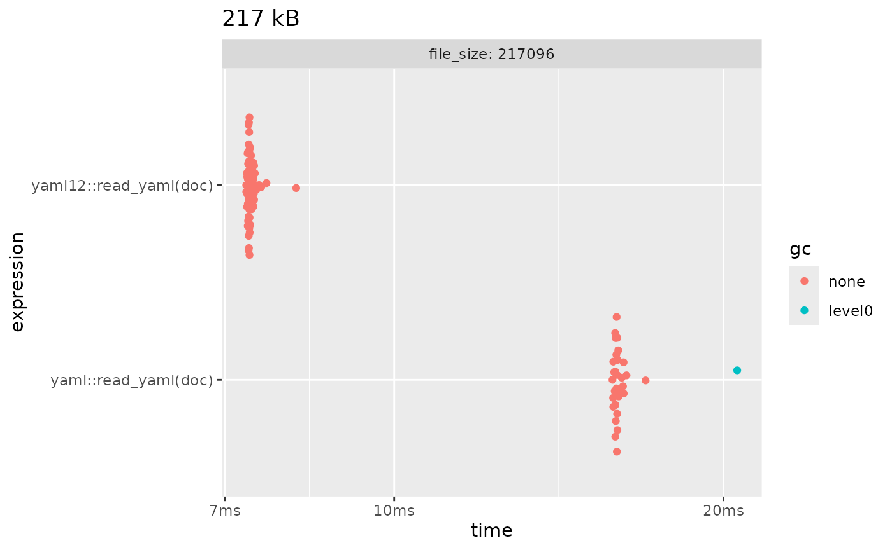

    #> # A tibble: 2 × 14
    #>   expression     file_size     min  median `itr/sec` mem_alloc `gc/sec`
    #>   <bch:expr>         <dbl> <bch:t> <bch:t>     <dbl> <bch:byt>    <dbl>
    #> 1 yaml12::read_…    217096  7.19ms  7.26ms     137.     4.05KB     0   
    #> 2 yaml::read_ya…    217096 15.68ms 15.85ms      62.5  610.65KB     1.95
    #> # ℹ 7 more variables: n_itr <int>, n_gc <dbl>, total_time <bch:tm>,
    #> #   result <list>, memory <list>, time <list>, gc <list>

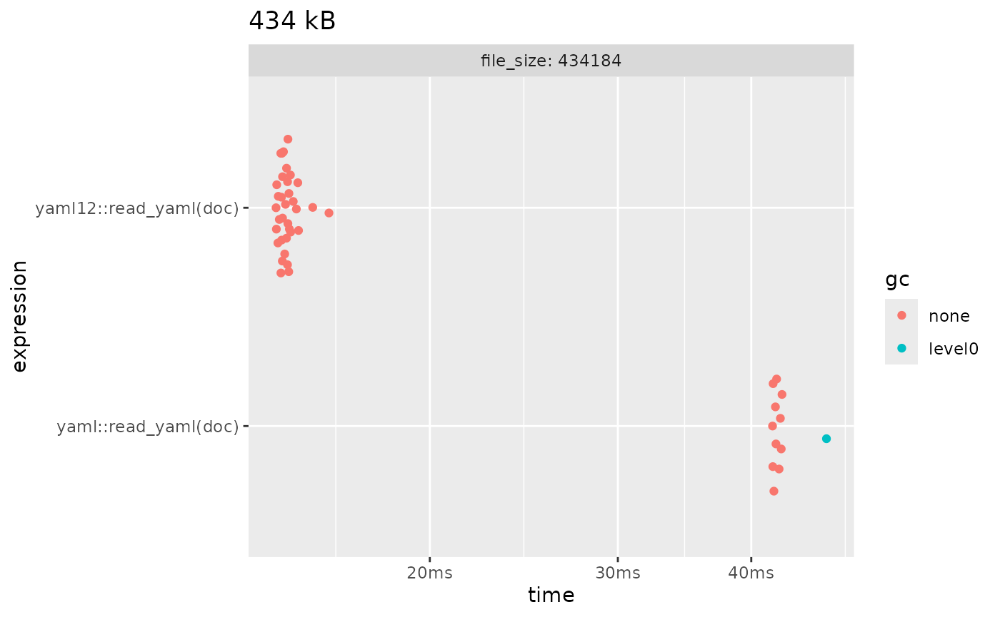

    #> # A tibble: 2 × 14
    #>   expression file_size    min median `itr/sec` mem_alloc `gc/sec` n_itr
    #>   <bch:expr>     <dbl> <bch:> <bch:>     <dbl> <bch:byt>    <dbl> <int>
    #> 1 yaml12::r…    434184 14.2ms 14.3ms      69.5    8.05KB     0       35
    #> 2 yaml::rea…    434184 41.4ms   42ms      23.5     1.2MB     1.96    12
    #> # ℹ 6 more variables: n_gc <dbl>, total_time <bch:tm>, result <list>,
    #> #   memory <list>, time <list>, gc <list>

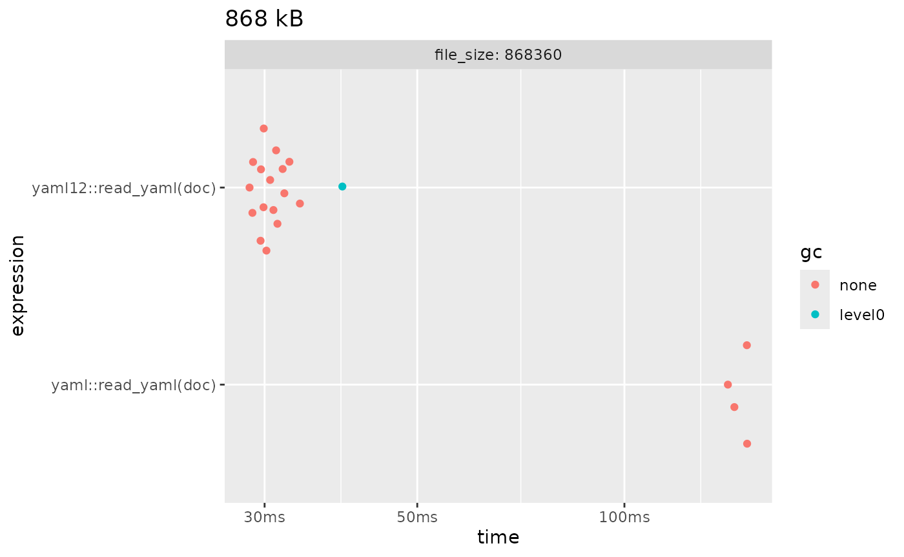

    #> # A tibble: 2 × 14
    #>   expression      file_size     min median `itr/sec` mem_alloc `gc/sec`
    #>   <bch:expr>          <dbl> <bch:t> <bch:>     <dbl> <bch:byt>    <dbl>
    #> 1 yaml12::read_y…    868360  27.6ms   28ms     35.0    16.05KB     1.94
    #> 2 yaml::read_yam…    868360 138.4ms  142ms      7.04    2.41MB     0   
    #> # ℹ 7 more variables: n_itr <int>, n_gc <dbl>, total_time <bch:tm>,
    #> #   result <list>, memory <list>, time <list>, gc <list>

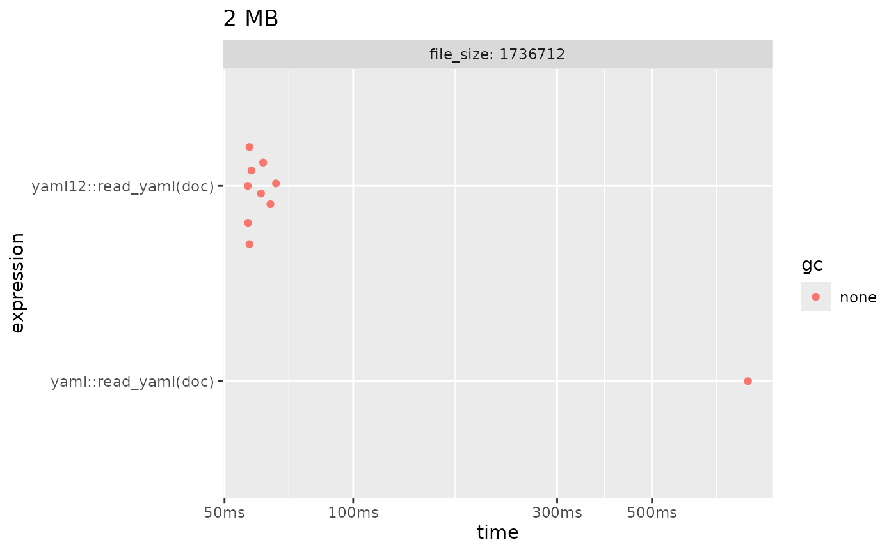

    #> # A tibble: 2 × 14
    #>   expression     file_size     min  median `itr/sec` mem_alloc `gc/sec`
    #>   <bch:expr>         <dbl> <bch:t> <bch:t>     <dbl> <bch:byt>    <dbl>
    #> 1 yaml12::read_…   1736712  56.6ms  57.8ms     16.7    32.05KB        0
    #> 2 yaml::read_ya…   1736712 838.5ms 838.5ms      1.19    4.82MB        0
    #> # ℹ 7 more variables: n_itr <int>, n_gc <dbl>, total_time <bch:tm>,
    #> #   result <list>, memory <list>, time <list>, gc <list>

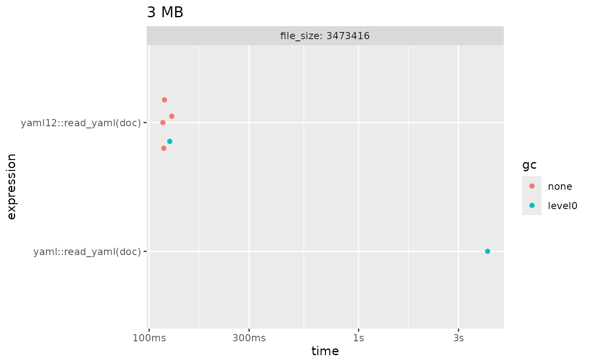

    #> # A tibble: 2 × 14
    #>   expression   file_size      min   median `itr/sec` mem_alloc `gc/sec`
    #>   <bch:expr>       <dbl> <bch:tm> <bch:tm>     <dbl> <bch:byt>    <dbl>
    #> 1 yaml12::rea…   3473416 116.23ms 118.32ms     8.26    64.05KB    1.65 
    #> 2 yaml::read_…   3473416    4.13s    4.13s     0.242    9.65MB    0.242
    #> # ℹ 7 more variables: n_itr <int>, n_gc <dbl>, total_time <bch:tm>,
    #> #   result <list>, memory <list>, time <list>, gc <list>

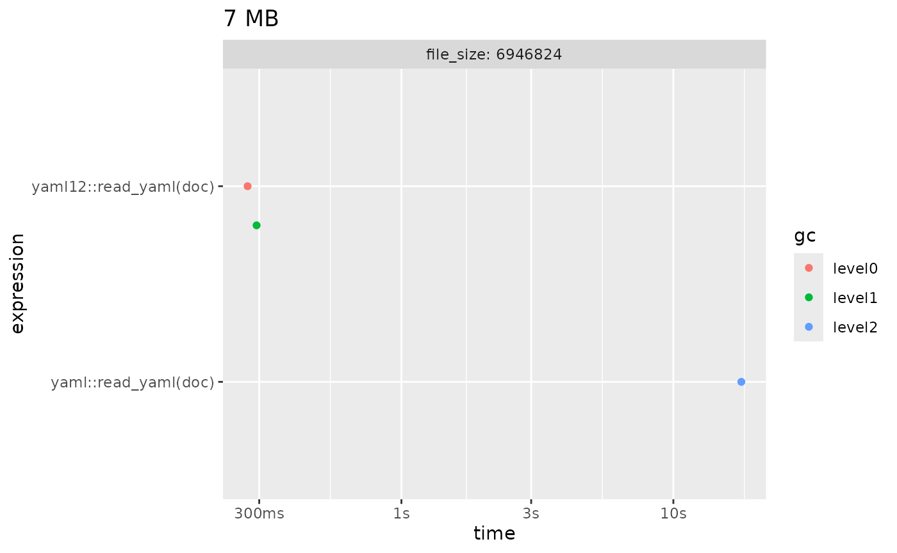

    #> # A tibble: 2 × 14
    #>   expression     file_size     min  median `itr/sec` mem_alloc `gc/sec`
    #>   <bch:expr>         <dbl> <bch:t> <bch:t>     <dbl> <bch:byt>    <dbl>
    #> 1 yaml12::read_…   6946824 244.6ms 251.1ms    3.98       128KB    1.99 
    #> 2 yaml::read_ya…   6946824   17.3s   17.3s    0.0579    19.3MB    0.116
    #> # ℹ 7 more variables: n_itr <int>, n_gc <dbl>, total_time <bch:tm>,
    #> #   result <list>, memory <list>, time <list>, gc <list>

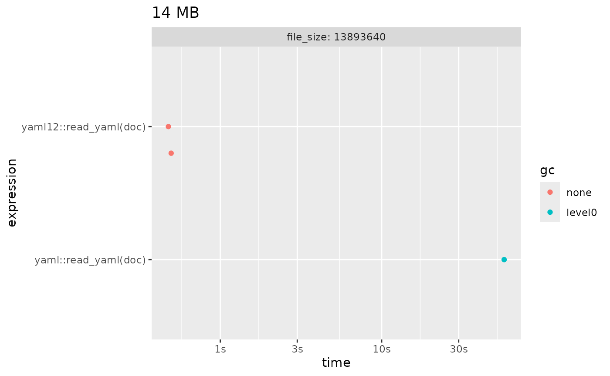

    #> # A tibble: 2 × 14
    #>   expression     file_size     min  median `itr/sec` mem_alloc `gc/sec`
    #>   <bch:expr>         <dbl> <bch:t> <bch:t>     <dbl> <bch:byt>    <dbl>
    #> 1 yaml12::read_…  13893640 477.1ms 486.7ms    2.05       256KB   0     
    #> 2 yaml::read_ya…  13893640   57.4s   57.4s    0.0174    38.6MB   0.0523
    #> # ℹ 7 more variables: n_itr <int>, n_gc <dbl>, total_time <bch:tm>,
    #> #   result <list>, memory <list>, time <list>, gc <list>

## Write performance

``` r
objs <- lapply(2^(1:15), function(n) rep(list(mixed_node), n))

write_results <- lapply(objs, function(obj) {
  result <- bench::mark(
    yaml12::write_yaml(obj, nullfile()),
    yaml::write_yaml(obj, nullfile()),
    check = FALSE
  )
  result$obj_size <- object.size(obj)
  result
})
#> Warning: Some expressions had a GC in every iteration; so filtering is
#> disabled.
```

### Write results summary:

``` r
write_results_df <- bind_rows(write_results) |>
  mutate(expression = as.factor(sapply(expression, deparse1)))
```

``` r
write_results_df |>
  ggplot(aes(x = obj_size, y = median, color = expression)) +
  labs(
    y = "Median Run Time",
    x = "Object Size",
    title = "Write Performance"
  ) +
  geom_point() +
  geom_smooth(linewidth = .5) +
  scale_x_log10(labels = scales::label_bytes()) +
  scale_y_continuous(trans = bench::bench_time_trans())
#> `geom_smooth()` using method = 'loess' and formula = 'y ~ x'
```

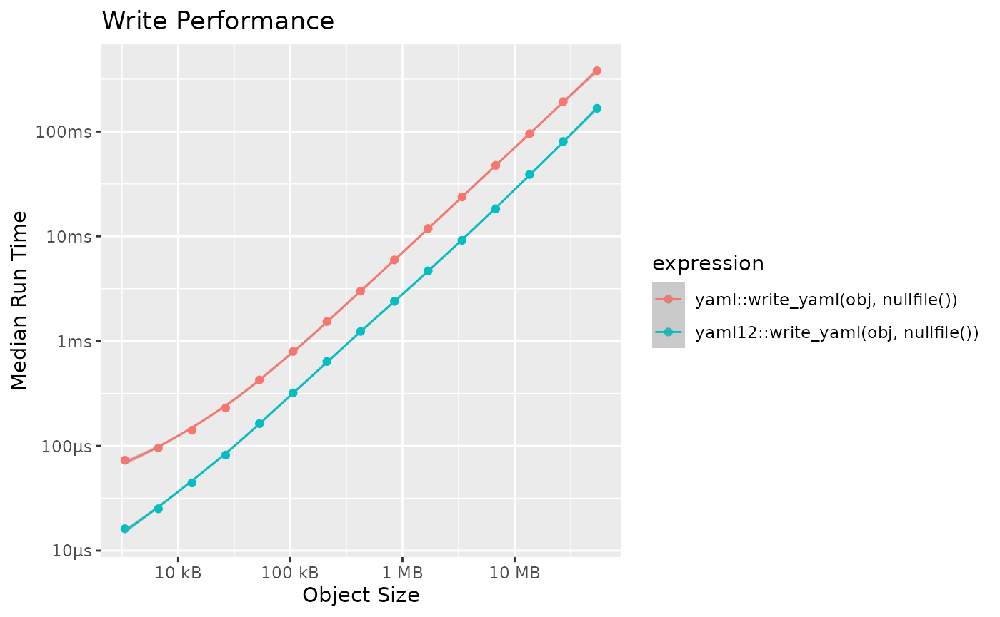

### Write results (detailed)

``` r
invisible(lapply(write_results, \(result) {
  print(plot(result) + ggplot2::ggtitle(scales::label_bytes()(as.numeric(result$obj_size[1]))))
  print(summary(result, filter_gc = FALSE))
}))
```

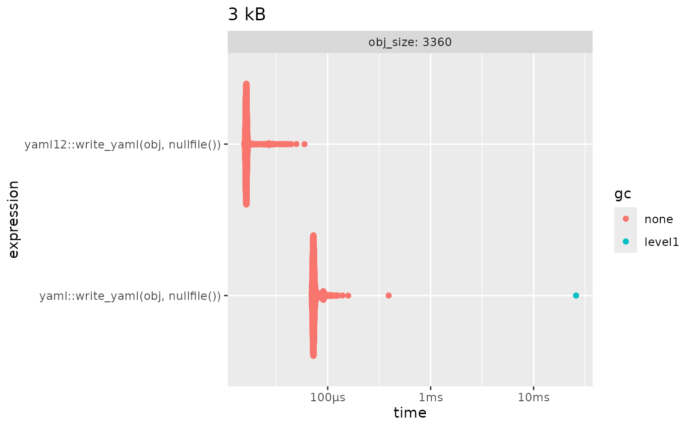

    #> # A tibble: 2 × 14
    #>   expression  obj_size    min median `itr/sec` mem_alloc `gc/sec` n_itr
    #>   <bch:expr>  <objct_> <bch:> <bch:>     <dbl> <bch:byt>    <dbl> <int>
    #> 1 yaml12::wr… 3360 by… 15.5µs 16.2µs    60666.    3.02KB     0    10000
    #> 2 yaml::writ… 3360 by… 69.8µs   73µs    12585.   33.67KB     2.00  6290
    #> # ℹ 6 more variables: n_gc <dbl>, total_time <bch:tm>, result <list>,
    #> #   memory <list>, time <list>, gc <list>


    #> # A tibble: 2 × 14
    #>   expression  obj_size    min median `itr/sec` mem_alloc `gc/sec` n_itr
    #>   <bch:expr>  <objct_> <bch:> <bch:>     <dbl> <bch:byt>    <dbl> <int>
    #> 1 yaml12::wr… 6672 by… 24.1µs 25.1µs    39219.        0B     0    10000
    #> 2 yaml::writ… 6672 by… 91.2µs 95.6µs     9836.    1.56KB     4.00  4917
    #> # ℹ 6 more variables: n_gc <dbl>, total_time <bch:tm>, result <list>,
    #> #   memory <list>, time <list>, gc <list>

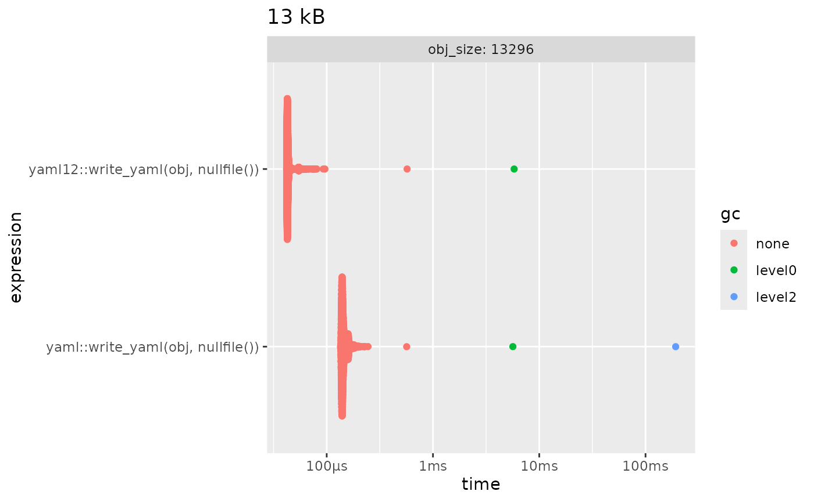

    #> # A tibble: 2 × 14
    #>   expression      obj_size     min  median `itr/sec` mem_alloc `gc/sec`
    #>   <bch:expr>      <objct_> <bch:t> <bch:t>     <dbl> <bch:byt>    <dbl>
    #> 1 yaml12::write_… 13296 b…  42.7µs  44.4µs    22185.        0B     0   
    #> 2 yaml::write_ya… 13296 b… 135.7µs   141µs     6799.    3.07KB     2.00
    #> # ℹ 7 more variables: n_itr <int>, n_gc <dbl>, total_time <bch:tm>,
    #> #   result <list>, memory <list>, time <list>, gc <list>

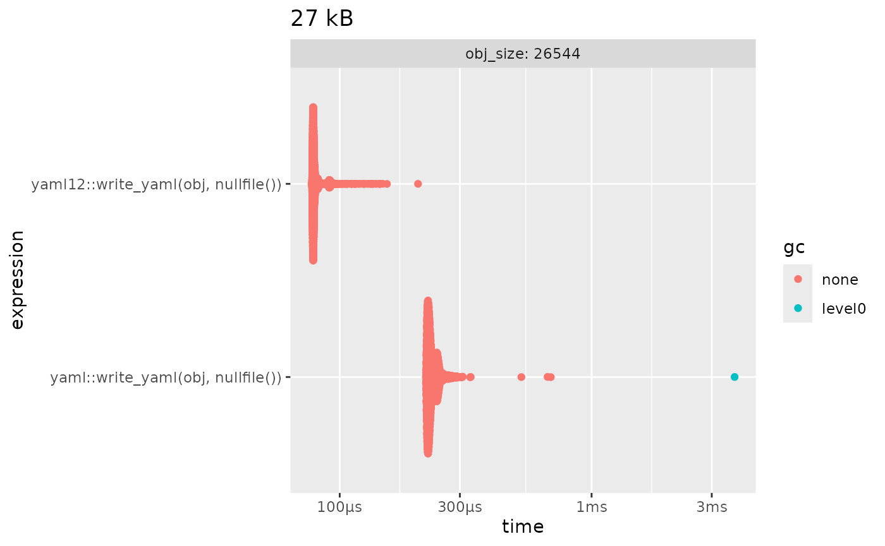

    #> # A tibble: 2 × 14
    #>   expression      obj_size     min  median `itr/sec` mem_alloc `gc/sec`
    #>   <bch:expr>      <objct_> <bch:t> <bch:t>     <dbl> <bch:byt>    <dbl>
    #> 1 yaml12::write_… 26544 b…  78.4µs  81.7µs    12020.        0B     0   
    #> 2 yaml::write_ya… 26544 b… 221.3µs   230µs     4200.    6.09KB     2.00
    #> # ℹ 7 more variables: n_itr <int>, n_gc <dbl>, total_time <bch:tm>,
    #> #   result <list>, memory <list>, time <list>, gc <list>

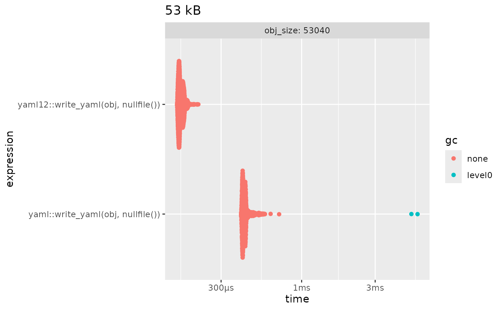

    #> # A tibble: 2 × 14
    #>   expression   obj_size   min median `itr/sec` mem_alloc `gc/sec` n_itr
    #>   <bch:expr>   <objct_> <bch> <bch:>     <dbl> <bch:byt>    <dbl> <int>
    #> 1 yaml12::wri… 53040 b… 155µs  163µs     6050.        0B     0     3025
    #> 2 yaml::write… 53040 b… 405µs  425µs     2275.    12.1KB     4.00  1138
    #> # ℹ 6 more variables: n_gc <dbl>, total_time <bch:tm>, result <list>,
    #> #   memory <list>, time <list>, gc <list>

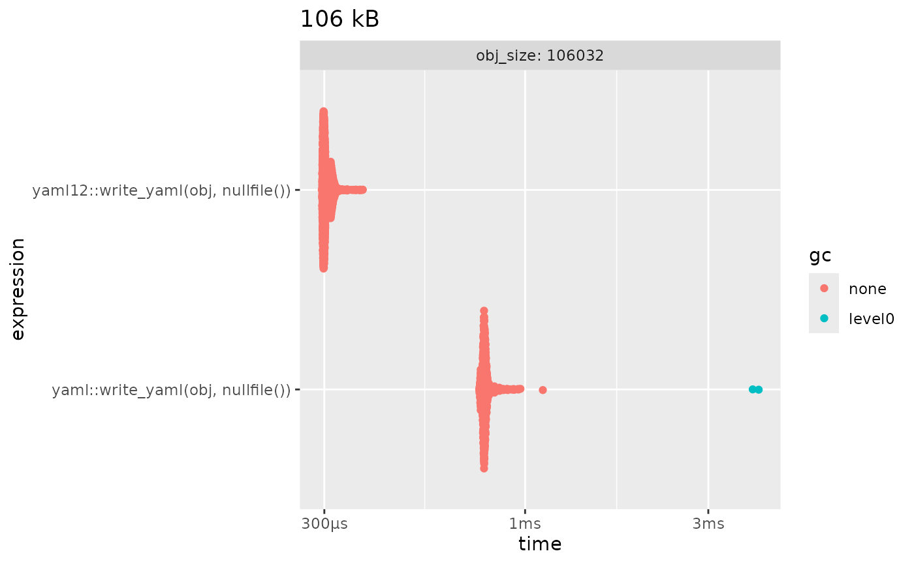

    #> # A tibble: 2 × 14
    #>   expression   obj_size   min median `itr/sec` mem_alloc `gc/sec` n_itr
    #>   <bch:expr>   <objct_> <bch> <bch:>     <dbl> <bch:byt>    <dbl> <int>
    #> 1 yaml12::wri… 106032 … 308µs  320µs     3103.        0B     0     1552
    #> 2 yaml::write… 106032 … 768µs  796µs     1228.    24.2KB     2.00   615
    #> # ℹ 6 more variables: n_gc <dbl>, total_time <bch:tm>, result <list>,
    #> #   memory <list>, time <list>, gc <list>

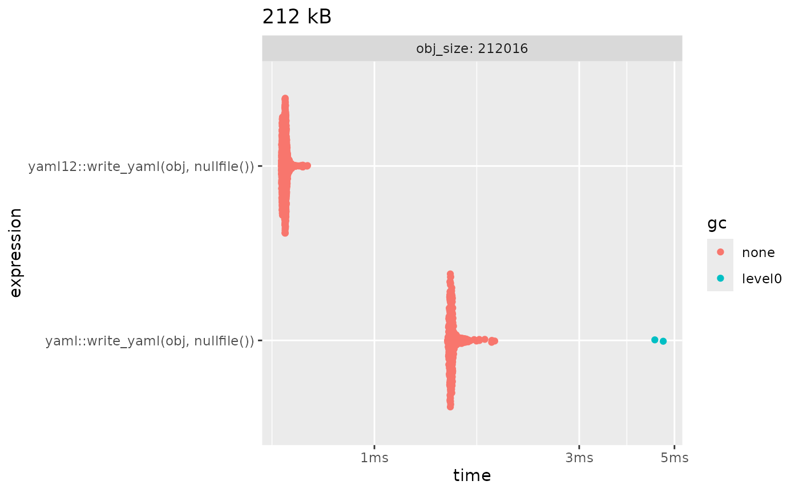

    #> # A tibble: 2 × 14
    #>   expression     obj_size     min   median `itr/sec` mem_alloc `gc/sec`
    #>   <bch:expr>     <objct_> <bch:t> <bch:tm>     <dbl> <bch:byt>    <dbl>
    #> 1 yaml12::write… 212016 … 617.7µs 638.18µs     1565.        0B     0   
    #> 2 yaml::write_y… 212016 …   1.5ms   1.54ms      628.    48.3KB     3.99
    #> # ℹ 7 more variables: n_itr <int>, n_gc <dbl>, total_time <bch:tm>,
    #> #   result <list>, memory <list>, time <list>, gc <list>


    #> # A tibble: 2 × 14
    #>   expression  obj_size    min median `itr/sec` mem_alloc `gc/sec` n_itr
    #>   <bch:expr>  <objct_> <bch:> <bch:>     <dbl> <bch:byt>    <dbl> <int>
    #> 1 yaml12::wr… 423984 … 1.21ms 1.24ms      807.        0B     0      404
    #> 2 yaml::writ… 423984 … 2.93ms    3ms      325.    96.6KB     1.99   163
    #> # ℹ 6 more variables: n_gc <dbl>, total_time <bch:tm>, result <list>,
    #> #   memory <list>, time <list>, gc <list>

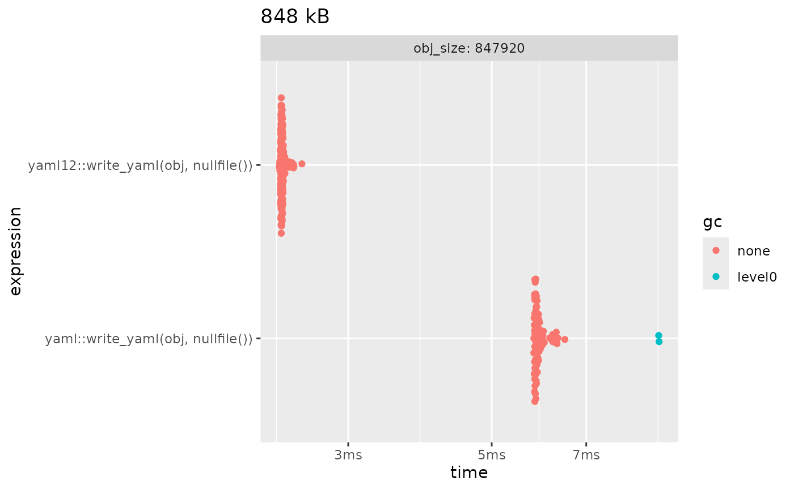

    #> # A tibble: 2 × 14
    #>   expression  obj_size    min median `itr/sec` mem_alloc `gc/sec` n_itr
    #>   <bch:expr>  <objct_> <bch:> <bch:>     <dbl> <bch:byt>    <dbl> <int>
    #> 1 yaml12::wr… 847920 … 2.37ms  2.4ms      417.        0B     0      209
    #> 2 yaml::writ… 847920 … 5.86ms 5.95ms      164.     193KB     1.98    83
    #> # ℹ 6 more variables: n_gc <dbl>, total_time <bch:tm>, result <list>,
    #> #   memory <list>, time <list>, gc <list>

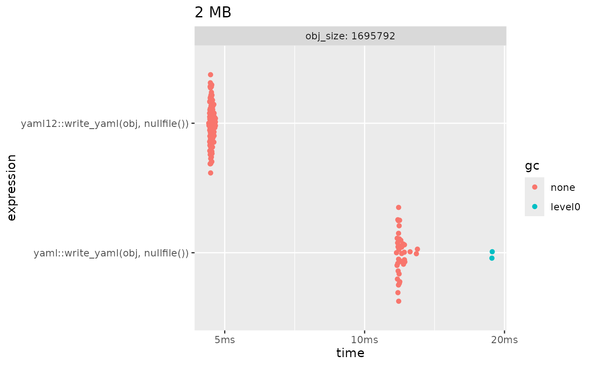

    #> # A tibble: 2 × 14
    #>   expression      obj_size     min  median `itr/sec` mem_alloc `gc/sec`
    #>   <bch:expr>      <objct_> <bch:t> <bch:t>     <dbl> <bch:byt>    <dbl>
    #> 1 yaml12::write_… 1695792…  4.62ms  4.68ms     213.         0B     0   
    #> 2 yaml::write_ya… 1695792… 11.71ms 11.88ms      81.3     386KB     3.96
    #> # ℹ 7 more variables: n_itr <int>, n_gc <dbl>, total_time <bch:tm>,
    #> #   result <list>, memory <list>, time <list>, gc <list>

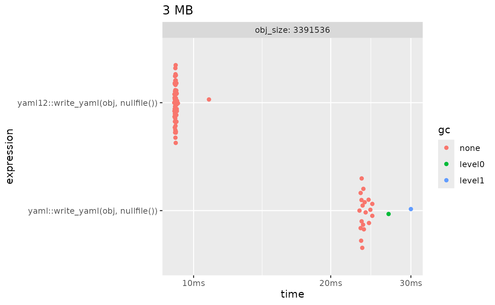

    #> # A tibble: 2 × 14
    #>   expression      obj_size     min  median `itr/sec` mem_alloc `gc/sec`
    #>   <bch:expr>      <objct_> <bch:t> <bch:t>     <dbl> <bch:byt>    <dbl>
    #> 1 yaml12::write_… 3391536…  9.07ms  9.15ms     109.         0B     0   
    #> 2 yaml::write_ya… 3391536… 23.32ms 23.75ms      41.4     772KB     1.97
    #> # ℹ 7 more variables: n_itr <int>, n_gc <dbl>, total_time <bch:tm>,
    #> #   result <list>, memory <list>, time <list>, gc <list>

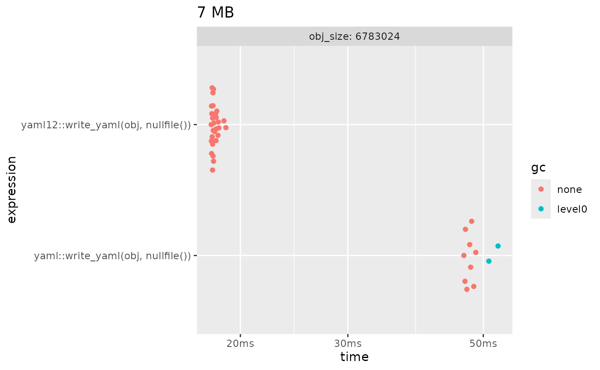

    #> # A tibble: 2 × 14
    #>   expression  obj_size    min median `itr/sec` mem_alloc `gc/sec` n_itr
    #>   <bch:expr>  <objct_> <bch:> <bch:>     <dbl> <bch:byt>    <dbl> <int>
    #> 1 yaml12::wr… 6783024… 18.1ms 18.3ms      54.6        0B     0       28
    #> 2 yaml::writ… 6783024…   47ms 47.6ms      20.4    1.51MB     3.71    11
    #> # ℹ 6 more variables: n_gc <dbl>, total_time <bch:tm>, result <list>,
    #> #   memory <list>, time <list>, gc <list>

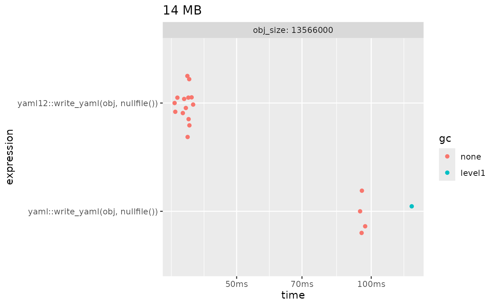

    #> # A tibble: 2 × 14
    #>   expression  obj_size    min median `itr/sec` mem_alloc `gc/sec` n_itr
    #>   <bch:expr>  <objct_> <bch:> <bch:>     <dbl> <bch:byt>    <dbl> <int>
    #> 1 yaml12::wr… 1356600… 36.3ms 38.8ms     26.0         0B     0       14
    #> 2 yaml::writ… 1356600… 94.4ms 95.3ms      9.90    3.02MB     1.98     5
    #> # ℹ 6 more variables: n_gc <dbl>, total_time <bch:tm>, result <list>,
    #> #   memory <list>, time <list>, gc <list>

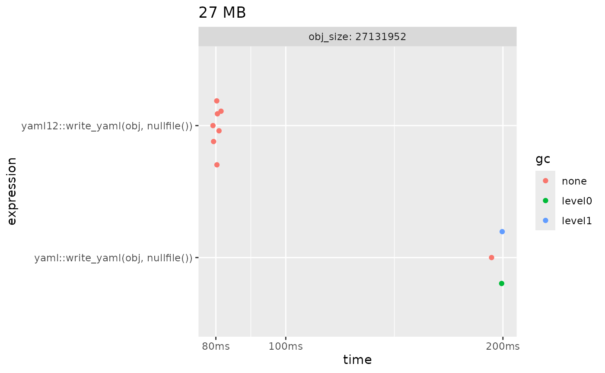

    #> # A tibble: 2 × 14
    #>   expression      obj_size     min  median `itr/sec` mem_alloc `gc/sec`
    #>   <bch:expr>      <objct_> <bch:t> <bch:t>     <dbl> <bch:byt>    <dbl>
    #> 1 yaml12::write_… 2713195…  79.3ms  80.3ms     12.5         0B     0   
    #> 2 yaml::write_ya… 2713195… 192.9ms 199.2ms      5.07    6.03MB     3.38
    #> # ℹ 7 more variables: n_itr <int>, n_gc <dbl>, total_time <bch:tm>,
    #> #   result <list>, memory <list>, time <list>, gc <list>

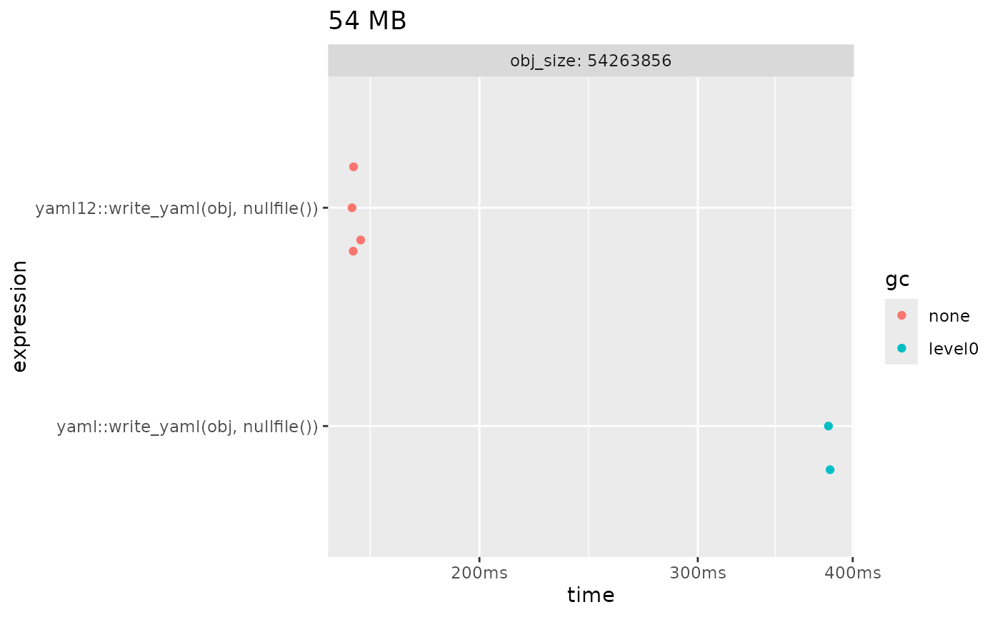

    #> # A tibble: 2 × 14
    #>   expression   obj_size   min median `itr/sec` mem_alloc `gc/sec` n_itr
    #>   <bch:expr>   <objct_> <bch> <bch:>     <dbl> <bch:byt>    <dbl> <int>
    #> 1 yaml12::wri… 5426385… 166ms  166ms      5.98        0B     0        3
    #> 2 yaml::write… 5426385… 379ms  380ms      2.63    12.1MB     2.63     2
    #> # ℹ 6 more variables: n_gc <dbl>, total_time <bch:tm>, result <list>,
    #> #   memory <list>, time <list>, gc <list>

## Conclusion

Across all tested file sizes and for this workload, `yaml12` is faster
than `yaml` at reading and writing YAML.
