# Benchmarks

## Goal

Compare `yaml12` and `yaml` for reading and writing YAML over a range of
document sizes.

We intentionally avoid testing semantic differences between YAML 1.1 and
1.2, as well as less-used YAML features like tags and streams. Instead,
we focus on the simple default usage of both.

Operations:

- **read**: YAML file → R object
- **write**: R object → YAML (written to
  [`nullfile()`](https://rdrr.io/r/base/showConnections.html))

## Setup

``` r

library(dplyr, warn.conflicts = FALSE)
library(ggplot2)
```

### Generate inputs

To benchmark, we create YAML files consisting of a repeating sequence of
a small, fixed “mixed” node, repeated `2^(1:15)` times. This node is
designed to exercise the full YAML 1.2 core schema (every core type is
represented). We generate these files with
[`yaml12::write_yaml()`](https://posit-dev.github.io/r-yaml12/dev/reference/format_yaml.md).

Each file is written to a temporary file and then we measure read time.
Note that on macOS and Linux,
[`tempfile()`](https://rdrr.io/r/base/tempfile.html) paths often live on
a `tmpfs` in RAM, so this typically won’t trigger a write to disk under
most circumstances.

``` r

# A YAML node that exercises every core schema type:
#   seq, map, str, bool, int, float, null
mixed_node <- list(
  str = c(
    "Lorem ipsum dolor sit amet, vel accumsan vitae faucibus ultrices leo",
    "neque? Et cursus lacinia, ut, sit donec facilisi eu interdum. Dui",
    "ipsum, vitae ligula commodo convallis ac sed nunc. Ipsum at nec lacus",
    "eros suscipit vitae."
  ),
  block_str = "lorem \n ipsum \n dolor\n",
  bools = c(TRUE, FALSE),
  ints = c(123L, -123L),
  floats = c(123.456, -123.456),
  null = NULL
)
```

``` r

make_yaml_doc <- function(size = 1) {
  path <- tempfile(fileext = ".yaml")
  yaml12::write_yaml(rep(list(mixed_node), size), path)
  path
}

docs <- sapply(2^(1:15), make_yaml_doc)
```

## Read performance

``` r

read_results <- lapply(docs, function(doc) {
  result <- bench::mark(
    yaml12::read_yaml(doc),
    yaml::read_yaml(doc),
    check = FALSE
  )
  result$file_size <- file.info(doc)$size
  result
})
#> Warning: Some expressions had a GC in every iteration; so filtering is
#> disabled.
#> Warning: Some expressions had a GC in every iteration; so filtering is
#> disabled.
#> Warning: Some expressions had a GC in every iteration; so filtering is
#> disabled.
```

### Read results summary

``` r

read_results_df <- bind_rows(read_results) |>
  mutate(expression = as.factor(sapply(expression, deparse1)))
```

``` r

read_results_df |>
  ggplot(aes(x = file_size, y = median, color = expression)) +
  labs(
    y = "Median Run Time",
    x = "File Size",
    title = "Read Performance"
  ) +
  geom_point() +
  geom_smooth(linewidth = .5) +
  scale_x_log10(labels = scales::label_bytes()) +
  scale_y_continuous(trans = bench::bench_time_trans())
#> `geom_smooth()` using method = 'loess' and formula = 'y ~ x'
```

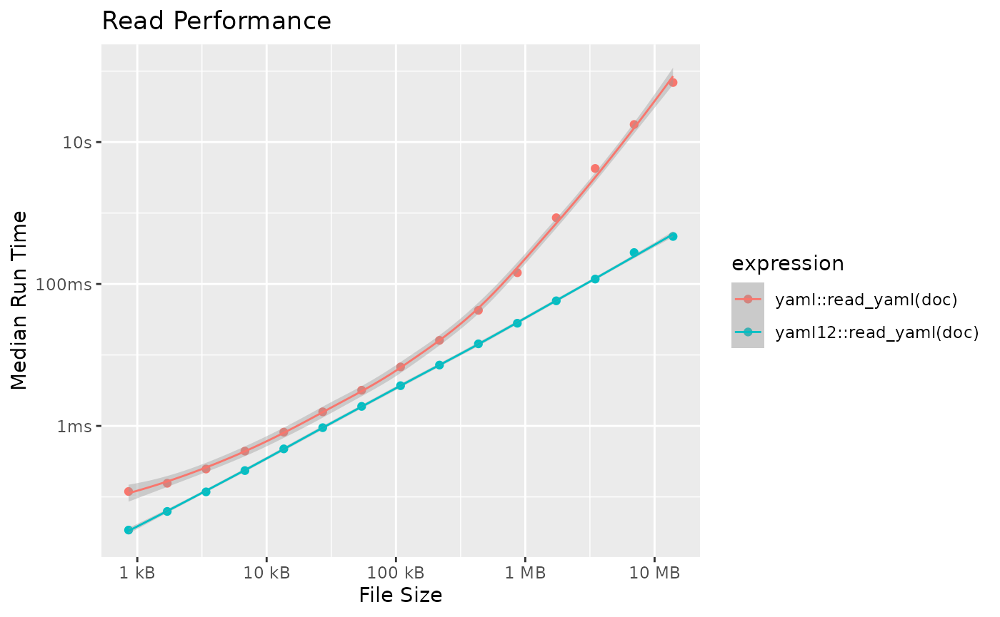

### Read results (detailed)

``` r

invisible(lapply(read_results, \(result) {
  print(plot(result) + ggplot2::ggtitle(scales::label_bytes()(result$file_size[1])))
  print(summary(result, filter_gc = FALSE))
}))
```

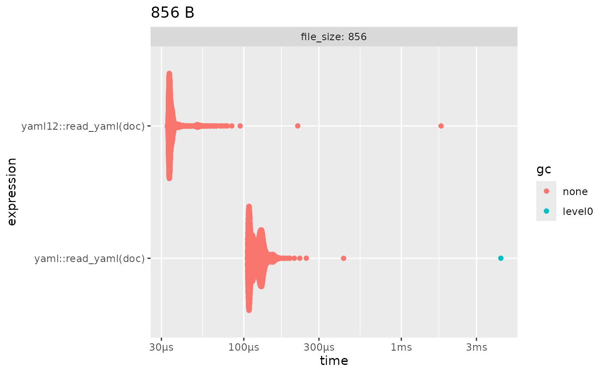

    #> # A tibble: 2 × 14
    #>   expression     file_size     min  median `itr/sec` mem_alloc `gc/sec`
    #>   <bch:expr>         <dbl> <bch:t> <bch:t>     <dbl> <bch:byt>    <dbl>
    #> 1 yaml12::read_…       856  32.7µs  34.1µs    28303.     2.6KB     0   
    #> 2 yaml::read_ya…       856 105.4µs 119.2µs     8164.    34.8KB     2.00
    #> # ℹ 7 more variables: n_itr <int>, n_gc <dbl>, total_time <bch:tm>,
    #> #   result <list>, memory <list>, time <list>, gc <list>

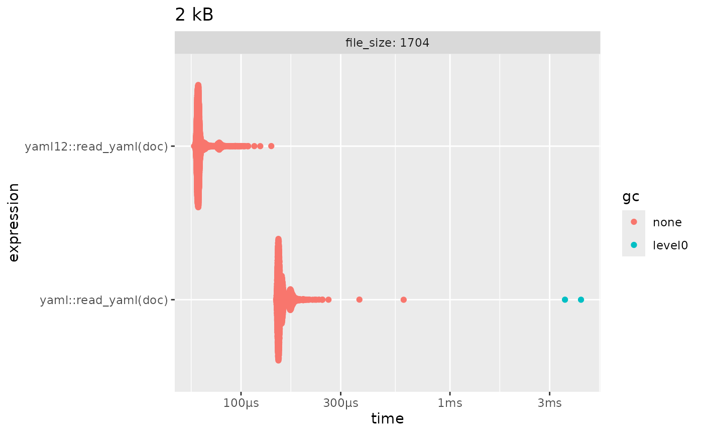

    #> # A tibble: 2 × 14
    #>   expression     file_size     min  median `itr/sec` mem_alloc `gc/sec`
    #>   <bch:expr>         <dbl> <bch:t> <bch:t>     <dbl> <bch:byt>    <dbl>
    #> 1 yaml12::read_…      1704  59.7µs  62.4µs    15510.        0B     0   
    #> 2 yaml::read_ya…      1704 148.7µs 155.6µs     6155.    10.9KB     4.00
    #> # ℹ 7 more variables: n_itr <int>, n_gc <dbl>, total_time <bch:tm>,
    #> #   result <list>, memory <list>, time <list>, gc <list>

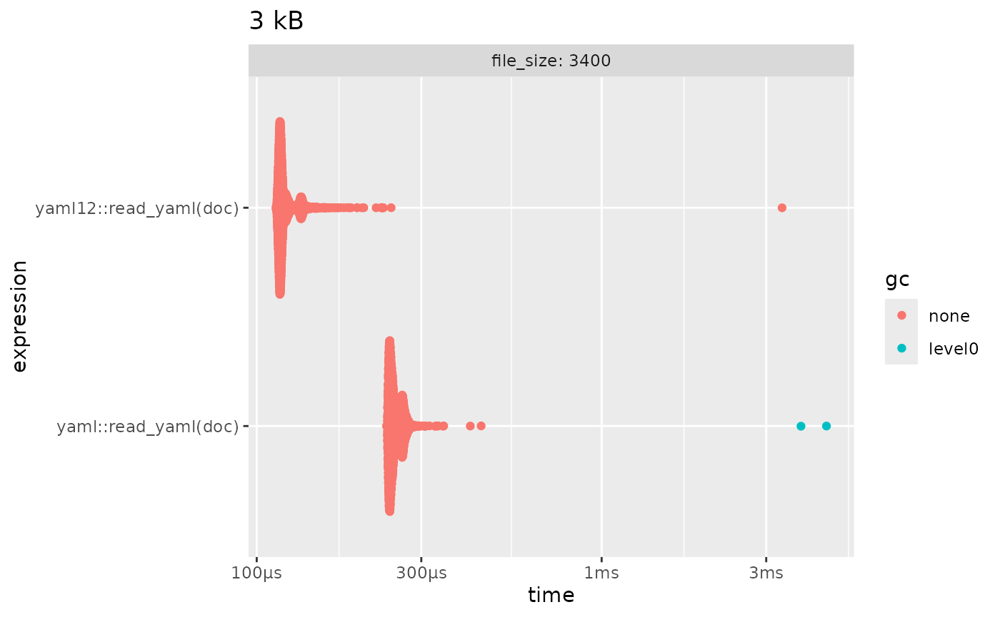

    #> # A tibble: 2 × 14
    #>   expression  file_size   min median `itr/sec` mem_alloc `gc/sec` n_itr
    #>   <bch:expr>      <dbl> <bch> <bch:>     <dbl> <bch:byt>    <dbl> <int>
    #> 1 yaml12::re…      3400 114µs  118µs     8201.        0B     0     4100
    #> 2 yaml::read…      3400 238µs  247µs     3905.    13.7KB     4.00  1953
    #> # ℹ 6 more variables: n_gc <dbl>, total_time <bch:tm>, result <list>,
    #> #   memory <list>, time <list>, gc <list>

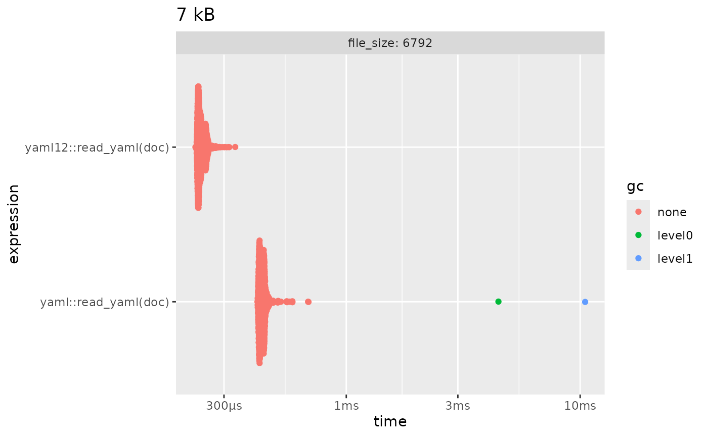

    #> # A tibble: 2 × 14
    #>   expression  file_size   min median `itr/sec` mem_alloc `gc/sec` n_itr
    #>   <bch:expr>      <dbl> <bch> <bch:>     <dbl> <bch:byt>    <dbl> <int>
    #> 1 yaml12::re…      6792 227µs  235µs     4176.        0B     0     2088
    #> 2 yaml::read…      6792 419µs  442µs     2190.    19.4KB     4.00  1095
    #> # ℹ 6 more variables: n_gc <dbl>, total_time <bch:tm>, result <list>,
    #> #   memory <list>, time <list>, gc <list>

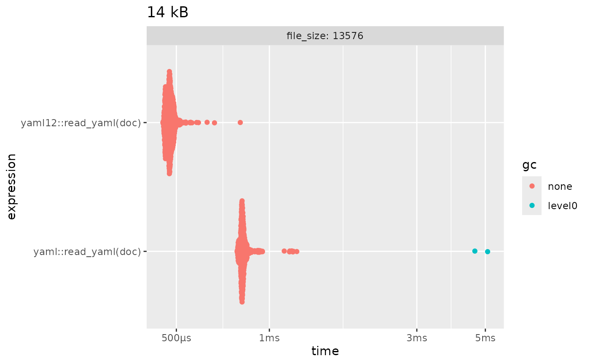

    #> # A tibble: 2 × 14
    #>   expression  file_size   min median `itr/sec` mem_alloc `gc/sec` n_itr
    #>   <bch:expr>      <dbl> <bch> <bch:>     <dbl> <bch:byt>    <dbl> <int>
    #> 1 yaml12::re…     13576 452µs  475µs     2097.      304B     0     1049
    #> 2 yaml::read…     13576 786µs  818µs     1190.    31.1KB     3.99   596
    #> # ℹ 6 more variables: n_gc <dbl>, total_time <bch:tm>, result <list>,
    #> #   memory <list>, time <list>, gc <list>

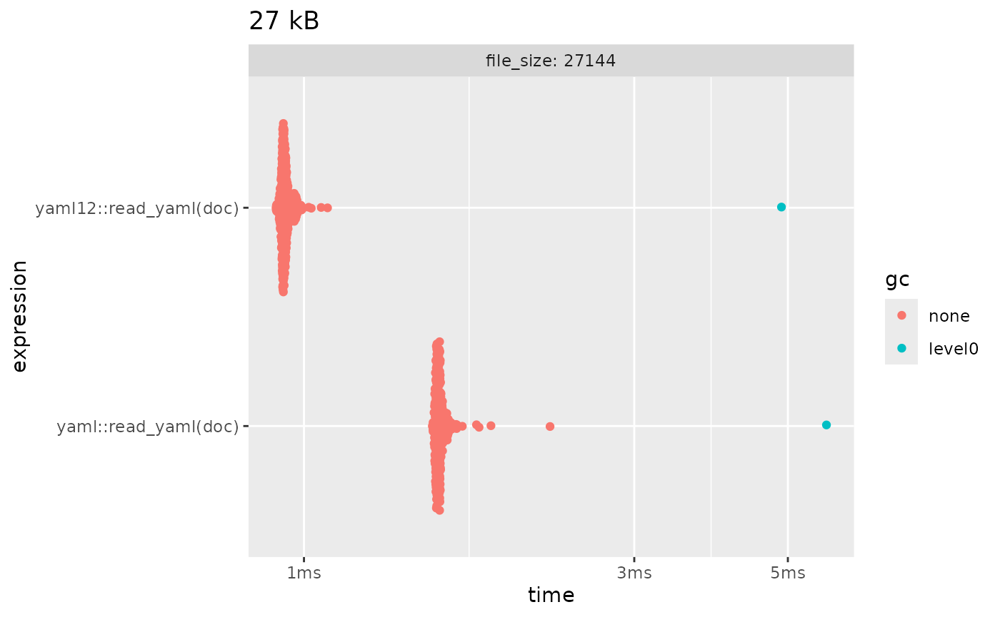

    #> # A tibble: 2 × 14
    #>   expression   file_size      min   median `itr/sec` mem_alloc `gc/sec`
    #>   <bch:expr>       <dbl> <bch:tm> <bch:tm>     <dbl> <bch:byt>    <dbl>
    #> 1 yaml12::rea…     27144 894.17µs 945.19µs     1054.      560B     0   
    #> 2 yaml::read_…     27144   1.54ms   1.58ms      616.    69.8KB     4.00
    #> # ℹ 7 more variables: n_itr <int>, n_gc <dbl>, total_time <bch:tm>,
    #> #   result <list>, memory <list>, time <list>, gc <list>

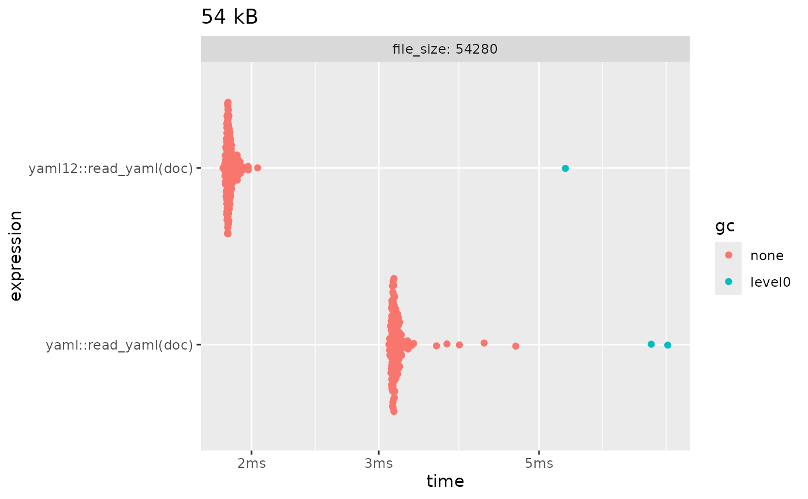

    #> # A tibble: 2 × 14
    #>   expression file_size    min median `itr/sec` mem_alloc `gc/sec` n_itr
    #>   <bch:expr>     <dbl> <bch:> <bch:>     <dbl> <bch:byt>    <dbl> <int>
    #> 1 yaml12::r…     54280 1.83ms 1.89ms      521.    1.05KB     2.00   261
    #> 2 yaml::rea…     54280 3.14ms 3.19ms      308.  147.06KB     2.00   154
    #> # ℹ 6 more variables: n_gc <dbl>, total_time <bch:tm>, result <list>,
    #> #   memory <list>, time <list>, gc <list>

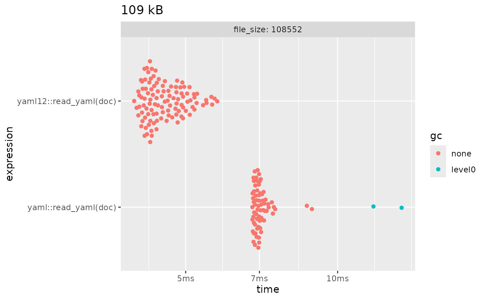

    #> # A tibble: 2 × 14
    #>   expression file_size    min median `itr/sec` mem_alloc `gc/sec` n_itr
    #>   <bch:expr>     <dbl> <bch:> <bch:>     <dbl> <bch:byt>    <dbl> <int>
    #> 1 yaml12::r…    108552 3.63ms 3.69ms      268.    2.05KB     2.00   134
    #> 2 yaml::rea…    108552 6.65ms 6.78ms      146.   301.6KB     1.99    73
    #> # ℹ 6 more variables: n_gc <dbl>, total_time <bch:tm>, result <list>,
    #> #   memory <list>, time <list>, gc <list>

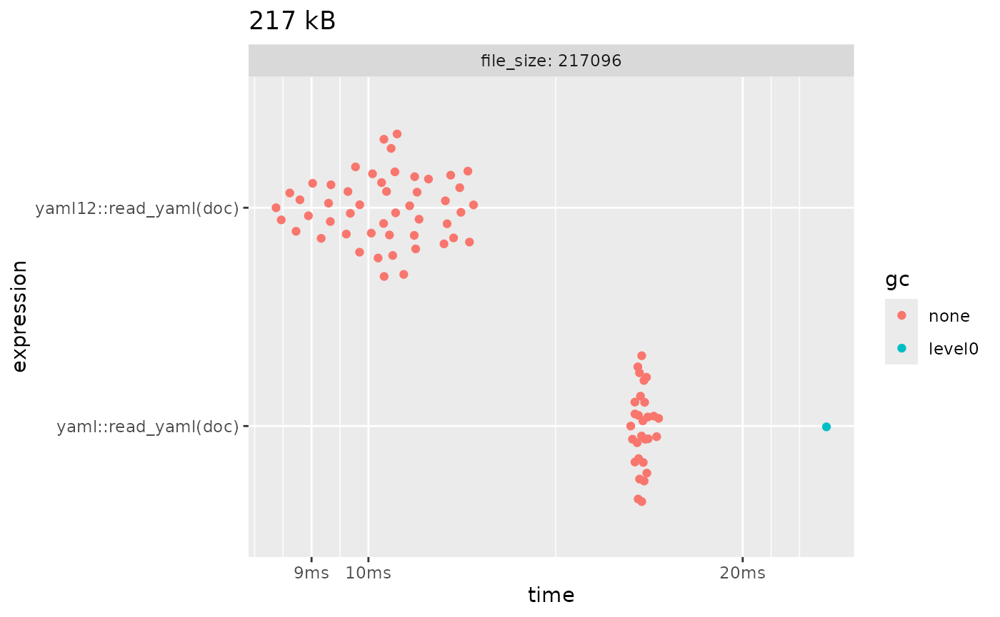

    #> # A tibble: 2 × 14
    #>   expression     file_size     min  median `itr/sec` mem_alloc `gc/sec`
    #>   <bch:expr>         <dbl> <bch:t> <bch:t>     <dbl> <bch:byt>    <dbl>
    #> 1 yaml12::read_…    217096  7.11ms  7.21ms     137.     4.05KB     1.98
    #> 2 yaml::read_ya…    217096  15.9ms 16.07ms      61.4  610.65KB     1.98
    #> # ℹ 7 more variables: n_itr <int>, n_gc <dbl>, total_time <bch:tm>,
    #> #   result <list>, memory <list>, time <list>, gc <list>

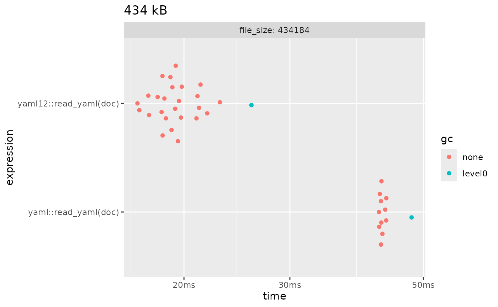

    #> # A tibble: 2 × 14
    #>   expression file_size    min median `itr/sec` mem_alloc `gc/sec` n_itr
    #>   <bch:expr>     <dbl> <bch:> <bch:>     <dbl> <bch:byt>    <dbl> <int>
    #> 1 yaml12::r…    434184 13.9ms 14.4ms      69.2    8.05KB     1.98    35
    #> 2 yaml::rea…    434184 42.2ms 42.6ms      23.1     1.2MB     1.93    12
    #> # ℹ 6 more variables: n_gc <dbl>, total_time <bch:tm>, result <list>,
    #> #   memory <list>, time <list>, gc <list>

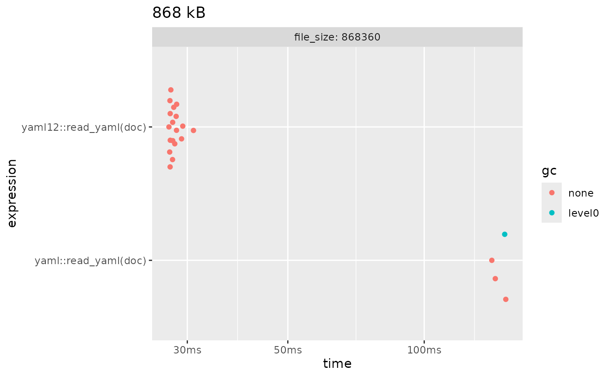

    #> # A tibble: 2 × 14
    #>   expression      file_size     min median `itr/sec` mem_alloc `gc/sec`
    #>   <bch:expr>          <dbl> <bch:t> <bch:>     <dbl> <bch:byt>    <dbl>
    #> 1 yaml12::read_y…    868360  27.7ms   28ms     35.5    16.05KB     0   
    #> 2 yaml::read_yam…    868360 142.8ms  146ms      6.77    2.41MB     1.69
    #> # ℹ 7 more variables: n_itr <int>, n_gc <dbl>, total_time <bch:tm>,
    #> #   result <list>, memory <list>, time <list>, gc <list>

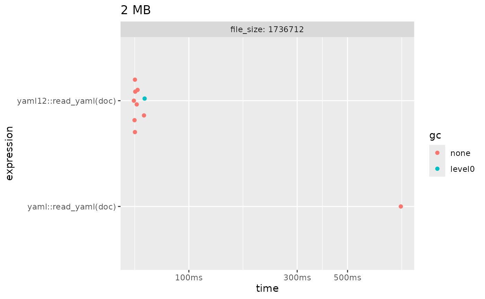

    #> # A tibble: 2 × 14
    #>   expression     file_size     min  median `itr/sec` mem_alloc `gc/sec`
    #>   <bch:expr>         <dbl> <bch:t> <bch:t>     <dbl> <bch:byt>    <dbl>
    #> 1 yaml12::read_…   1736712  57.3ms  58.1ms     16.8    32.05KB     1.87
    #> 2 yaml::read_ya…   1736712 858.5ms 858.5ms      1.16    4.82MB     0   
    #> # ℹ 7 more variables: n_itr <int>, n_gc <dbl>, total_time <bch:tm>,
    #> #   result <list>, memory <list>, time <list>, gc <list>

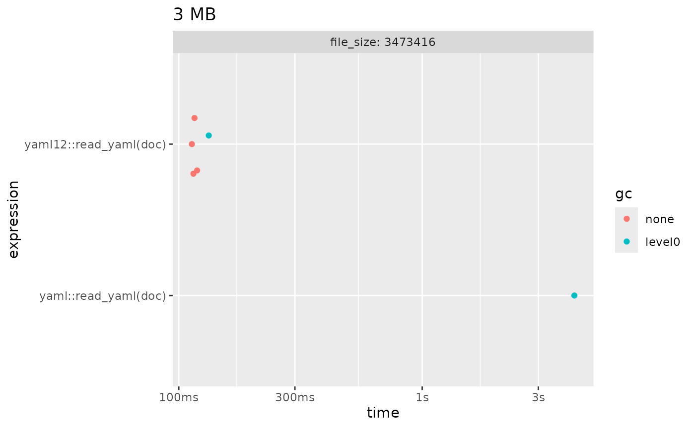

    #> # A tibble: 2 × 14
    #>   expression   file_size      min   median `itr/sec` mem_alloc `gc/sec`
    #>   <bch:expr>       <dbl> <bch:tm> <bch:tm>     <dbl> <bch:byt>    <dbl>
    #> 1 yaml12::rea…   3473416 116.17ms 117.35ms     8.51    64.05KB    0    
    #> 2 yaml::read_…   3473416    4.25s    4.25s     0.235    9.65MB    0.235
    #> # ℹ 7 more variables: n_itr <int>, n_gc <dbl>, total_time <bch:tm>,
    #> #   result <list>, memory <list>, time <list>, gc <list>


    #> # A tibble: 2 × 14
    #>   expression     file_size     min  median `itr/sec` mem_alloc `gc/sec`
    #>   <bch:expr>         <dbl> <bch:t> <bch:t>     <dbl> <bch:byt>    <dbl>
    #> 1 yaml12::read_…   6946824 253.7ms 277.3ms    3.61       128KB    3.61 
    #> 2 yaml::read_ya…   6946824   17.7s   17.7s    0.0565    19.3MB    0.113
    #> # ℹ 7 more variables: n_itr <int>, n_gc <dbl>, total_time <bch:tm>,
    #> #   result <list>, memory <list>, time <list>, gc <list>

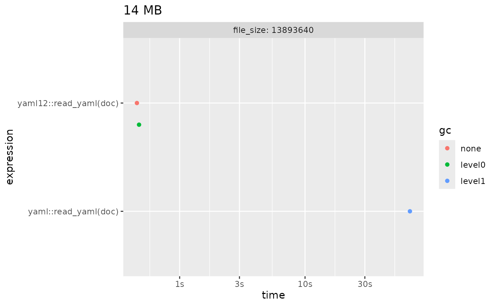

    #> # A tibble: 2 × 14
    #>   expression   file_size      min   median `itr/sec` mem_alloc `gc/sec`
    #>   <bch:expr>       <dbl> <bch:tm> <bch:tm>     <dbl> <bch:byt>    <dbl>
    #> 1 yaml12::rea…  13893640 460.96ms 467.85ms    2.14       256KB    1.07 
    #> 2 yaml::read_…  13893640    1.15m    1.15m    0.0145    38.6MB    0.101
    #> # ℹ 7 more variables: n_itr <int>, n_gc <dbl>, total_time <bch:tm>,
    #> #   result <list>, memory <list>, time <list>, gc <list>

## Write performance

``` r

objs <- lapply(2^(1:15), function(n) rep(list(mixed_node), n))

write_results <- lapply(objs, function(obj) {
  result <- bench::mark(
    yaml12::write_yaml(obj, nullfile()),
    yaml::write_yaml(obj, nullfile()),
    check = FALSE
  )
  result$obj_size <- object.size(obj)
  result
})
#> Warning: Some expressions had a GC in every iteration; so filtering is
#> disabled.
```

### Write results summary:

``` r

write_results_df <- bind_rows(write_results) |>
  mutate(expression = as.factor(sapply(expression, deparse1)))
```

``` r

write_results_df |>
  ggplot(aes(x = obj_size, y = median, color = expression)) +
  labs(
    y = "Median Run Time",
    x = "Object Size",
    title = "Write Performance"
  ) +
  geom_point() +
  geom_smooth(linewidth = .5) +
  scale_x_log10(labels = scales::label_bytes()) +
  scale_y_continuous(trans = bench::bench_time_trans())
#> `geom_smooth()` using method = 'loess' and formula = 'y ~ x'
```

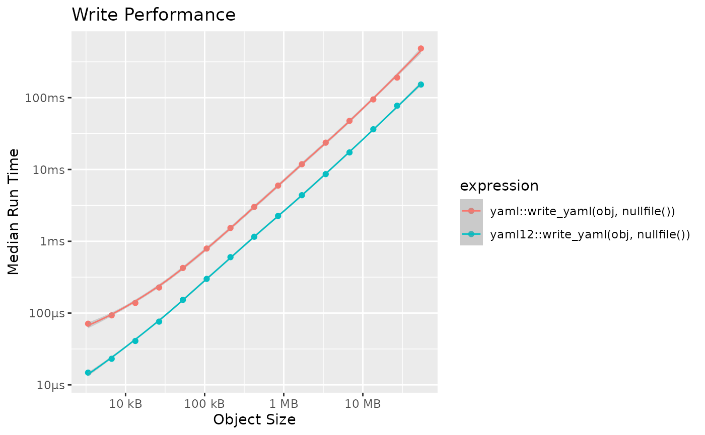

### Write results (detailed)

``` r

invisible(lapply(write_results, \(result) {
  print(plot(result) + ggplot2::ggtitle(scales::label_bytes()(as.numeric(result$obj_size[1]))))
  print(summary(result, filter_gc = FALSE))
}))
```

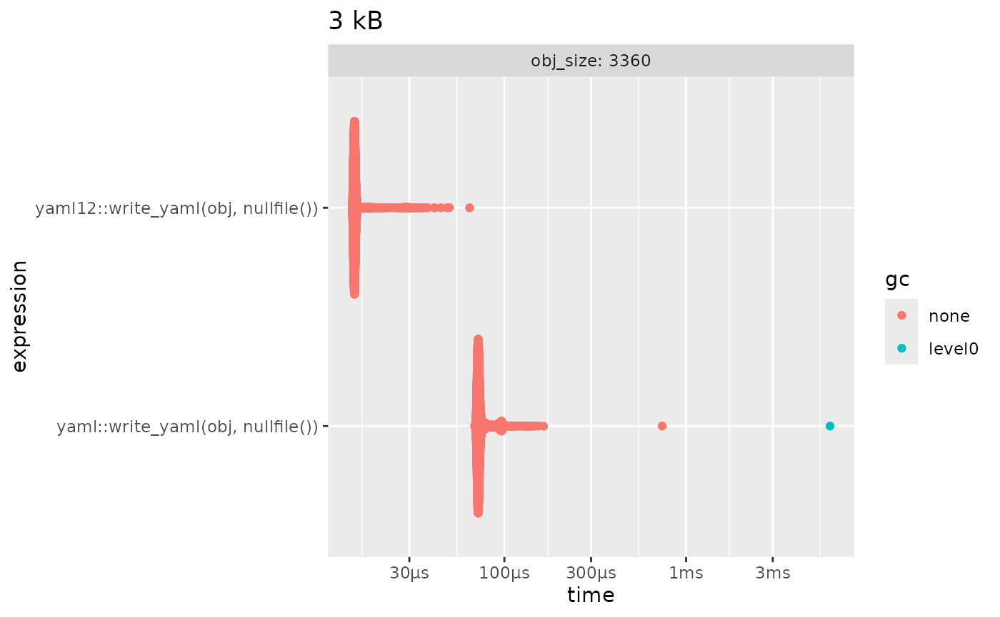

    #> # A tibble: 2 × 14
    #>   expression  obj_size    min median `itr/sec` mem_alloc `gc/sec` n_itr
    #>   <bch:expr>  <objct_> <bch:> <bch:>     <dbl> <bch:byt>    <dbl> <int>
    #> 1 yaml12::wr… 3360 by… 14.5µs   15µs    65195.    3.02KB     0    10000
    #> 2 yaml::writ… 3360 by… 68.5µs 72.1µs    13194.   33.68KB     2.00  6594
    #> # ℹ 6 more variables: n_gc <dbl>, total_time <bch:tm>, result <list>,
    #> #   memory <list>, time <list>, gc <list>

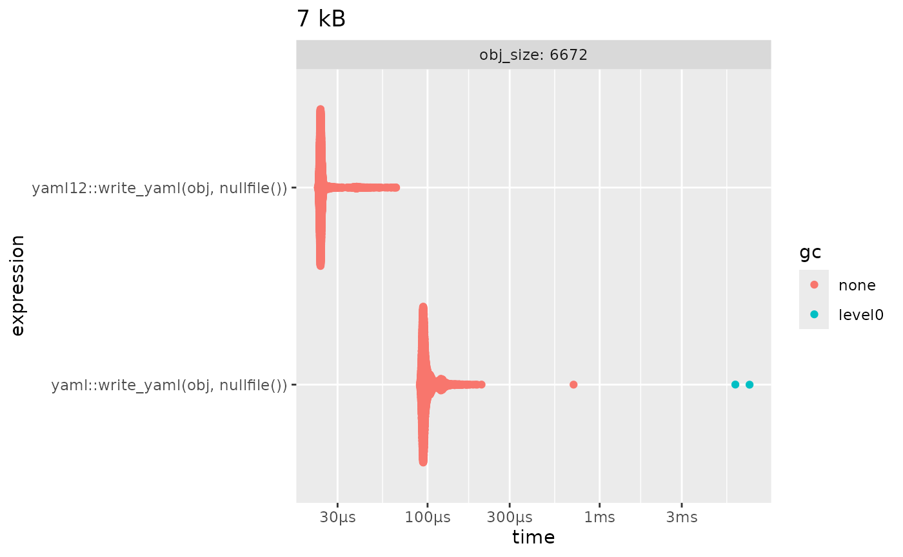

    #> # A tibble: 2 × 14
    #>   expression  obj_size    min median `itr/sec` mem_alloc `gc/sec` n_itr
    #>   <bch:expr>  <objct_> <bch:> <bch:>     <dbl> <bch:byt>    <dbl> <int>
    #> 1 yaml12::wr… 6672 by… 22.7µs 23.2µs    41942.        0B     0    10000
    #> 2 yaml::writ… 6672 by… 91.2µs 94.9µs     9903.    1.56KB     4.00  4950
    #> # ℹ 6 more variables: n_gc <dbl>, total_time <bch:tm>, result <list>,
    #> #   memory <list>, time <list>, gc <list>

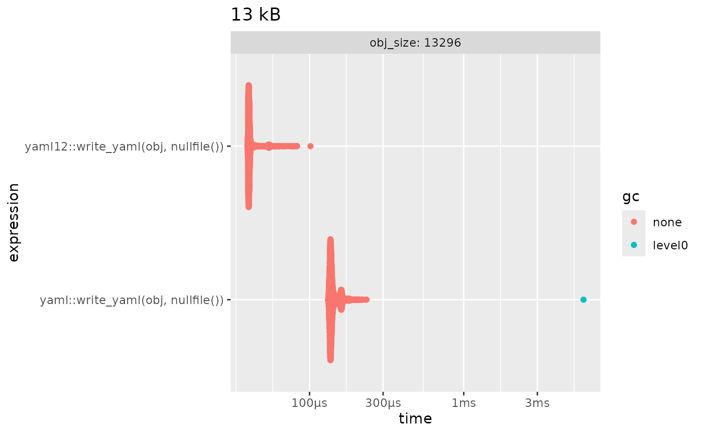

    #> # A tibble: 2 × 14
    #>   expression      obj_size     min  median `itr/sec` mem_alloc `gc/sec`
    #>   <bch:expr>      <objct_> <bch:t> <bch:t>     <dbl> <bch:byt>    <dbl>
    #> 1 yaml12::write_… 13296 b…  39.9µs  40.8µs    23918.        0B     0   
    #> 2 yaml::write_ya… 13296 b… 135.2µs 140.5µs     6784.    3.07KB     2.00
    #> # ℹ 7 more variables: n_itr <int>, n_gc <dbl>, total_time <bch:tm>,
    #> #   result <list>, memory <list>, time <list>, gc <list>

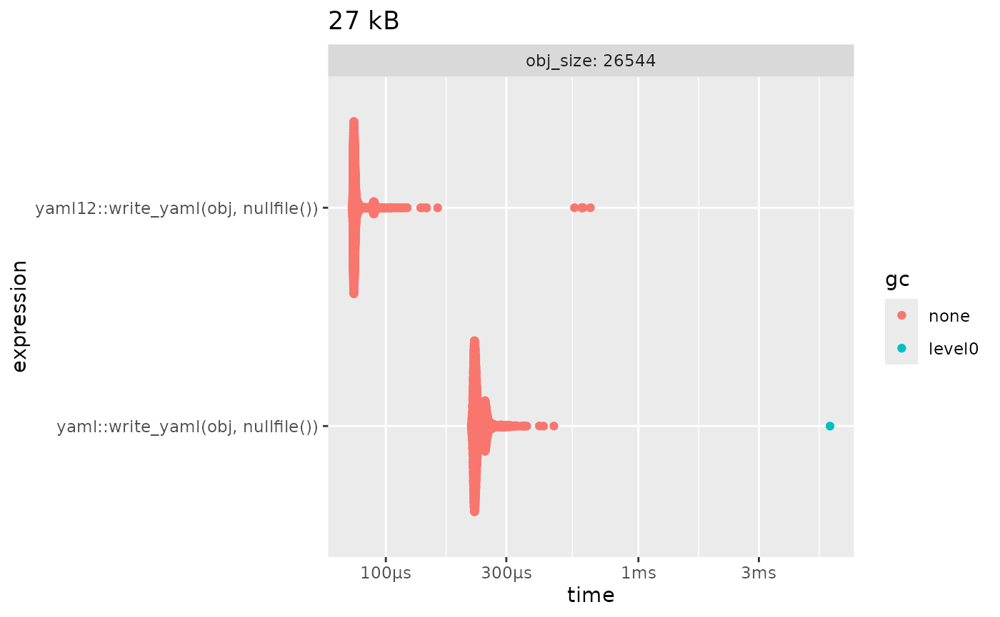

    #> # A tibble: 2 × 14
    #>   expression  obj_size   min  median `itr/sec` mem_alloc `gc/sec` n_itr
    #>   <bch:expr>  <objct_> <bch> <bch:t>     <dbl> <bch:byt>    <dbl> <int>
    #> 1 yaml12::wr… 26544 b…  75µs  76.4µs    12715.        0B     0     6355
    #> 2 yaml::writ… 26544 b… 222µs 230.8µs     3934.    6.09KB     2.00  1967
    #> # ℹ 6 more variables: n_gc <dbl>, total_time <bch:tm>, result <list>,
    #> #   memory <list>, time <list>, gc <list>

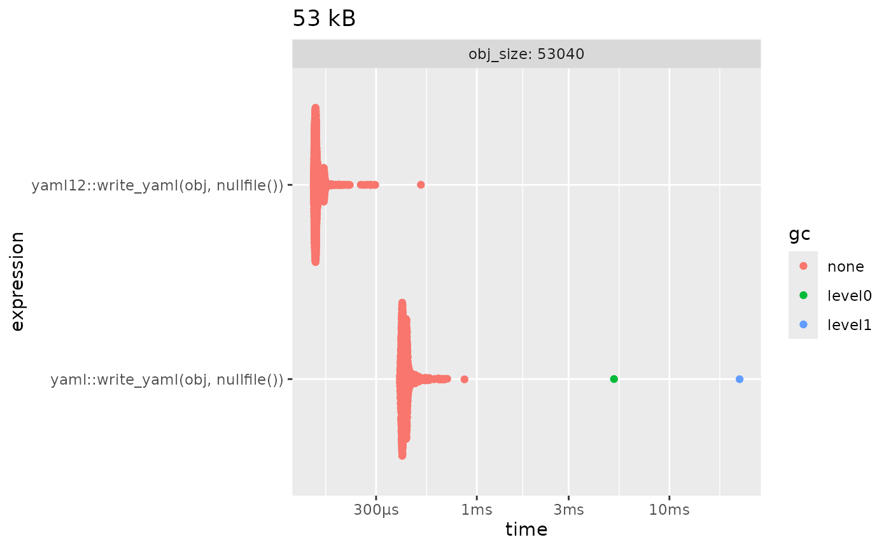

    #> # A tibble: 2 × 14
    #>   expression   obj_size   min median `itr/sec` mem_alloc `gc/sec` n_itr
    #>   <bch:expr>   <objct_> <bch> <bch:>     <dbl> <bch:byt>    <dbl> <int>
    #> 1 yaml12::wri… 53040 b… 142µs  144µs     6775.        0B     0     3387
    #> 2 yaml::write… 53040 b… 404µs  429µs     2236.    12.1KB     4.00  1119
    #> # ℹ 6 more variables: n_gc <dbl>, total_time <bch:tm>, result <list>,
    #> #   memory <list>, time <list>, gc <list>

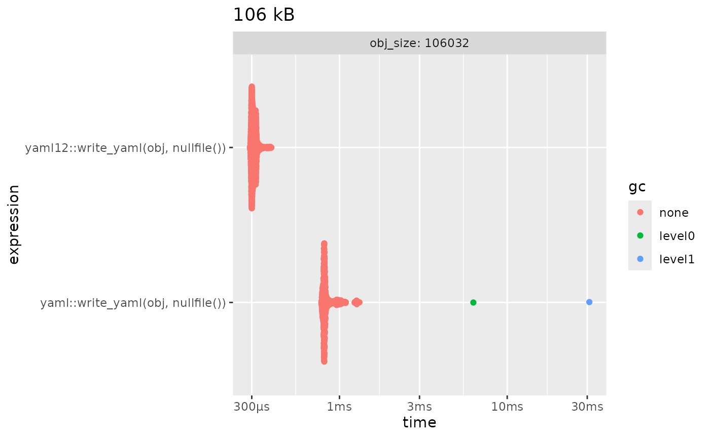

    #> # A tibble: 2 × 14
    #>   expression   obj_size   min median `itr/sec` mem_alloc `gc/sec` n_itr
    #>   <bch:expr>   <objct_> <bch> <bch:>     <dbl> <bch:byt>    <dbl> <int>
    #> 1 yaml12::wri… 106032 … 285µs  291µs     3380.        0B     0     1690
    #> 2 yaml::write… 106032 … 763µs  799µs     1216.    24.2KB     2.00   609
    #> # ℹ 6 more variables: n_gc <dbl>, total_time <bch:tm>, result <list>,
    #> #   memory <list>, time <list>, gc <list>

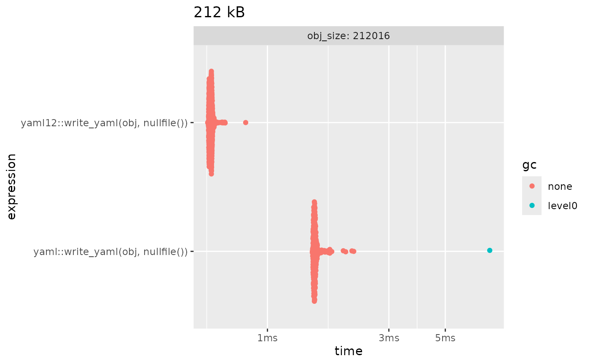

    #> # A tibble: 2 × 14
    #>   expression    obj_size      min   median `itr/sec` mem_alloc `gc/sec`
    #>   <bch:expr>    <objct_> <bch:tm> <bch:tm>     <dbl> <bch:byt>    <dbl>
    #> 1 yaml12::writ… 212016 … 578.29µs 593.98µs     1684.        0B     0   
    #> 2 yaml::write_… 212016 …   1.51ms   1.55ms      629.    48.3KB     2.00
    #> # ℹ 7 more variables: n_itr <int>, n_gc <dbl>, total_time <bch:tm>,
    #> #   result <list>, memory <list>, time <list>, gc <list>

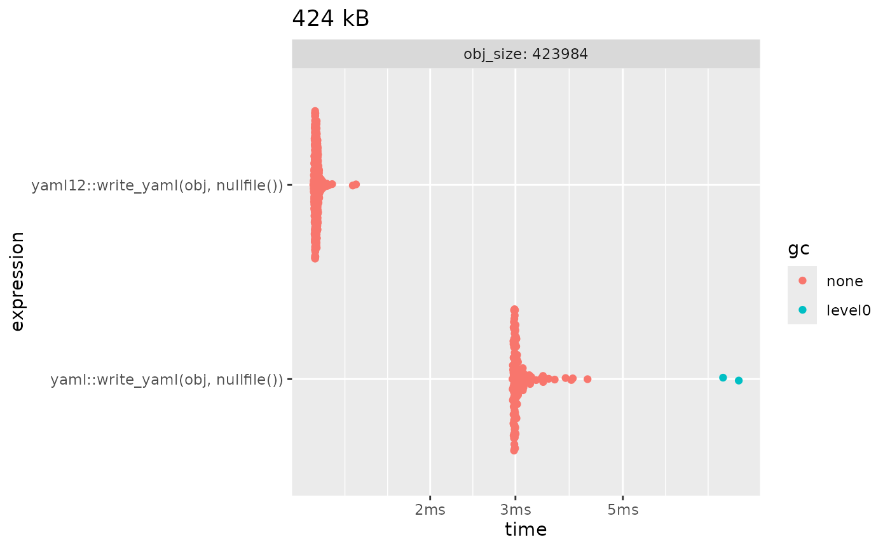

    #> # A tibble: 2 × 14
    #>   expression  obj_size    min median `itr/sec` mem_alloc `gc/sec` n_itr
    #>   <bch:expr>  <objct_> <bch:> <bch:>     <dbl> <bch:byt>    <dbl> <int>
    #> 1 yaml12::wr… 423984 … 1.15ms 1.16ms      855.        0B     0      428
    #> 2 yaml::writ… 423984 … 2.98ms 3.04ms      313.    96.6KB     3.98   157
    #> # ℹ 6 more variables: n_gc <dbl>, total_time <bch:tm>, result <list>,
    #> #   memory <list>, time <list>, gc <list>

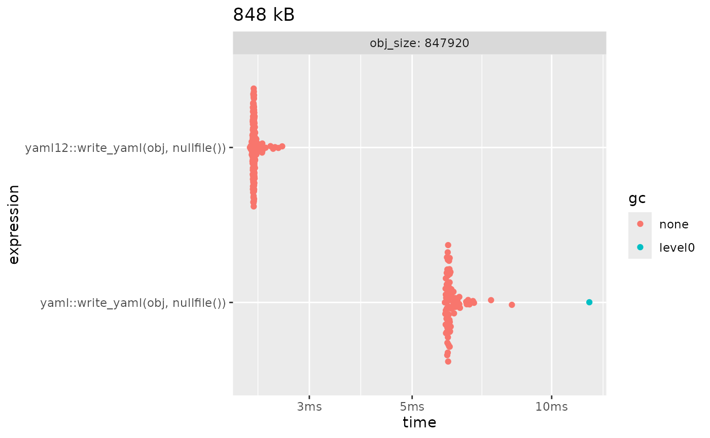

    #> # A tibble: 2 × 14
    #>   expression  obj_size    min median `itr/sec` mem_alloc `gc/sec` n_itr
    #>   <bch:expr>  <objct_> <bch:> <bch:>     <dbl> <bch:byt>    <dbl> <int>
    #> 1 yaml12::wr… 847920 … 2.23ms 2.28ms      437.        0B     0      219
    #> 2 yaml::writ… 847920 … 5.88ms 6.01ms      162.     193KB     2.00    81
    #> # ℹ 6 more variables: n_gc <dbl>, total_time <bch:tm>, result <list>,
    #> #   memory <list>, time <list>, gc <list>


    #> # A tibble: 2 × 14
    #>   expression      obj_size     min  median `itr/sec` mem_alloc `gc/sec`
    #>   <bch:expr>      <objct_> <bch:t> <bch:t>     <dbl> <bch:byt>    <dbl>
    #> 1 yaml12::write_… 1695792…  4.36ms  4.39ms     227.         0B     0   
    #> 2 yaml::write_ya… 1695792…  11.8ms 11.98ms      81.3     386KB     1.98
    #> # ℹ 7 more variables: n_itr <int>, n_gc <dbl>, total_time <bch:tm>,
    #> #   result <list>, memory <list>, time <list>, gc <list>

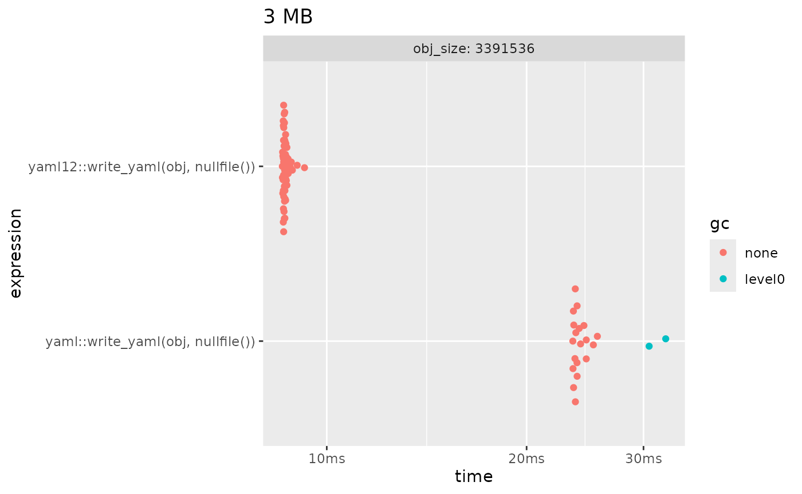

    #> # A tibble: 2 × 14
    #>   expression obj_size     min median `itr/sec` mem_alloc `gc/sec` n_itr
    #>   <bch:expr> <objct_> <bch:t> <bch:>     <dbl> <bch:byt>    <dbl> <int>
    #> 1 yaml12::w… 3391536…  8.52ms  8.6ms     116.         0B     0       59
    #> 2 yaml::wri… 3391536… 23.61ms   24ms      39.9     772KB     3.99    20
    #> # ℹ 6 more variables: n_gc <dbl>, total_time <bch:tm>, result <list>,
    #> #   memory <list>, time <list>, gc <list>

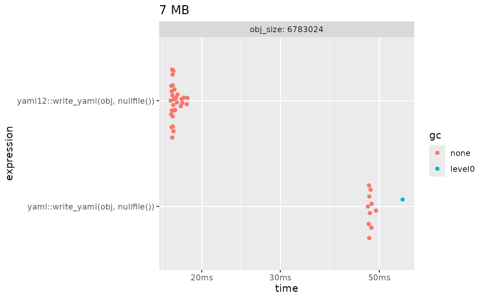

    #> # A tibble: 2 × 14
    #>   expression  obj_size    min median `itr/sec` mem_alloc `gc/sec` n_itr
    #>   <bch:expr>  <objct_> <bch:> <bch:>     <dbl> <bch:byt>    <dbl> <int>
    #> 1 yaml12::wr… 6783024… 16.7ms 16.8ms      59.0        0B     0       30
    #> 2 yaml::writ… 6783024… 47.6ms 48.3ms      20.3    1.51MB     1.85    11
    #> # ℹ 6 more variables: n_gc <dbl>, total_time <bch:tm>, result <list>,
    #> #   memory <list>, time <list>, gc <list>

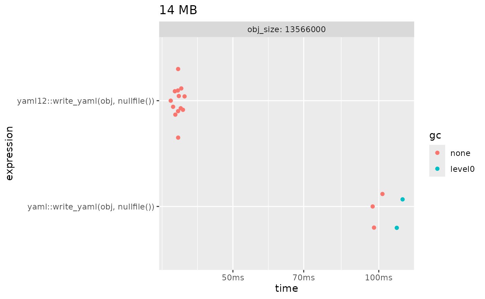

    #> # A tibble: 2 × 14
    #>   expression  obj_size    min median `itr/sec` mem_alloc `gc/sec` n_itr
    #>   <bch:expr>  <objct_> <bch:> <bch:>     <dbl> <bch:byt>    <dbl> <int>
    #> 1 yaml12::wr… 1356600… 33.6ms 33.8ms      29.2        0B     0       15
    #> 2 yaml::writ… 1356600… 95.2ms   97ms      10.1    3.02MB     3.36     6
    #> # ℹ 6 more variables: n_gc <dbl>, total_time <bch:tm>, result <list>,
    #> #   memory <list>, time <list>, gc <list>

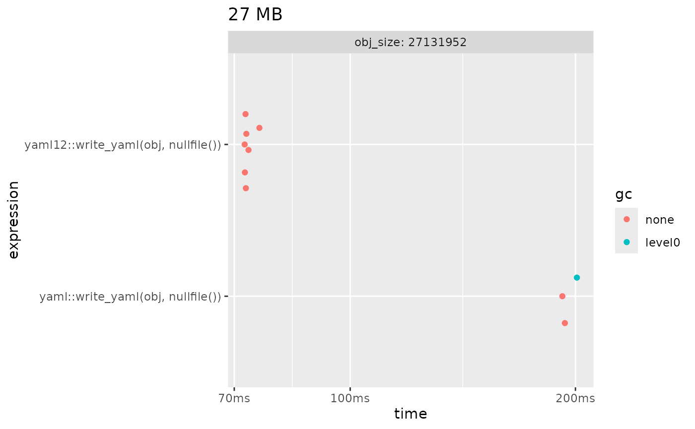

    #> # A tibble: 2 × 14
    #>   expression      obj_size     min  median `itr/sec` mem_alloc `gc/sec`
    #>   <bch:expr>      <objct_> <bch:t> <bch:t>     <dbl> <bch:byt>    <dbl>
    #> 1 yaml12::write_… 2713195…  72.3ms  72.5ms     13.7         0B     0   
    #> 2 yaml::write_ya… 2713195… 192.1ms 193.6ms      5.11    6.03MB     1.70
    #> # ℹ 7 more variables: n_itr <int>, n_gc <dbl>, total_time <bch:tm>,
    #> #   result <list>, memory <list>, time <list>, gc <list>

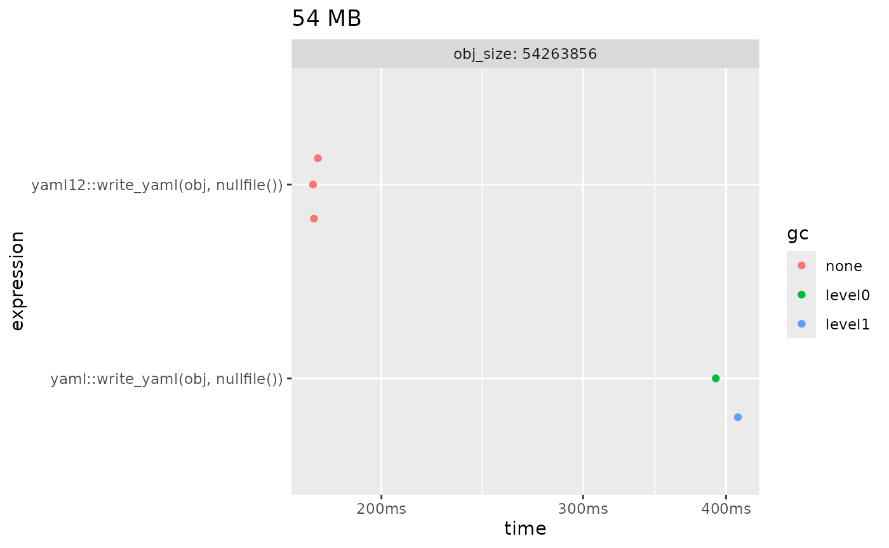

    #> # A tibble: 2 × 14
    #>   expression   obj_size   min median `itr/sec` mem_alloc `gc/sec` n_itr
    #>   <bch:expr>   <objct_> <bch> <bch:>     <dbl> <bch:byt>    <dbl> <int>
    #> 1 yaml12::wri… 5426385… 174ms  175ms      5.72        0B     0        3
    #> 2 yaml::write… 5426385… 392ms  401ms      2.50    12.1MB     2.50     2
    #> # ℹ 6 more variables: n_gc <dbl>, total_time <bch:tm>, result <list>,
    #> #   memory <list>, time <list>, gc <list>

## Conclusion

Across all tested file sizes and for this workload, `yaml12` is faster
than `yaml` at reading and writing YAML.
