# Benchmarks

## Goal

Compare `yaml12` and `yaml` for reading and writing YAML over a range of
document sizes.

We intentionally avoid testing semantic differences between YAML 1.1 and
1.2, as well as less-used YAML features like tags and streams. Instead,
we focus on the simple default usage of both.

Operations:

- **read**: YAML file → R object
- **write**: R object → YAML (written to
  [`nullfile()`](https://rdrr.io/r/base/showConnections.html))

## Setup

``` r

library(dplyr, warn.conflicts = FALSE)
library(ggplot2)
```

### Generate inputs

To benchmark, we create YAML files consisting of a repeating sequence of
a small, fixed “mixed” node, repeated `2^(1:15)` times. This node is
designed to exercise the full YAML 1.2 core schema (every core type is
represented). We generate these files with
[`yaml12::write_yaml()`](https://posit-dev.github.io/r-yaml12/dev/reference/format_yaml.md).

Each file is written to a temporary file and then we measure read time.
Note that on macOS and Linux,
[`tempfile()`](https://rdrr.io/r/base/tempfile.html) paths often live on
a `tmpfs` in RAM, so this typically won’t trigger a write to disk under
most circumstances.

``` r

# A YAML node that exercises every core schema type:
#   seq, map, str, bool, int, float, null
mixed_node <- list(
  str = c(
    "Lorem ipsum dolor sit amet, vel accumsan vitae faucibus ultrices leo",
    "neque? Et cursus lacinia, ut, sit donec facilisi eu interdum. Dui",
    "ipsum, vitae ligula commodo convallis ac sed nunc. Ipsum at nec lacus",
    "eros suscipit vitae."
  ),
  block_str = "lorem \n ipsum \n dolor\n",
  bools = c(TRUE, FALSE),
  ints = c(123L, -123L),
  floats = c(123.456, -123.456),
  null = NULL
)
```

``` r

make_yaml_doc <- function(size = 1) {
  path <- tempfile(fileext = ".yaml")
  yaml12::write_yaml(rep(list(mixed_node), size), path)
  path
}

docs <- sapply(2^(1:15), make_yaml_doc)
```

## Read performance

``` r

read_results <- lapply(docs, function(doc) {
  result <- bench::mark(
    yaml12::read_yaml(doc),
    yaml::read_yaml(doc),
    check = FALSE
  )
  result$file_size <- file.info(doc)$size
  result
})
#> Warning: Some expressions had a GC in every iteration; so filtering is
#> disabled.
#> Warning: Some expressions had a GC in every iteration; so filtering is
#> disabled.
#> Warning: Some expressions had a GC in every iteration; so filtering is
#> disabled.
#> Warning: Some expressions had a GC in every iteration; so filtering is
#> disabled.
```

### Read results summary

``` r

read_results_df <- bind_rows(read_results) |>
  mutate(expression = as.factor(sapply(expression, deparse1)))
```

``` r

read_results_df |>
  ggplot(aes(x = file_size, y = median, color = expression)) +
  labs(
    y = "Median Run Time",
    x = "File Size",
    title = "Read Performance"
  ) +
  geom_point() +
  geom_smooth(linewidth = .5) +
  scale_x_log10(labels = scales::label_bytes()) +
  scale_y_continuous(trans = bench::bench_time_trans())
#> `geom_smooth()` using method = 'loess' and formula = 'y ~ x'
```

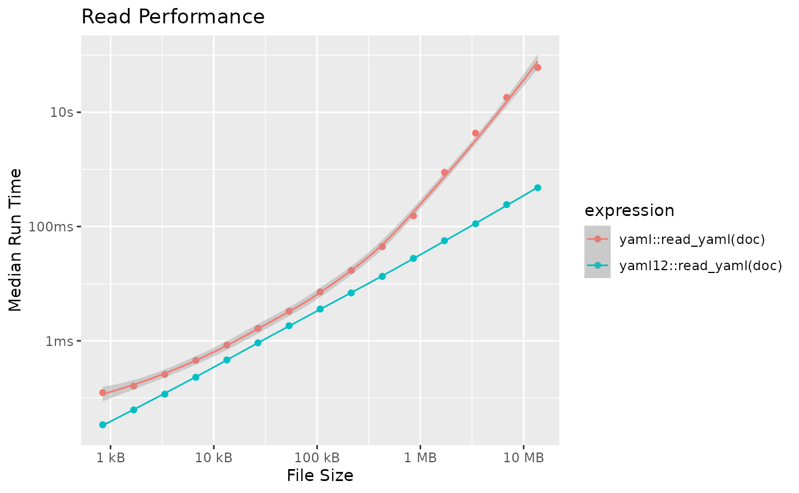

### Read results (detailed)

``` r

invisible(lapply(read_results, \(result) {
  print(plot(result) + ggplot2::ggtitle(scales::label_bytes()(result$file_size[1])))
  print(summary(result, filter_gc = FALSE))
}))
```

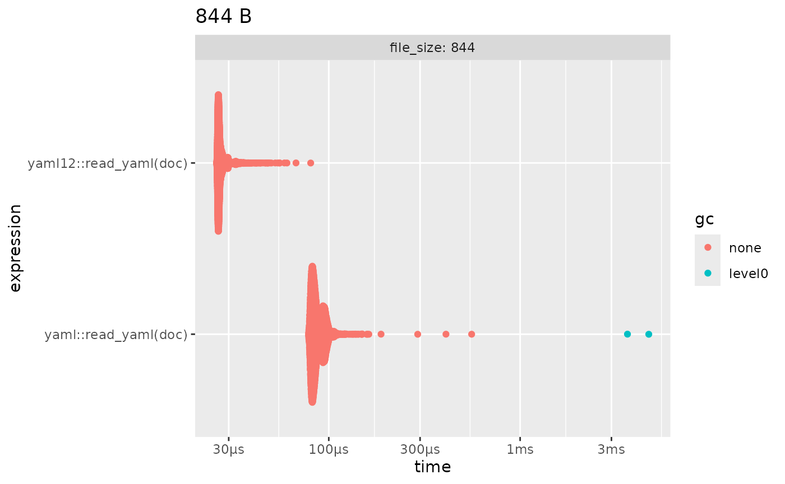

    #> # A tibble: 2 × 14
    #>   expression file_size    min median `itr/sec` mem_alloc `gc/sec` n_itr
    #>   <bch:expr>     <dbl> <bch:> <bch:>     <dbl> <bch:byt>    <dbl> <int>
    #> 1 yaml12::r…       844 17.8µs 18.8µs    51429.    2.75KB     0    10000
    #> 2 yaml::rea…       844 49.8µs 58.2µs    16302.    34.8KB     6.00  8148
    #> # ℹ 6 more variables: n_gc <dbl>, total_time <bch:tm>, result <list>,
    #> #   memory <list>, time <list>, gc <list>

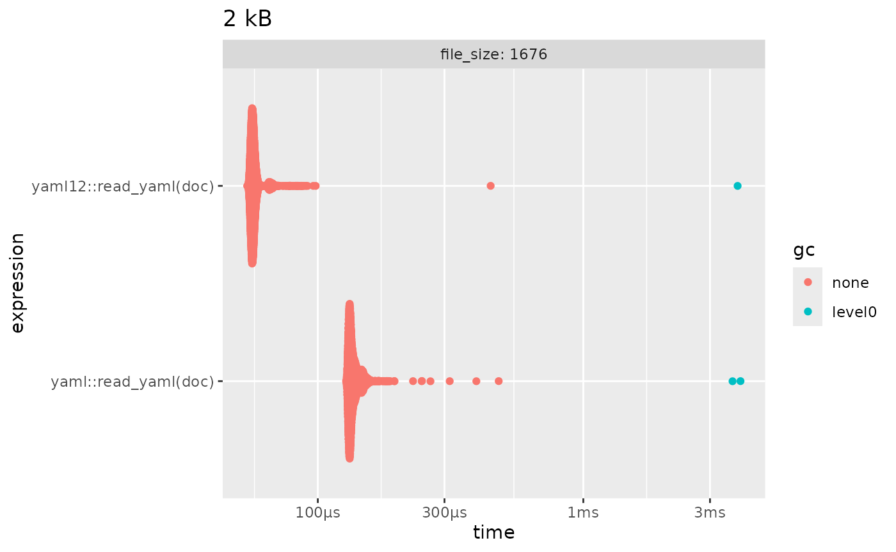

    #> # A tibble: 2 × 14
    #>   expression file_size    min median `itr/sec` mem_alloc `gc/sec` n_itr
    #>   <bch:expr>     <dbl> <bch:> <bch:>     <dbl> <bch:byt>    <dbl> <int>
    #> 1 yaml12::r…      1680   32µs 34.7µs    27844.        0B     2.78 10000
    #> 2 yaml::rea…      1680 78.4µs 87.4µs    10714.    10.9KB     8.00  5356
    #> # ℹ 6 more variables: n_gc <dbl>, total_time <bch:tm>, result <list>,
    #> #   memory <list>, time <list>, gc <list>

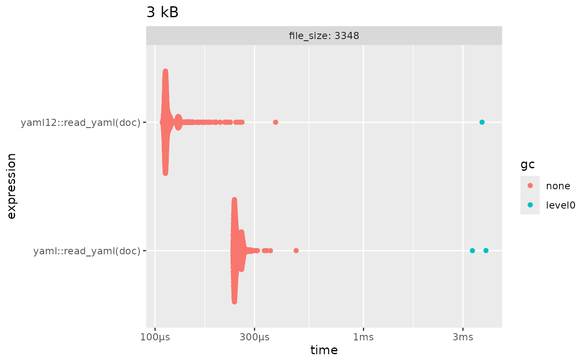

    #> # A tibble: 2 × 14
    #>   expression     file_size     min  median `itr/sec` mem_alloc `gc/sec`
    #>   <bch:expr>         <dbl> <bch:t> <bch:t>     <dbl> <bch:byt>    <dbl>
    #> 1 yaml12::read_…      3352  62.3µs  70.8µs    13955.        0B     2.00
    #> 2 yaml::read_ya…      3352 139.4µs 147.2µs     6342.    13.7KB     6.00
    #> # ℹ 7 more variables: n_itr <int>, n_gc <dbl>, total_time <bch:tm>,
    #> #   result <list>, memory <list>, time <list>, gc <list>

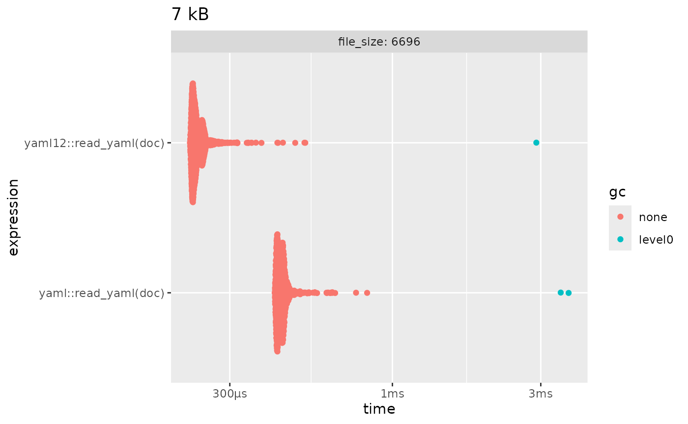

    #> # A tibble: 2 × 14
    #>   expression  file_size   min median `itr/sec` mem_alloc `gc/sec` n_itr
    #>   <bch:expr>      <dbl> <bch> <bch:>     <dbl> <bch:byt>    <dbl> <int>
    #> 1 yaml12::re…      6696 125µs  132µs     7322.        0B     2.00  3661
    #> 2 yaml::read…      6696 253µs  272µs     3479.    19.3KB     6.00  1740
    #> # ℹ 6 more variables: n_gc <dbl>, total_time <bch:tm>, result <list>,
    #> #   memory <list>, time <list>, gc <list>

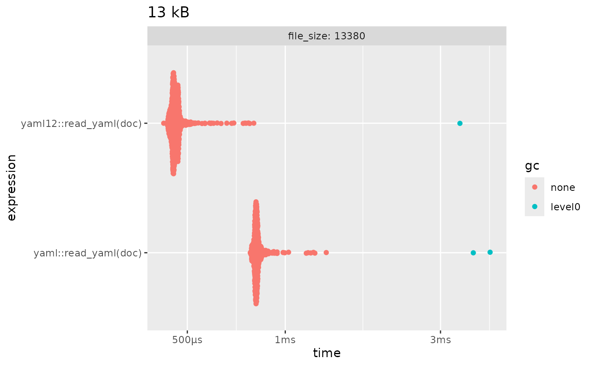

    #> # A tibble: 2 × 14
    #>   expression  file_size   min median `itr/sec` mem_alloc `gc/sec` n_itr
    #>   <bch:expr>      <dbl> <bch> <bch:>     <dbl> <bch:byt>    <dbl> <int>
    #> 1 yaml12::re…     13384 248µs  266µs     3678.      304B     2.00  1839
    #> 2 yaml::read…     13384 503µs  524µs     1816.    30.9KB     5.99   909
    #> # ℹ 6 more variables: n_gc <dbl>, total_time <bch:tm>, result <list>,
    #> #   memory <list>, time <list>, gc <list>

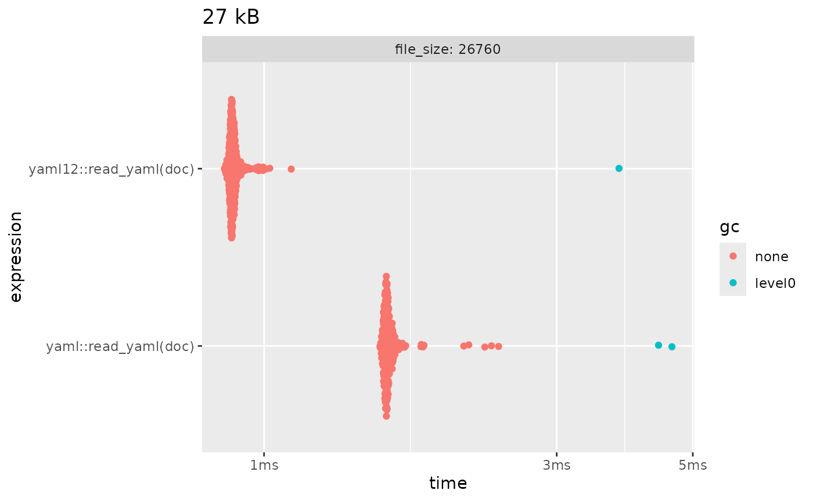

    #> # A tibble: 2 × 14
    #>   expression      file_size   min   median `itr/sec` mem_alloc `gc/sec`
    #>   <bch:expr>          <dbl> <bch> <bch:tm>     <dbl> <bch:byt>    <dbl>
    #> 1 yaml12::read_y…     26760 518µs 565.76µs     1755.      560B     2.00
    #> 2 yaml::read_yam…     26760 999µs   1.04ms      920.    69.4KB     5.99
    #> # ℹ 7 more variables: n_itr <int>, n_gc <dbl>, total_time <bch:tm>,
    #> #   result <list>, memory <list>, time <list>, gc <list>

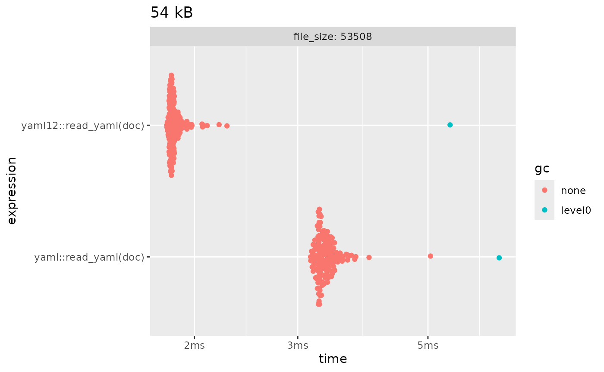

    #> # A tibble: 2 × 14
    #>   expression file_size    min median `itr/sec` mem_alloc `gc/sec` n_itr
    #>   <bch:expr>     <dbl> <bch:> <bch:>     <dbl> <bch:byt>    <dbl> <int>
    #> 1 yaml12::r…     53512 1.15ms  1.2ms      820.    1.05KB     2.00   411
    #> 2 yaml::rea…     53512 2.08ms 2.13ms      451.  146.31KB     3.99   226
    #> # ℹ 6 more variables: n_gc <dbl>, total_time <bch:tm>, result <list>,
    #> #   memory <list>, time <list>, gc <list>

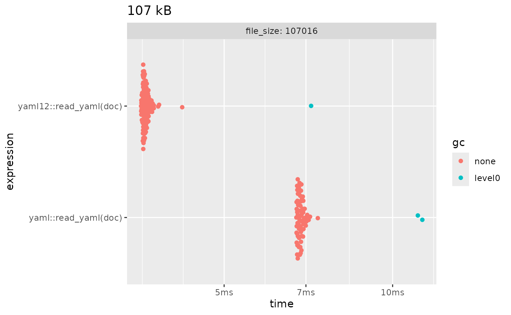

    #> # A tibble: 2 × 14
    #>   expression file_size    min median `itr/sec` mem_alloc `gc/sec` n_itr
    #>   <bch:expr>     <dbl> <bch:> <bch:>     <dbl> <bch:byt>    <dbl> <int>
    #> 1 yaml12::r…    107016 2.52ms 2.71ms      367.    2.05KB     2.00   184
    #> 2 yaml::rea…    107016 4.55ms 4.78ms      195.   300.1KB     5.98    98
    #> # ℹ 6 more variables: n_gc <dbl>, total_time <bch:tm>, result <list>,
    #> #   memory <list>, time <list>, gc <list>

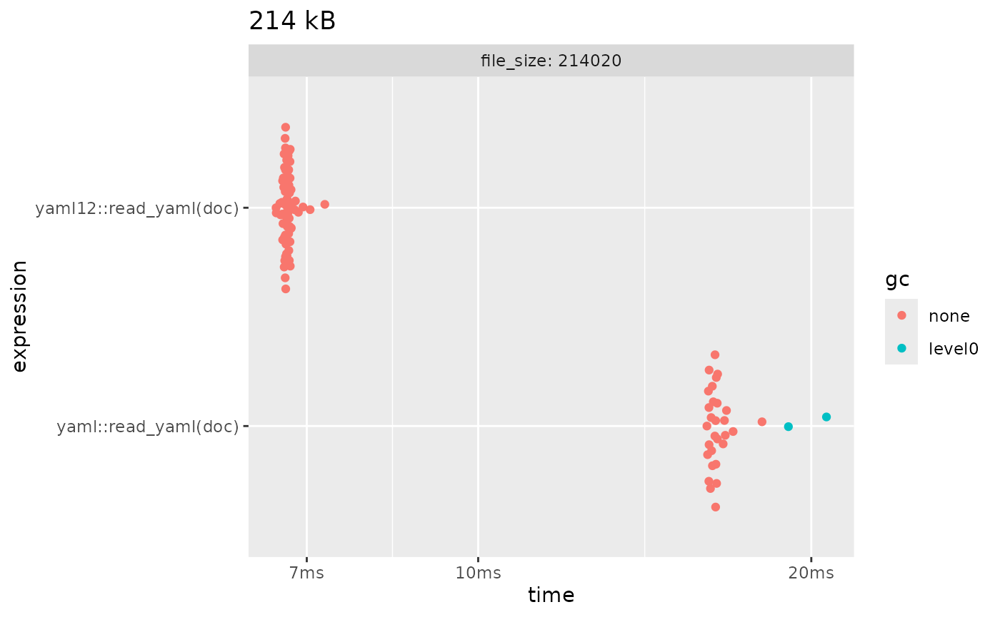

    #> # A tibble: 2 × 14
    #>   expression     file_size     min  median `itr/sec` mem_alloc `gc/sec`
    #>   <bch:expr>         <dbl> <bch:t> <bch:t>     <dbl> <bch:byt>    <dbl>
    #> 1 yaml12::read_…    214024  4.46ms  4.64ms     211.     4.05KB     1.99
    #> 2 yaml::read_ya…    214024 10.87ms 11.64ms      84.2  607.65KB     3.92
    #> # ℹ 7 more variables: n_itr <int>, n_gc <dbl>, total_time <bch:tm>,
    #> #   result <list>, memory <list>, time <list>, gc <list>

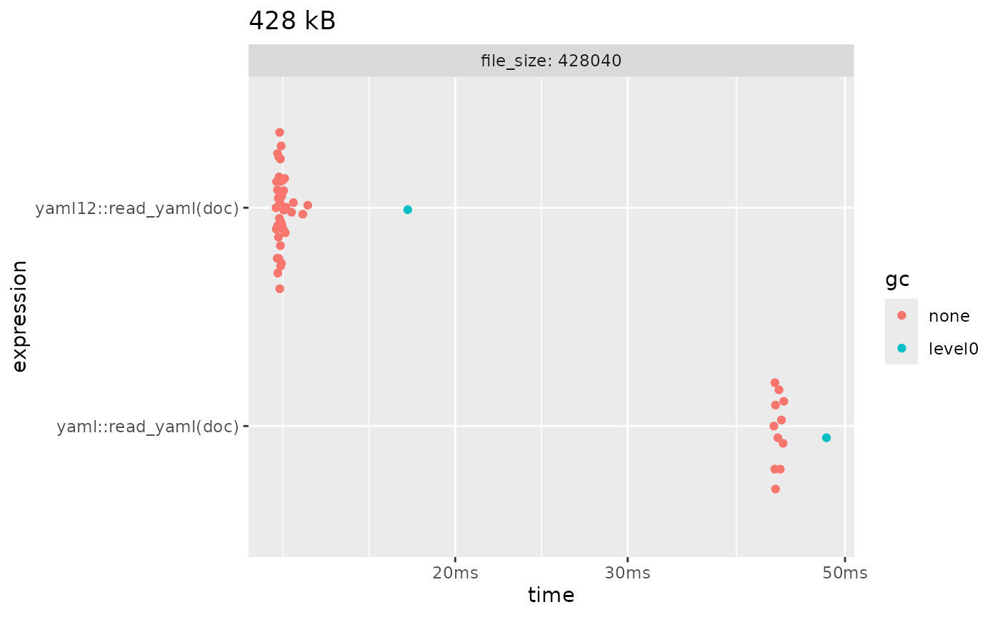

    #> # A tibble: 2 × 14
    #>   expression      file_size     min median `itr/sec` mem_alloc `gc/sec`
    #>   <bch:expr>          <dbl> <bch:t> <bch:>     <dbl> <bch:byt>    <dbl>
    #> 1 yaml12::read_y…    428040  8.53ms    9ms     109.     8.05KB     1.99
    #> 2 yaml::read_yam…    428040  30.8ms 31.9ms      31.2    1.19MB     1.95
    #> # ℹ 7 more variables: n_itr <int>, n_gc <dbl>, total_time <bch:tm>,
    #> #   result <list>, memory <list>, time <list>, gc <list>

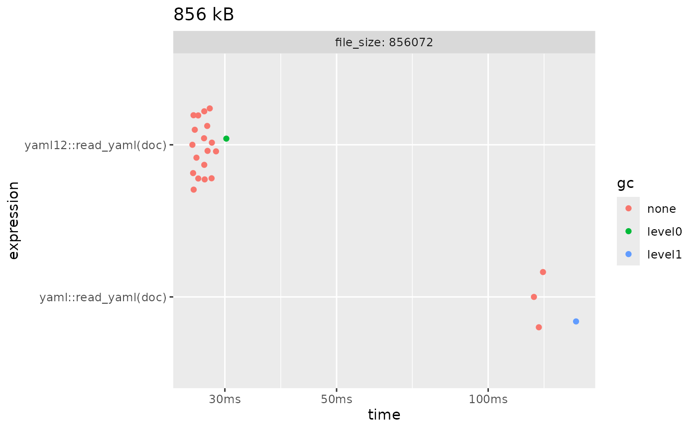

    #> # A tibble: 2 × 14
    #>   expression     file_size     min  median `itr/sec` mem_alloc `gc/sec`
    #>   <bch:expr>         <dbl> <bch:t> <bch:t>     <dbl> <bch:byt>    <dbl>
    #> 1 yaml12::read_…    856072  17.5ms  18.8ms     52.5       16KB     1.95
    #> 2 yaml::read_ya…    856072 103.5ms 110.8ms      9.10     2.4MB     1.82
    #> # ℹ 7 more variables: n_itr <int>, n_gc <dbl>, total_time <bch:tm>,
    #> #   result <list>, memory <list>, time <list>, gc <list>

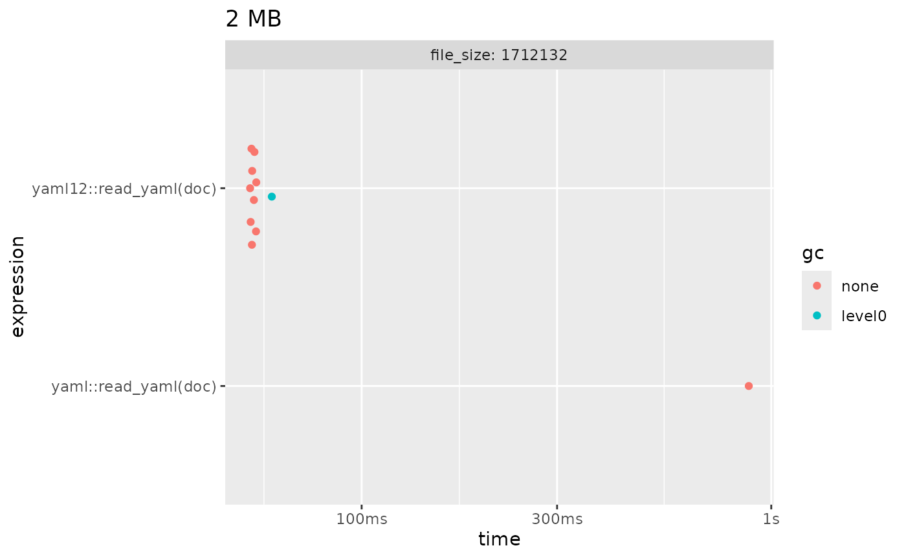

    #> # A tibble: 2 × 14
    #>   expression      file_size     min median `itr/sec` mem_alloc `gc/sec`
    #>   <bch:expr>          <dbl> <bch:t> <bch:>     <dbl> <bch:byt>    <dbl>
    #> 1 yaml12::read_y…   1712136  37.6ms   38ms     25.8       32KB     1.98
    #> 2 yaml::read_yam…   1712136 540.9ms  541ms      1.85     4.8MB     1.85
    #> # ℹ 7 more variables: n_itr <int>, n_gc <dbl>, total_time <bch:tm>,
    #> #   result <list>, memory <list>, time <list>, gc <list>

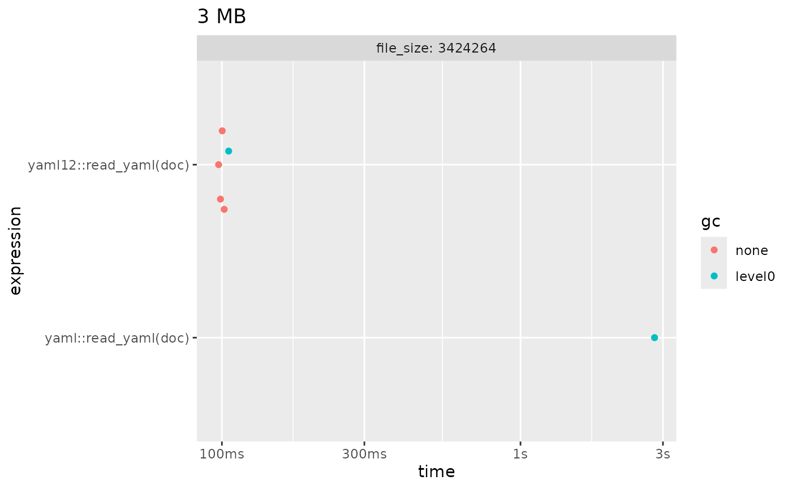

    #> # A tibble: 2 × 14
    #>   expression file_size    min median `itr/sec` mem_alloc `gc/sec` n_itr
    #>   <bch:expr>     <dbl> <bch:> <bch:>     <dbl> <bch:byt>    <dbl> <int>
    #> 1 yaml12::r…   3424264 74.5ms   76ms    12.8        64KB    3.66      7
    #> 2 yaml::rea…   3424264   2.3s   2.3s     0.435     9.6MB    0.435     1
    #> # ℹ 6 more variables: n_gc <dbl>, total_time <bch:tm>, result <list>,
    #> #   memory <list>, time <list>, gc <list>

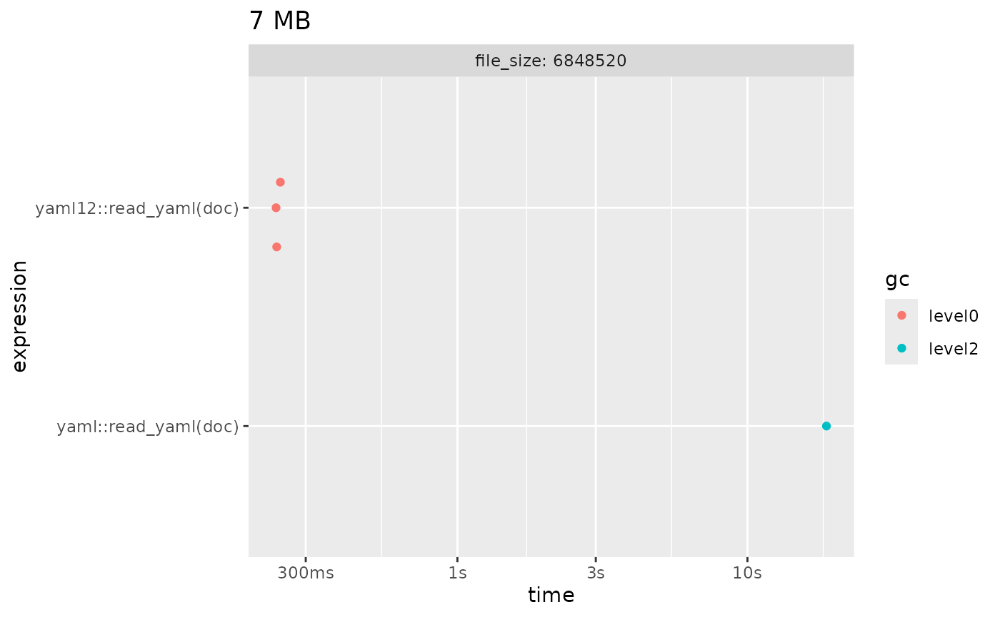

    #> # A tibble: 2 × 14
    #>   expression     file_size     min  median `itr/sec` mem_alloc `gc/sec`
    #>   <bch:expr>         <dbl> <bch:t> <bch:t>     <dbl> <bch:byt>    <dbl>
    #> 1 yaml12::read_…   6848520 154.1ms 170.2ms    5.11       128KB    2.55 
    #> 2 yaml::read_ya…   6848520   16.3s   16.3s    0.0613    19.2MB    0.123
    #> # ℹ 7 more variables: n_itr <int>, n_gc <dbl>, total_time <bch:tm>,
    #> #   result <list>, memory <list>, time <list>, gc <list>

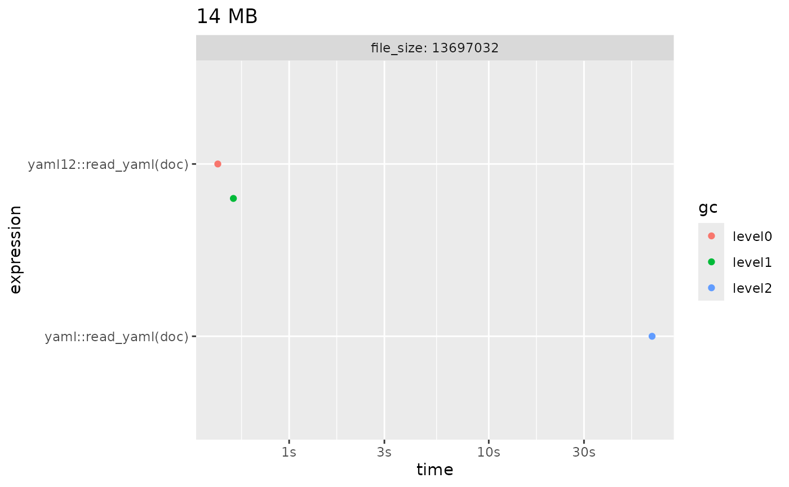

    #> # A tibble: 2 × 14
    #>   expression   file_size      min   median `itr/sec` mem_alloc `gc/sec`
    #>   <bch:expr>       <dbl> <bch:tm> <bch:tm>     <dbl> <bch:byt>    <dbl>
    #> 1 yaml12::rea…  13697032 334.27ms 358.15ms    2.79       256KB   4.19  
    #> 2 yaml::read_…  13697032    1.35m    1.35m    0.0124    38.4MB   0.0866
    #> # ℹ 7 more variables: n_itr <int>, n_gc <dbl>, total_time <bch:tm>,
    #> #   result <list>, memory <list>, time <list>, gc <list>

## Write performance

``` r

objs <- lapply(2^(1:15), function(n) rep(list(mixed_node), n))

write_results <- lapply(objs, function(obj) {
  result <- bench::mark(
    yaml12::write_yaml(obj, nullfile()),
    yaml::write_yaml(obj, nullfile()),
    check = FALSE
  )
  result$obj_size <- object.size(obj)
  result
})
#> Warning: Some expressions had a GC in every iteration; so filtering is
#> disabled.
```

### Write results summary:

``` r

write_results_df <- bind_rows(write_results) |>
  mutate(expression = as.factor(sapply(expression, deparse1)))
```

``` r

write_results_df |>
  ggplot(aes(x = obj_size, y = median, color = expression)) +
  labs(
    y = "Median Run Time",
    x = "Object Size",
    title = "Write Performance"
  ) +
  geom_point() +
  geom_smooth(linewidth = .5) +
  scale_x_log10(labels = scales::label_bytes()) +
  scale_y_continuous(trans = bench::bench_time_trans())
#> `geom_smooth()` using method = 'loess' and formula = 'y ~ x'
```

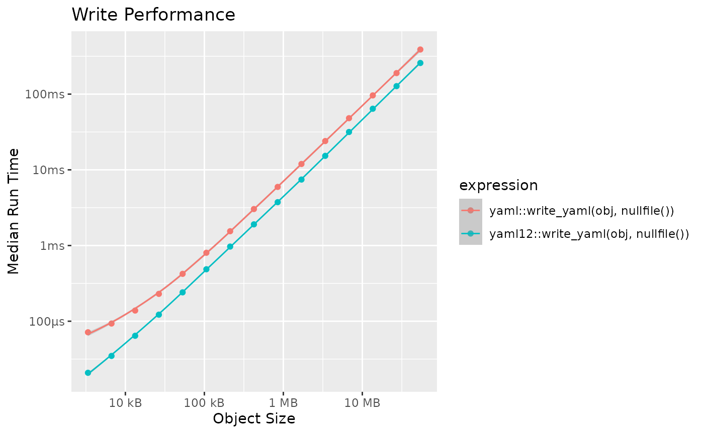

### Write results (detailed)

``` r

invisible(lapply(write_results, \(result) {
  print(plot(result) + ggplot2::ggtitle(scales::label_bytes()(as.numeric(result$obj_size[1]))))
  print(summary(result, filter_gc = FALSE))
}))
```

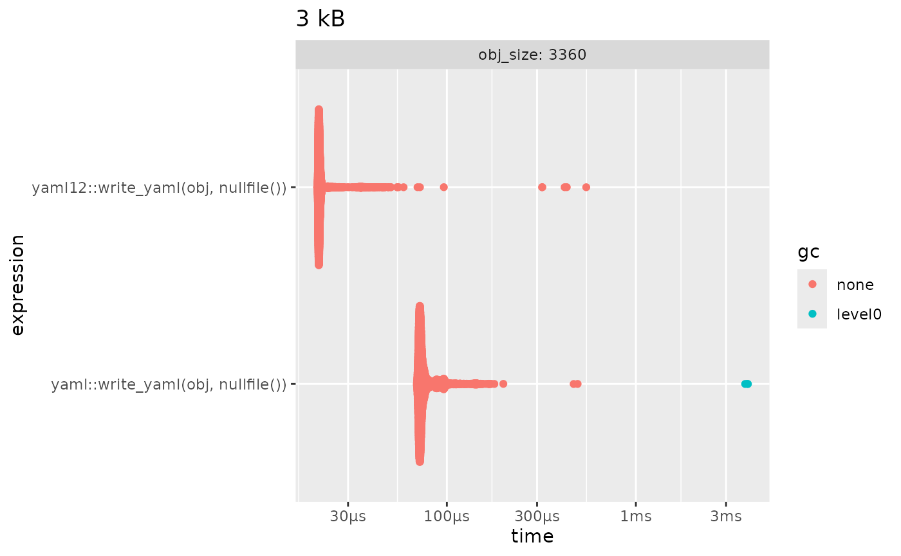

    #> # A tibble: 2 × 14
    #>   expression  obj_size    min median `itr/sec` mem_alloc `gc/sec` n_itr
    #>   <bch:expr>  <objct_> <bch:> <bch:>     <dbl> <bch:byt>    <dbl> <int>
    #> 1 yaml12::wr… 3360 by… 12.1µs 12.5µs    78248.    3.02KB     0    10000
    #> 2 yaml::writ… 3360 by…   29µs 32.4µs    28290.   33.68KB     5.66 10000
    #> # ℹ 6 more variables: n_gc <dbl>, total_time <bch:tm>, result <list>,
    #> #   memory <list>, time <list>, gc <list>

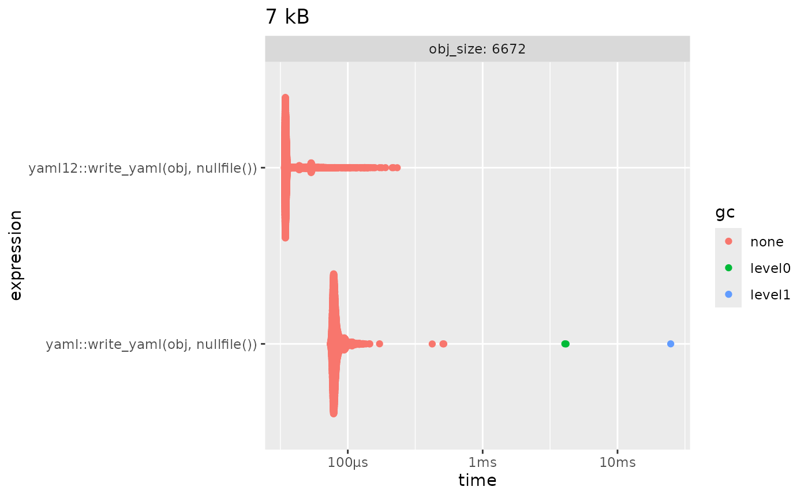

    #> # A tibble: 2 × 14
    #>   expression  obj_size    min median `itr/sec` mem_alloc `gc/sec` n_itr
    #>   <bch:expr>  <objct_> <bch:> <bch:>     <dbl> <bch:byt>    <dbl> <int>
    #> 1 yaml12::wr… 6672 by… 21.6µs 22.2µs    44412.        0B     0    10000
    #> 2 yaml::writ… 6672 by…   43µs 47.5µs    19390.    1.56KB     6.00  9691
    #> # ℹ 6 more variables: n_gc <dbl>, total_time <bch:tm>, result <list>,
    #> #   memory <list>, time <list>, gc <list>

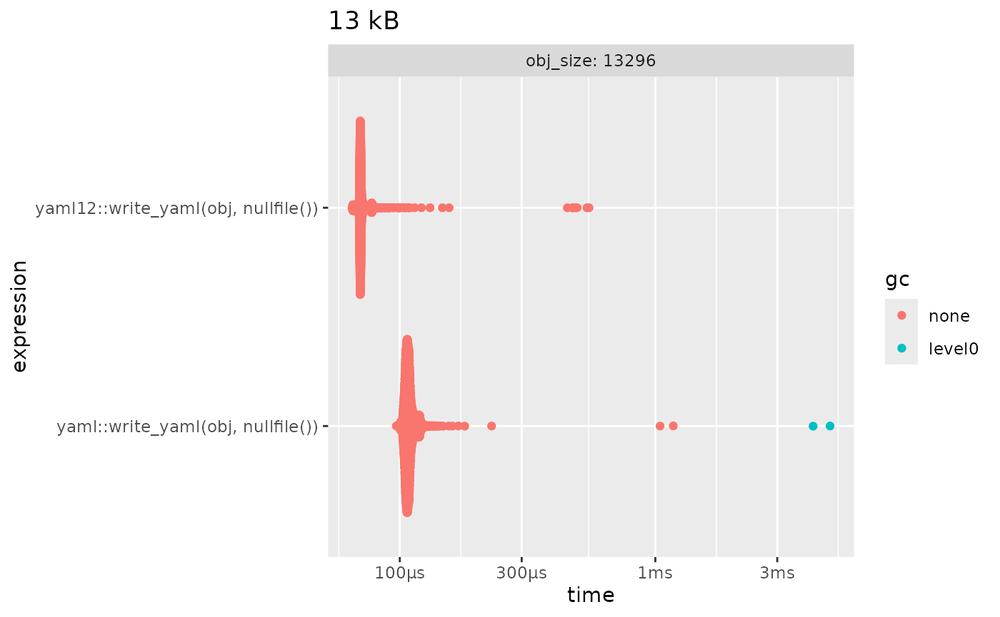

    #> # A tibble: 2 × 14
    #>   expression  obj_size    min median `itr/sec` mem_alloc `gc/sec` n_itr
    #>   <bch:expr>  <objct_> <bch:> <bch:>     <dbl> <bch:byt>    <dbl> <int>
    #> 1 yaml12::wr… 13296 b… 41.2µs 42.8µs    22890.        0B     0    10000
    #> 2 yaml::writ… 13296 b… 71.9µs 85.1µs    10724.    3.07KB     4.00  5361
    #> # ℹ 6 more variables: n_gc <dbl>, total_time <bch:tm>, result <list>,
    #> #   memory <list>, time <list>, gc <list>

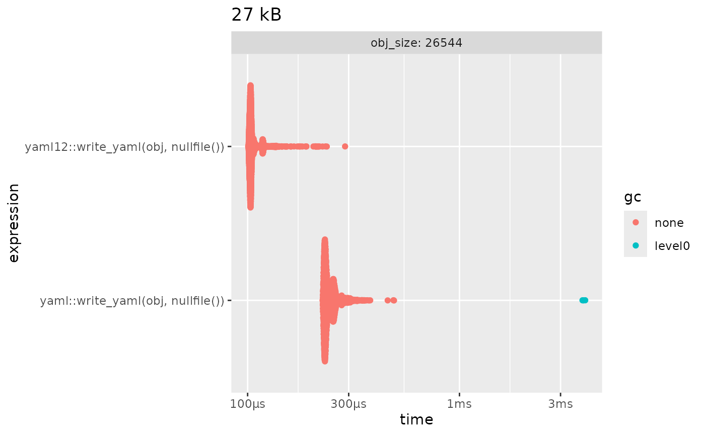

    #> # A tibble: 2 × 14
    #>   expression      obj_size     min  median `itr/sec` mem_alloc `gc/sec`
    #>   <bch:expr>      <objct_> <bch:t> <bch:t>     <dbl> <bch:byt>    <dbl>
    #> 1 yaml12::write_… 26544 b…  80.3µs  82.6µs    11948.        0B     0   
    #> 2 yaml::write_ya… 26544 b… 127.9µs 131.8µs     7138.    6.09KB     4.00
    #> # ℹ 7 more variables: n_itr <int>, n_gc <dbl>, total_time <bch:tm>,
    #> #   result <list>, memory <list>, time <list>, gc <list>

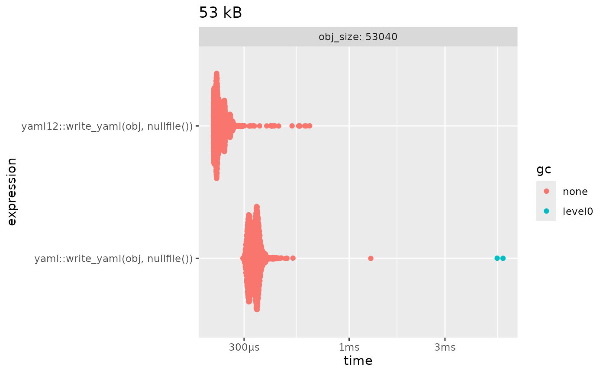

    #> # A tibble: 2 × 14
    #>   expression   obj_size   min median `itr/sec` mem_alloc `gc/sec` n_itr
    #>   <bch:expr>   <objct_> <bch> <bch:>     <dbl> <bch:byt>    <dbl> <int>
    #> 1 yaml12::wri… 53040 b… 155µs  161µs     6163.        0B     0     3082
    #> 2 yaml::write… 53040 b… 239µs  252µs     3719.    12.1KB     6.00  1860
    #> # ℹ 6 more variables: n_gc <dbl>, total_time <bch:tm>, result <list>,
    #> #   memory <list>, time <list>, gc <list>

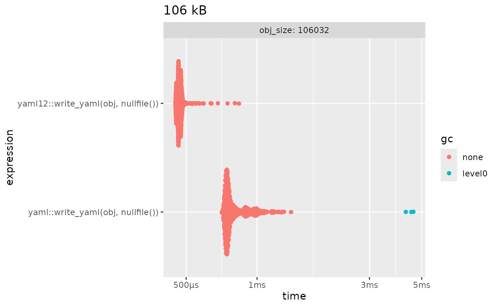

    #> # A tibble: 2 × 14
    #>   expression   obj_size   min median `itr/sec` mem_alloc `gc/sec` n_itr
    #>   <bch:expr>   <objct_> <bch> <bch:>     <dbl> <bch:byt>    <dbl> <int>
    #> 1 yaml12::wri… 106032 … 317µs  323µs     3075.        0B     0     1538
    #> 2 yaml::write… 106032 … 470µs  491µs     1918.    24.2KB     6.00   959
    #> # ℹ 6 more variables: n_gc <dbl>, total_time <bch:tm>, result <list>,
    #> #   memory <list>, time <list>, gc <list>

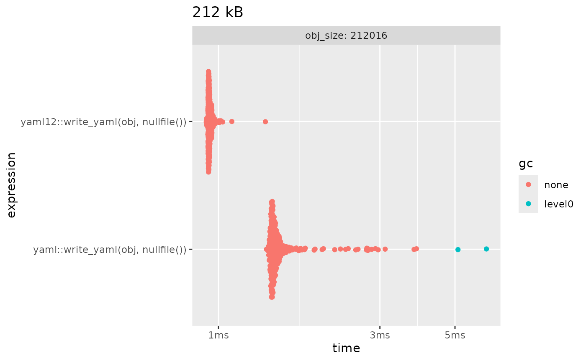

    #> # A tibble: 2 × 14
    #>   expression   obj_size   min median `itr/sec` mem_alloc `gc/sec` n_itr
    #>   <bch:expr>   <objct_> <bch> <bch:>     <dbl> <bch:byt>    <dbl> <int>
    #> 1 yaml12::wri… 212016 … 619µs  644µs     1549.        0B     0      775
    #> 2 yaml::write… 212016 … 939µs  964µs      991.    48.3KB     4.00   496
    #> # ℹ 6 more variables: n_gc <dbl>, total_time <bch:tm>, result <list>,
    #> #   memory <list>, time <list>, gc <list>

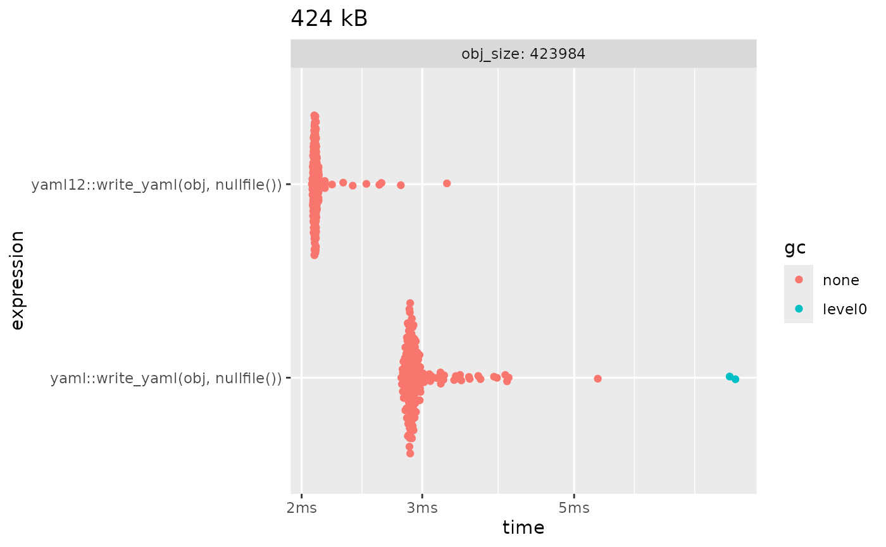

    #> # A tibble: 2 × 14
    #>   expression   obj_size   min median `itr/sec` mem_alloc `gc/sec` n_itr
    #>   <bch:expr>   <objct_> <bch> <bch:>     <dbl> <bch:byt>    <dbl> <int>
    #> 1 yaml12::wri… 423984 … 1.3ms 1.33ms      725.        0B     0      363
    #> 2 yaml::write… 423984 … 1.9ms 2.06ms      433.    96.6KB     3.99   217
    #> # ℹ 6 more variables: n_gc <dbl>, total_time <bch:tm>, result <list>,
    #> #   memory <list>, time <list>, gc <list>

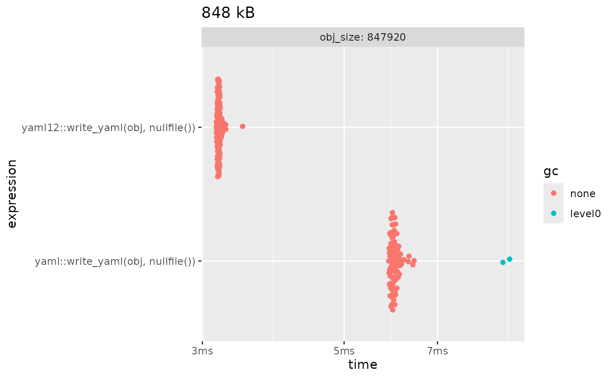

    #> # A tibble: 2 × 14
    #>   expression  obj_size    min median `itr/sec` mem_alloc `gc/sec` n_itr
    #>   <bch:expr>  <objct_> <bch:> <bch:>     <dbl> <bch:byt>    <dbl> <int>
    #> 1 yaml12::wr… 847920 … 2.67ms 2.71ms      368.        0B     0      184
    #> 2 yaml::writ… 847920 … 3.85ms 3.94ms      231.     193KB     5.97   116
    #> # ℹ 6 more variables: n_gc <dbl>, total_time <bch:tm>, result <list>,
    #> #   memory <list>, time <list>, gc <list>

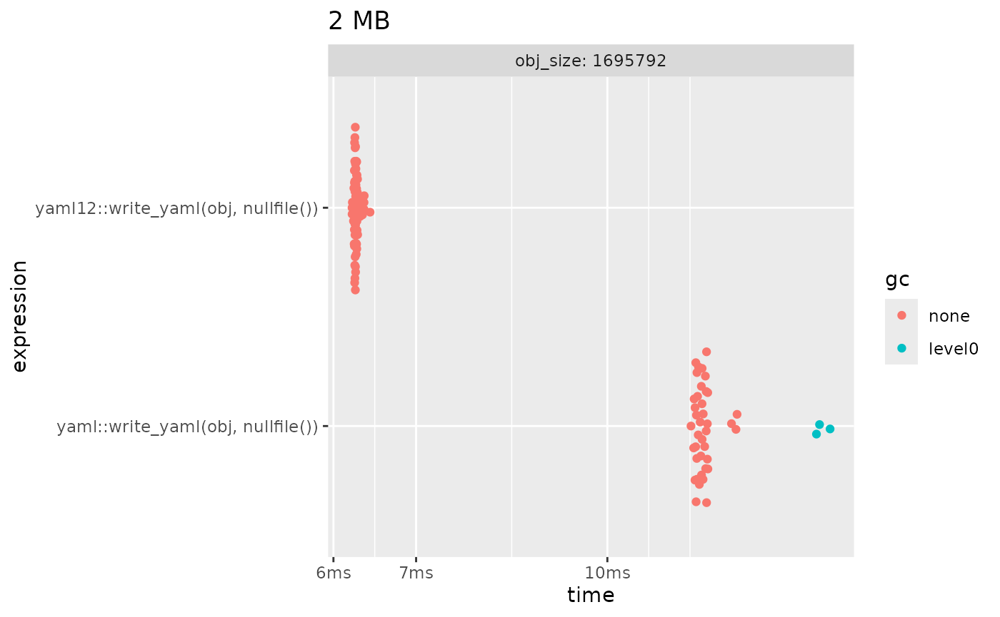

    #> # A tibble: 2 × 14
    #>   expression  obj_size    min median `itr/sec` mem_alloc `gc/sec` n_itr
    #>   <bch:expr>  <objct_> <bch:> <bch:>     <dbl> <bch:byt>    <dbl> <int>
    #> 1 yaml12::wr… 1695792… 5.37ms 5.48ms      182.        0B     0       92
    #> 2 yaml::writ… 1695792… 7.93ms 8.33ms      114.     386KB     3.94    58
    #> # ℹ 6 more variables: n_gc <dbl>, total_time <bch:tm>, result <list>,
    #> #   memory <list>, time <list>, gc <list>

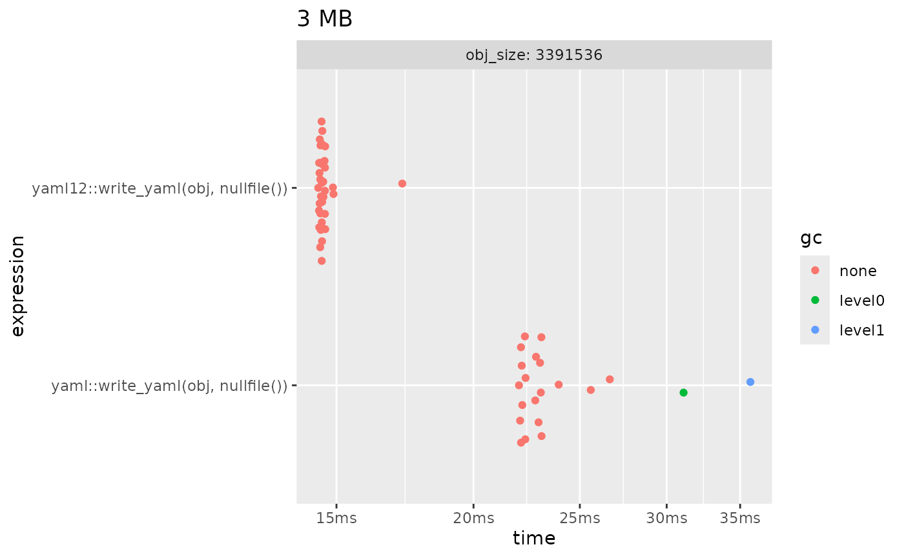

    #> # A tibble: 2 × 14
    #>   expression  obj_size    min median `itr/sec` mem_alloc `gc/sec` n_itr
    #>   <bch:expr>  <objct_> <bch:> <bch:>     <dbl> <bch:byt>    <dbl> <int>
    #> 1 yaml12::wr… 3391536… 10.9ms 11.1ms      89.6        0B     0       45
    #> 2 yaml::writ… 3391536… 16.2ms 16.6ms      57.0     772KB     3.93    29
    #> # ℹ 6 more variables: n_gc <dbl>, total_time <bch:tm>, result <list>,
    #> #   memory <list>, time <list>, gc <list>

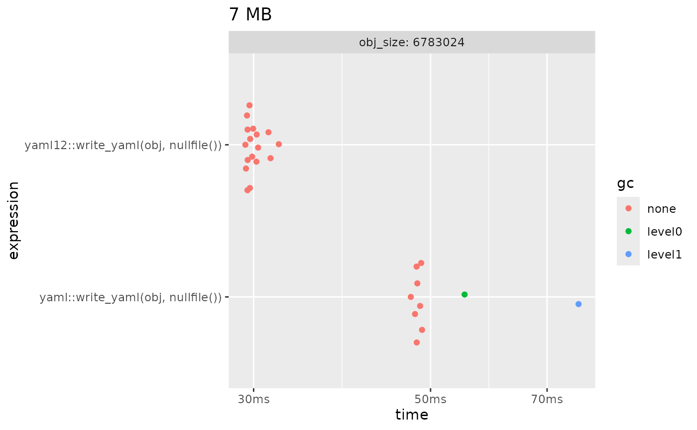

    #> # A tibble: 2 × 14
    #>   expression  obj_size    min median `itr/sec` mem_alloc `gc/sec` n_itr
    #>   <bch:expr>  <objct_> <bch:> <bch:>     <dbl> <bch:byt>    <dbl> <int>
    #> 1 yaml12::wr… 6783024… 22.8ms 23.5ms      42.3        0B     0       22
    #> 2 yaml::writ… 6783024… 32.3ms 33.2ms      28.1    1.51MB     5.62    15
    #> # ℹ 6 more variables: n_gc <dbl>, total_time <bch:tm>, result <list>,
    #> #   memory <list>, time <list>, gc <list>

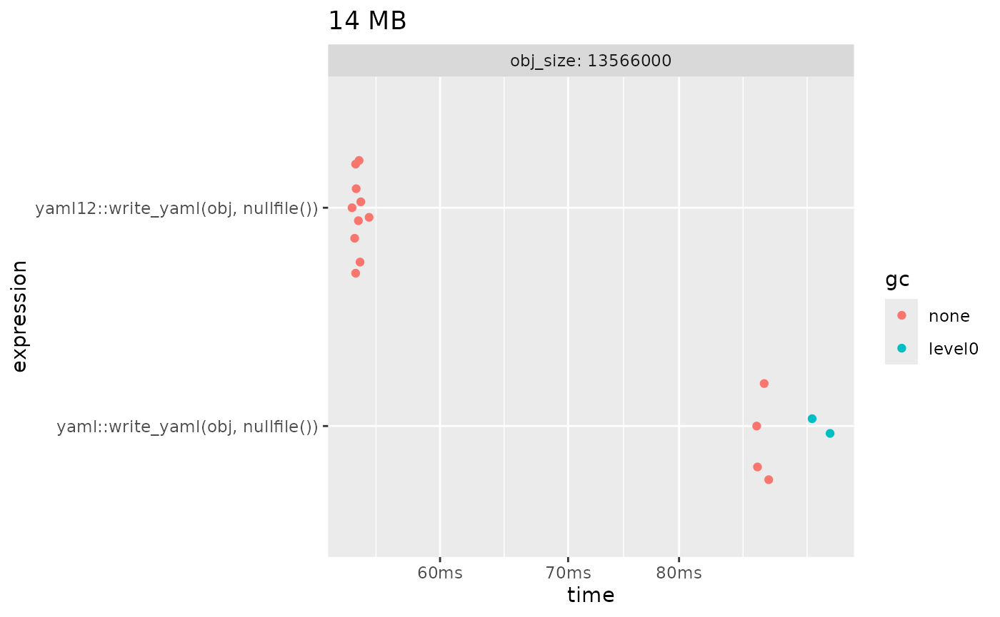

    #> # A tibble: 2 × 14
    #>   expression   obj_size   min median `itr/sec` mem_alloc `gc/sec` n_itr
    #>   <bch:expr>   <objct_> <bch> <bch:>     <dbl> <bch:byt>    <dbl> <int>
    #> 1 yaml12::wri… 1356600…  48ms 48.7ms      20.4        0B     0       11
    #> 2 yaml::write… 1356600…  66ms   67ms      14.4    3.02MB     3.59     8
    #> # ℹ 6 more variables: n_gc <dbl>, total_time <bch:tm>, result <list>,
    #> #   memory <list>, time <list>, gc <list>

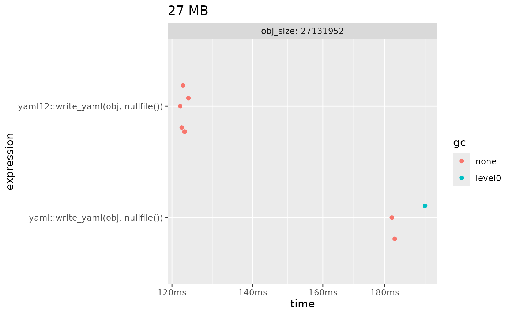

    #> # A tibble: 2 × 14
    #>   expression obj_size     min median `itr/sec` mem_alloc `gc/sec` n_itr
    #>   <bch:expr> <objct_> <bch:t> <bch:>     <dbl> <bch:byt>    <dbl> <int>
    #> 1 yaml12::w… 2713195…  97.6ms   99ms     10.1         0B     0        6
    #> 2 yaml::wri… 2713195… 133.8ms  143ms      7.03    6.03MB     5.27     4
    #> # ℹ 6 more variables: n_gc <dbl>, total_time <bch:tm>, result <list>,
    #> #   memory <list>, time <list>, gc <list>

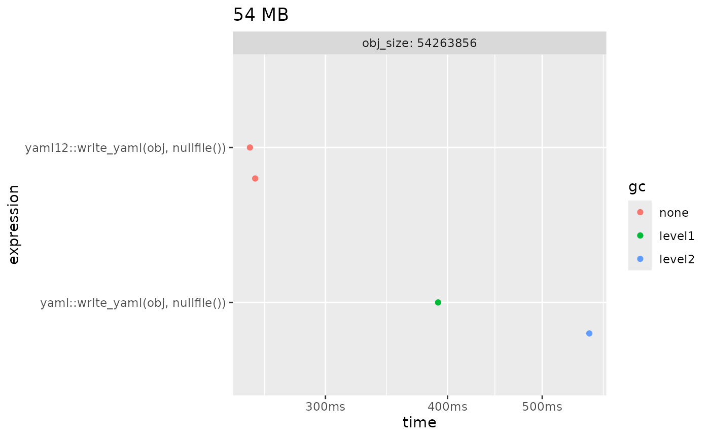

    #> # A tibble: 2 × 14
    #>   expression   obj_size   min median `itr/sec` mem_alloc `gc/sec` n_itr
    #>   <bch:expr>   <objct_> <bch> <bch:>     <dbl> <bch:byt>    <dbl> <int>
    #> 1 yaml12::wri… 5426385… 197ms  198ms      5.04        0B     0        3
    #> 2 yaml::write… 5426385… 281ms  281ms      3.55    12.1MB     3.55     2
    #> # ℹ 6 more variables: n_gc <dbl>, total_time <bch:tm>, result <list>,
    #> #   memory <list>, time <list>, gc <list>

## Conclusion

Across all tested file sizes and for this workload, `yaml12` is faster
than `yaml` at reading and writing YAML.
